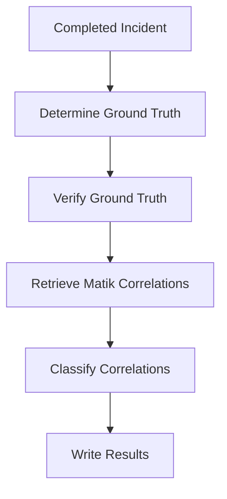

# Automated Root Cause Coverage Audit

Companion design doc to the **Matik Correlation Quality Validation**, which evaluates Matik's correlation quality through a manual review of completed incidents. This design automates that process, producing a continuous, auditable evaluation dataset of Matik's performance going forward.

> **Forward-looking only.** Incidents that predate this pipeline are out of scope.

---

# TL;DR

Every day, the pipeline evaluates newly completed incidents by answering four questions:

1. What actually caused the incident?
2. What did Matik surface?
3. How well did Matik's correlations match the ground truth?
4. What evidence supports that evaluation?

The pipeline produces an auditable dataset that downstream graphing tools use to compute and visualize three quality metrics:

- **Root Cause Coverage**
- **Relevant Context Coverage**
- **Noise Ratio**

Each evaluation is performed twice:

- **Investigation-time** — what responders saw during the incident.
- **Postmortem-time** — what Matik surfaced after the incident was fully documented.

---

# Pipeline Overview

Every completed incident moves through the same evaluation pipeline.

The following sections describe each stage.

---

# 1. Select incidents

The pipeline runs once per day and retrieves incidents from the previous 24 hours.

Only incidents that have reached a terminal state (**Closed** or **Cancelled**) are evaluated.

For each incident, four eligibility tags are determined.

| Tag                        | Definition                                                                                           |
| --------------------------- | ------------------------------------------------------------------------------------------------------ |
| `matik_eligible`           | Root cause exists in a source Matik currently ingests (GitHub PRs, Jira TCMRs).                      |
| `airbnb_change_related`    | Root cause exists in any Airbnb-managed change system, regardless of whether Matik ingests it today. |
| `external_change_related`  | Root cause is a change, but in a vendor/third-party-managed system, not an Airbnb-managed one.       |
| `catch_all`                | Root cause is not change-related at all (vendor outage, hardware failure, unknown cause, etc.).      |

The first measures Matik's current capability. The second measures the total opportunity for future data source expansion. The third captures incidents caused by a change outside Airbnb's control. The fourth captures incidents not caused by any change at all.

---

# 2. Determine the ground truth

Before Matik can be evaluated, the pipeline must determine what actually caused the incident.

An LLM analyzes the incident.io record and answers four questions:

1. Is the incident change-related?
2. Is the change Airbnb-owned or vendor-owned?
3. If Airbnb-owned, what PR, TCMR, or commit caused it?
4. Even without a specific identifier, does the root cause have some traceable external source (e.g. a vendor status page), or is it untracked (a manual change, hardware failure, etc.)?

To reduce hallucinations, the model must quote the identifier directly from the incident record instead of generating one. If no identifier is present, it returns **"none found."** Question 4 is the one judgment call the model is allowed to make rather than quote — it can also answer "genuinely unclear," leaving that field blank for a human reviewer to decide.

Any extracted identifier is verified against the source (GitHub or Jira) before becoming the incident's ground truth. A verified identifier always answers question 4 as traceable, regardless of what the model said.

If no verifiable identifier can be established, the incident is marked for manual review — the model's answer to question 4 still gets recorded on the row as a starting point, but a human reviewer can always correct it.

---

# 3. Retrieve Matik's correlations

Once the ground truth has been established, the pipeline retrieves Matik's correlations for the incident.

The evaluation is performed twice.

| Evaluation         | Source                                                                        |
| ------------------- | ------------------------------------------------------------------------------ |
| Investigation-time | Braintrust traces generated within the **first 20 minutes\*** of the incident |
| Postmortem-time    | Current `reliability_correlations` after the incident has completed           |

This measures both the usefulness of Matik during incident response and the quality of its final correlations after all information becomes available.

**\****This is not fixed and can be updated as we see fit.*

---

# 4. Classify correlations

Each surfaced correlation is classified into one of three categories.

| Classification | Definition                             |
| --------------- | ---------------------------------------- |
| ✅ Root Cause   | Matches the verified ground truth      |
| ⚠️ Relevant    | Helpful context but not the root cause |
| ❌ Noise        | Unrelated to the incident              |

Root Cause is determined deterministically from the verified entity.

Relevant versus Noise is also determined deterministically: an event is relevant if it touches the same service as the confirmed root cause (or, absent a verified root cause, the incident's own affected services), even if it wasn't the cause itself; otherwise it's noise.

---

# 5. Write results

The final output of the pipeline is a Google Sheet containing the evaluated incidents.

For each completed incident, the pipeline records the extracted ground truth, supporting evidence, verification results, Matik's investigation-time and postmortem-time correlations, and the classification of each surfaced correlation.

This sheet serves as the primary output of the job and provides an editable, auditable dataset. Downstream graphing tools consume this dataset to compute and visualize Root Cause Coverage, Relevant Context Coverage, and Noise Ratio over time.

---

# 6. Execution

The pipeline runs as a daily Kubernetes CronJob following the existing historian CronJob pattern and reuses the existing clients for incident.io, GitHub, Jira, Facade, and Bedrock.

---

# Open questions

---

# Future considerations

- Extract the ground truth from the incident Slack channel, this will require a bot (possibly OpsBot) that has access to the incident channel. This is to cover the instances when the root cause event was not documented in the incident.
  - Make sure that in the OpsBot summary prompt that we are not removing the event IDs
- Request SRE to add a custom field that where incident commanders can enter the root cause event.
