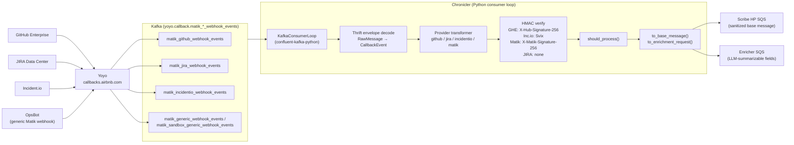
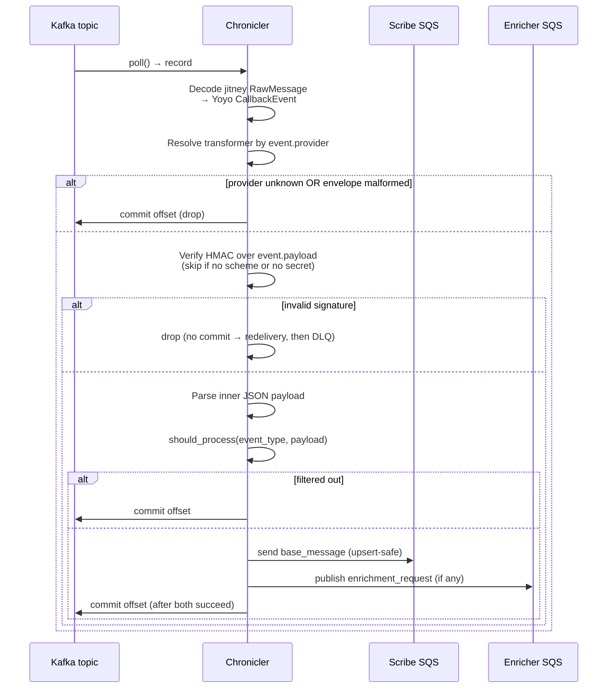

# Chronicler

## Overview

Chronicler is the real-time ingestion service for Matik. It is a long-running Python Kafka consumer that subscribes to Yoyo callback topics, validates and filters webhook events from GitHub Enterprise, JIRA, Incident.io, and the generic Matik-originated webhook (e.g. OpsBot's incident-channel-summary feed), and fans them out to the Scribe and Enricher SQS queues.

Chronicler does **not** expose an HTTP server, does **not** receive webhooks directly, and does **not** write to MySQL. Persistence and LLM enrichment are handled by [Scribe](./scribe-design.md) and [Enricher](./enricher-design.md) respectively.

**Key properties:**
- Direct `confluent-kafka-python` consumer against the Kafka bus via AirMesh — no sidecar (see [ADR 018](../decisions/013-chronicler-direct-kafka-python.md)).
- Trust boundary for inbound webhooks: HMAC signatures are verified here, not at Yoyo.
- Per-provider transformer registry: filtering, sanitization, and message shaping live in `chronicler/transformers/`.
- At-least-once delivery: Kafka offset is committed only after the Scribe and Enricher SQS publishes both succeed. Scribe is upsert-safe, so duplicates on retry are harmless.

## System Architecture



## Processing Flow



## Kafka Wire Format

Each Kafka record is a **two-layer Thrift binary envelope** (`TBinaryProtocol`, big-endian) produced by Yoyo. The provider's original webhook body (JSON for all three providers today) sits at the innermost layer:

```
Kafka record bytes
  └─ jitney RawMessage (event_v1.thrift)
       field 2 = raw_event: binary
         └─ Yoyo CallbackEvent (yoyo_v1.thrift, schema com.airbnb.jitney.event.yoyo:CallbackEvent:1.0.x)
              field 1     = external_service_type: string   (e.g. matik_sandbox_ghe_webhook_events)
              field 3     = host: string
              field 4     = path: string
              field 6     = headers: map<string, string>    (Yoyo lowercases header keys)
              field 7     = payload: binary                 ← original provider webhook body (JSON bytes)
              field 11    = request_received_ts: i64        (unix ms)
              field 31337 = schema: string                  (jitney schema identifier)
```

**Decoder.** [`chronicler/models/_thrift_binary.py`](../../../matik/chronicler/models/_thrift_binary.py) is a ~170-line pure-Python `TBinaryProtocol` reader covering only the field types we need (i16/i32/i64, string/binary, struct, `map<string,string>`); everything else is type-skipped. We do **not** depend on the `thrift` package or any pre-generated jitney bindings — no codegen step, no IDL files committed. Field IDs are pinned as constants in [`chronicler/models/callback_event.py`](../../../matik/chronicler/models/callback_event.py) so a schema bump that re-orders fields surfaces as a `CallbackEventDeserializationError` rather than a silent misread.

**Provider routing.** Transformer dispatch keys off `CallbackEvent.provider`, a derived short name — not the raw `external_service_type`. The property tokenizes on `_` and matches against `github` / `ghe` → `github`, `jira` → `jira`, `incidentio` → `incidentio`, `generic` → `matik`, so all environment prefixes (`matik_ghe_webhook_events`, `matik_sandbox_ghe_webhook_events`, `matik_github_webhook_events`, …) route to the same transformer without per-env config. The generic Matik webhook deliberately uses a distinct `generic` token rather than a bare `matik` token, since every `external_service_type` is prefixed `matik_` and would otherwise ambiguously match.

**Inner payload.** `CallbackEvent.payload` is decoded from binary into a UTF-8 string. HMAC verification (`transformer.validate_signature`) runs against `payload.encode("utf-8")` — i.e. the exact bytes the provider POSTed to Yoyo — so signature checks remain byte-accurate end-to-end. After signature verification the consumer `json.loads(event.payload)` to produce the dict handed to `should_process` / `to_base_message` / `to_enrichment_request`.

## Provider Transformers

Each provider implements the `ProviderTransformer` protocol in [`chronicler/transformers/base.py`](../../../matik/chronicler/transformers/base.py) and self-registers at import time.

| Provider | Source type | HMAC scheme | Filter |
|----------|-------------|-------------|--------|
| GitHub | `ghe_pr` | HMAC-SHA256 over body, `X-Hub-Signature-256` | `pull_request` events where `action=closed AND merged=true` |
| Incident.io | `incidentio_incident` | Svix (delegated to `svix` SDK) | `public_incident.*` events |
| JIRA | `jira_issue` | None (Atlassian does not sign); see [ADR 020](../decisions/020-jira-webhook-spoofing-mitigations.md) | Tracked projects + issue types (TCMR, operational) |
| Matik/generic | `incident_channel_summary` (today; more `category` values may be added) | HMAC-SHA256 over body, `X-Matik-Signature-256` — a webhook Matik originates itself, not a vendor's | `payload["category"]` ∈ accepted set; see [ADR 023](../decisions/023-generic-matik-webhook.md) |

A transformer returns two things per accepted event:

- `to_base_message(payload)` — a Pydantic model published to the Scribe HP queue. Sensitive free-text (PR body, JIRA description) is **stripped** here; only structured fields and a content hash flow to Scribe.
- `to_enrichment_request(payload, task_id)` — an `EnrichmentRequest` carrying the free-text for the LLM. Returns `None` when there is nothing to enrich (e.g. empty PR body).

Adding a new vendor provider is one file under `chronicler/transformers/` plus one entry in the Kafka topic list. Adding a new **first-party** event source that fits the generic Matik webhook's shape (see [ADR 023](../decisions/023-generic-matik-webhook.md)) is cheaper still: a new `category` value plus a Scribe `source_type`/DAO method — no new provider transformer, Yoyo ticket, or secret.

## HMAC and the Trust Boundary

ADR 018 originally proposed skipping HMAC in Chronicler on the assumption that Yoyo validated upstream. That turned out to be wrong — **Yoyo passes webhooks through unverified**. Chronicler is the trust boundary.

Validation rules in [`chronicler/consumer.py`](../../../matik/chronicler/consumer.py):

1. If the transformer declares no signature scheme (`webhook_secret_key == ""`, e.g. JIRA) → skip, record `signature: skipped_no_scheme`.
2. If the scheme exists but no secret is configured (sandbox bootstrap before secret-lair entry) → skip with a startup warning, record `signature: skipped_no_secret`.
3. Otherwise verify; on mismatch the event is dropped (status `signature_failed`) and the offset **is** committed so it does not redeliver.

Secrets live in secret-lair under `chronicler.github_webhook_secret`, `chronicler.incidentio_webhook_secret`, and `chronicler.generic_webhook_secret`; staging and prod must have them set.

## Delivery Semantics

- `enable.auto.commit=false`. The loop commits **after** each message is fully handled, including SQS publishes.
- A Scribe publish failure raises → no commit → Kafka redelivers the record.
- An Enricher publish failure also raises (including the "publisher returned `None`" case) so we don't lose an enrichment request even though Scribe already received its message — duplicates on Scribe are absorbed by upsert.
- Decoding failures and unknown providers commit the offset immediately (poison-pill avoidance); they are visible in the `malformed_envelope` / `unknown_provider` status metrics.

## Configuration

Loaded from `matik-chronicler-config.yml` (file-mounted at `/app/config/`) and rendered per-env by kube-gen.

```yaml
chronicler:
  kafka:
    bootstrap_servers: "<airmesh-routed kafka bus>"
    group_id: "<env-scoped consumer group>"
    auto_offset_reset: latest
    poll_timeout_seconds: 1.0
    topics:
      - yoyo.callback.matik_github_webhook_events
      - yoyo.callback.matik_jira_webhook_events
      - yoyo.callback.matik_incidentio_webhook_events
      - yoyo.callback.matik_generic_webhook_events
      - yoyo.callback.matik_sandbox_generic_webhook_events

  github_webhook_secret:    "<from secret-lair>"
  incidentio_webhook_secret: "<from secret-lair>"
  generic_webhook_secret:    "<from secret-lair>"

  scribe_queue_url:     "<Scribe HP queue>"
  scribe_queue_region:  "<region>"
  enricher_queue_url:   "<Enricher queue>"   # optional
  enricher_queue_region: "<region>"
```

## Deployment

Defined in [`_infra/kube/apps/matik-chronicler.yml`](../../kube/apps/matik-chronicler.yml).

- Image: [`_infra/kube/images/chronicler.Dockerfile`](../../kube/images/chronicler.Dockerfile), entry point `python -m chronicler`.
- No HTTP port. Liveness and readiness use `exec: kill -0 1` to verify PID 1 is alive.
- Resources: 500m CPU request, 1000Mi memory. Replicas / autoscaling driven by `Env.Params`.
- Kafka ACLs for the consumer group on each `yoyo.callback.matik_*` topic must be granted per environment via `#data-infra-support`.

## Observability

Telescope metrics are emitted by [`common/metrics/chronicler_metrics.py`](../../../matik/common/metrics/chronicler_metrics.py) under service name `chronicler`.

| Metric | Dimensions | Purpose |
|--------|------------|---------|
| `chronicler.kafka.poll.duration` | — | Poll loop latency |
| `chronicler.kafka.error` | error_type | Broker-side message errors |
| `chronicler.message.received` | topic | Total Kafka records seen |
| `chronicler.message.duration` | provider, status | End-to-end per-message handling time and terminal status (`success`, `filtered`, `signature_failed`, `unknown_provider`, `malformed_envelope`, `malformed_payload`, `error`) |
| `chronicler.signature` | provider, result | `valid` / `invalid` / `skipped_no_scheme` / `skipped_no_secret` |
| `chronicler.publish` | target (`scribe`/`enricher`), provider, success | Downstream publish outcomes |

Dashboards live under the Matik Chronicler Grafana folder.

## Related Documents

- [ADR 016 — Chronicler Kafka Consumer (superseded)](../decisions/016-chronicler-kafka-consumer.md)
- [ADR 018 — Direct `confluent-kafka-python`](../decisions/013-chronicler-direct-kafka-python.md)
- [ADR 019 — Scribe / Enricher no batching](../decisions/019-scribe-enrichment-no-batching.md)
- [ADR 020 — JIRA Webhook Spoofing Mitigations](../decisions/020-jira-webhook-spoofing-mitigations.md)
- [ADR 023 — Generic Matik Webhook Framework](../decisions/023-generic-matik-webhook.md)
- [Scribe Design](./scribe-design.md)
- [Enricher Design](./enricher-design.md)
