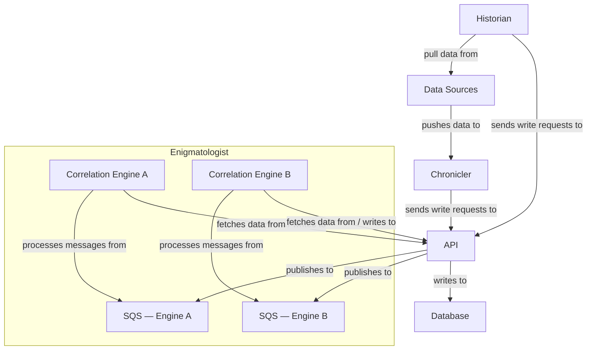
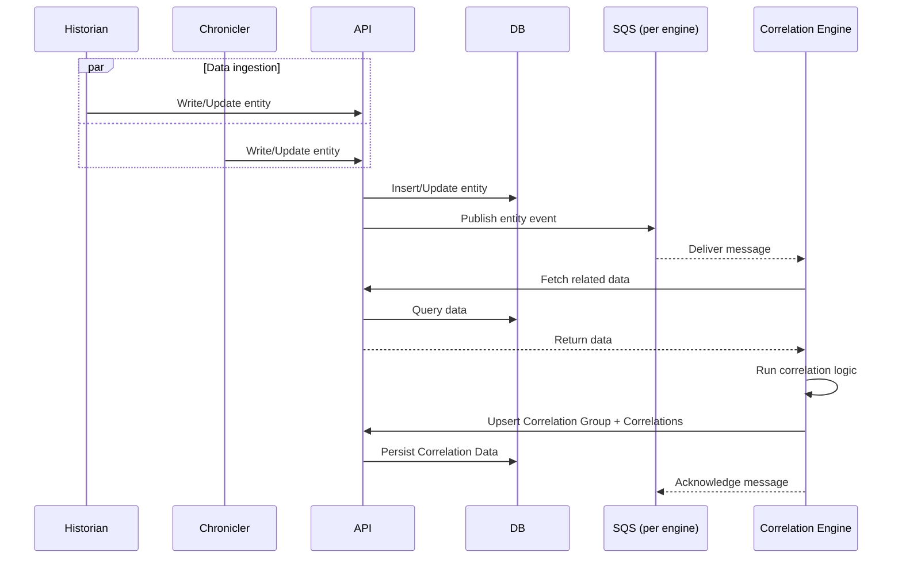

# Enigmatologist

## Overview

The Enigmatologist is Matik's correlation platform. It listens for events across the system and routes them through one or more **correlation engines** — each engine implements its own logic for linking related data, scoring confidence, and persisting results.

Each engine operates independently: each have their own data model, processing pipeline, and configuration.

## Correlation Engines

| Engine | Anchor | Description | Doc |
|--------|--------|-------------|-----|
| Reliability Correlation | Incident | Links incidents to related changes (GitHub PRs, Jira TCMRs) via service matching and LLM semantic correlation | [reliability-correlation.md](./reliability-correlation.md) |

## Diagram

> Note: Design will change post-MVP as we introduce more components. See [C4](https://lucid.app/lucidchart/6c6d807b-ca61-4be7-b571-897e35bd9712/edit?viewport_loc=-346%2C124%2C3590%2C2126%2C8B28vFlzfJx7&invitationId=inv_16bf17b0-a22f-4cdf-b908-9e90f06fc47c) for the post MVP diagram.

### Flow

### Sequence

## Infrastructure

### Message Delivery

Each correlation engine has its own dedicated SQS queue. The API publishes events to the appropriate queue when an entity is created or updated. Messages are only acknowledged after successful processing. Failed messages are returned to the queue after the visibility timeout and retried automatically.

Each queue has a paired dead-letter queue (DLQ). Messages that exceed the maximum receive count are moved to the DLQ for inspection and replay without blocking the main pipeline.
