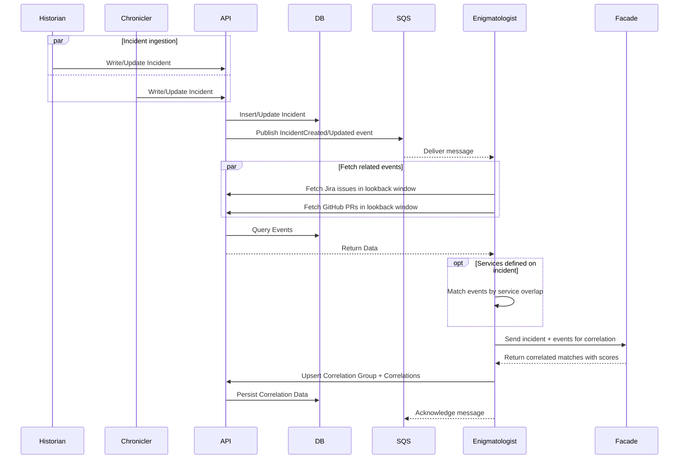

# Reliability Correlation

## Overview
The Reliability Correlator engine within Enigmatologist analyzes and links reliability data across systems—incidents, alerts, observability signals, job events, and related metadata—to construct causal event chains behind key reliability signals.

## Diagram

> Note: Design will change post-MVP as we introduce more components. See [C4](https://lucid.app/lucidchart/6c6d807b-ca61-4be7-b571-897e35bd9712/edit?viewport_loc=-346%2C124%2C3590%2C2126%2C8B28vFlzfJx7&invitationId=inv_16bf17b0-a22f-4cdf-b908-9e90f06fc47c) for the post MVP diagram.

### Sequence


## Data Model

The normalized design uses two core tables. The model is centered around
correlation grouping and relationships, with optional support for
confidence signals.

### 1. RELIABILITY_CORRELATION_GROUP

This table represents a correlation group as a whole. A correlation group is a
container for related events that are believed to be connected.

The group stores metadata and human feedback, which may influence how
individual correlations are interpreted.

#### Columns

| Column | Description |
|------|-------------|
| `id` | Auto-increment primary key |
| `anchor_entity_id` | Unique business key for the anchor entity (e.g., `INC-99`). No FK constraint — keeps the schema generic |
| `anchor_type` | Type of entity this group is anchored to (e.g., `incident`, `deployment`, `alert`) |
| `services` | Backstage (GreenRoom) service identifiers from the anchor entity. NULL when the anchor has no services defined. Set once at group creation |
| `start_time` | Earliest `start_time` across the group's correlations. Updated when correlations are added |
| `end_time` | Latest `end_time` across the group's correlations. Updated when correlations are added |
| `correlation_timestamp` | When the correlation group was created or last updated |
| `base_score` | Aggregated score computed from individual correlation `final_score` values: `min(avg(individual final_scores), 0.90)` |
| `final_score` | Score after applying user feedback. Defaults to `base_score` when `feedback_state` is `NEUTRAL` |
| `scoring_version` | Identifier for the scoring algorithm version used (e.g., `incident_v1`) |
| `feedback_list` | List of feedback received from users |
| `feedback_state` | High-level assessment of the group (`POSITIVE`, `NEUTRAL`, `NEGATIVE`) |
| `review_status` | Flag indicating whether the group has been reviewed |
| `last_reviewed_at` | Timestamp of the most recent review |
---

#### Example

| id | anchor_entity_id | anchor_type | services | start_time | end_time | correlation_timestamp | base_score | final_score | scoring_version | feedback_list | feedback_state | review_status | last_reviewed_at |
|----|------------------|-------------|----------|------------|----------|------------------------|------------|-------------|-----------------|---------------|----------------|---------------|------------------|
| 1 | INC-99 | incident | [service-checkout] | 2025-10-27 09:12 | 2025-10-27 10:04 | 2025-10-27 10:00 | 0.63 | 0.63 | incident_v1 | [] | NEUTRAL | false | NULL |
| 2 | INC-100 | incident | NULL | 2025-10-28 13:50 | 2025-10-28 14:30 | 2025-10-28 14:30 | 0.72 | 0.90 | incident_v1 | [{"user_id":"u3","value":"POSITIVE","timestamp":"2025-10-28T14:45:00Z"}] | POSITIVE | true | 2025-10-28 15:10 |


---

### 2. RELIABILITY_CORRELATION

This table captures individual correlations between a correlation group and external events. Each row represents one potential relationship.

#### Columns

| Column | Description |
|------|-------------|
| `id` | Auto increment id |
| `anchor_entity_id` | FK → `RELIABILITY_CORRELATION_GROUP.anchor_entity_id` |
| `correlation_type` | Why this correlation exists: `SERVICE_MATCH` (service overlap + time scoring) or `LLM` (semantic correlation via Facade) |
| `entity_type` | Type of correlated entity: `github_pr` (merged PR) or `jira_tcmr` (TCMR ticket). New types added as data sources are onboarded |
| `entity_id` | External identifier (e.g., `PR-1`, `TCMR-1`) |
| `services` | Affected services |
| `reasoning` | Human-readable explanation of why this correlation was made |
| `start_time` | Event start time (if applicable) |
| `end_time` | Event end time (if applicable) |
| `base_score` | Raw confidence score from the scoring path (time-based for service path, LLM-provided for LLM path) |
| `final_score` | Score after applying the path-specific cap (`base_score × SERVICE_SCORE_CAP` or `base_score × LLM_SCORE_CAP`) |
| `scoring_version` | Identifier for the scoring algorithm version used (e.g., `incident_v1`) |

---

#### Example

| id | anchor_entity_id | correlation_type | entity_type | entity_id | services | start_time | end_time | base_score | final_score | scoring_version |
|----|------------------|------------------|-------------|-----------|----------|-------------|-----------|-------------|--------------|-----------------|
| 1 | INC-99 | SERVICE_MATCH | github_pr | PR-1 | [service-checkout] | 2025-10-27 09:12 | 2025-10-27 09:35 | 1.00 | 0.90 | incident_v1 |
| 2 | INC-99 | SERVICE_MATCH | github_pr | PR-2 | [service-checkout] | 2025-10-27 09:20 | 2025-10-27 09:40 | 0.80 | 0.72 | incident_v1 |
| 3 | INC-99 | LLM | jira_tcmr | TCMR-1 | NULL | 2025-10-27 09:42 | 2025-10-27 10:04 | 0.70 | 0.42 | incident_v1 |


## Trigger

Correlation is triggered by `EnigmatologistCorrelationHook` (`matik/scribe/hooks/enigmatologist.py`), a Scribe post-write hook that publishes a `CorrelationRequest` to the Enigmatologist SQS queue. Two sources wire it in (`matik/scribe/main.py`), sharing the same hook instance:

- **`incidentio`** — fires on both base writes and enrichment writes (e.g. `root_cause_summary`/`description_summary` landing).
- **`incident_channel_summary`** (OpsBot's on-demand channel summary) — enrichment only, since this source has no base-write route.

Both sources declare `enrichment_hook_target="record"` in their `DataSourceSpec`, so the hook always receives the full, freshly re-fetched `IncidentIOIncident` row (via `record_finder`) regardless of which source triggered it — an OpsBot-triggered run can carry `description_summary` if Incident.io's own enrichment already populated it, and vice versa.

The Historian additionally queries Incident.io for incidents with `updated_at >= yesterday`, so any incident update flowing back through Scribe can re-trigger correlation, keeping correlations up to date as incidents evolve.

## Processing Pipeline

Correlation runs as a LangGraph state graph with the following node sequence:

1. **Fetch Jira issues** — queries the API for TCMRs within the Jira lookback window
2. **Fetch GitHub PRs** — queries the API for merged PRs within the GitHub lookback window
3. **Conditional routing** — if the incident has affected services defined, take the service path; otherwise skip to the LLM path
4. **Service path** — filter events by exact service overlap, then score by temporal proximity
5. **LLM path** — send the incident description (plus the OpsBot channel summary, when present) and remaining events to Facade for semantic correlation. Results are post-filtered to remove low-confidence and speculative matches
6. **Score** — apply path-specific caps to individual correlations
7. **Group** — merge all correlations into a single group with an aggregated score

When affected services exist, both the service path and LLM path run. When no services are defined, only the LLM path runs.

## Correlation Rules

Correlation uses two complementary paths:

- **Service path** — exact Backstage service overlap between the incident and candidate events, scored by temporal proximity
- **LLM path** — semantic correlation via Facade, where the LLM identifies which events are plausibly related to the incident and provides a confidence score

### Lookback Windows

Each data source has a fixed lookback window measured from the incident creation time. Only events within the window are candidates for correlation.

| Source | Default Lookback | Notes |
|--------|-----------------|-------|
| GitHub PRs | 6 hours | Merged PRs only |
| Jira TCMRs | 24 hours | Broader window due to slower TCMR lifecycle |

Lookback windows are configurable per environment.

## Service Matching

Services are not uniformly defined across data sources. For consistency, Backstage (GreenRoom) is treated as the source of truth for service identity.

### Incident.io

Incident.io incidents already include service metadata that maps directly to Backstage. As a result, no additional service resolution or mapping is required for this data source.

### BizTech GitHub

We leverage data produced by the [_infra indexer](https://github.airbnb.biz/Airbnb-ITX/infra_indexer/tree/master) as the source of truth for mapping pull request merges to repositories. This is especially important for mono-repos.

### BizTech Jira

Jira maintains its own internal list of services for TCMRs, which does not directly align with Backstage. To resolve this, we will either:
- Derive the service from PRs linked to the TCMR, or
- Maintain an explicit mapping from Jira services to their Backstage equivalents


> Note: Going forward, any new data source must be able to map events to a Backstage service before being onboarded.

## Scoring

Scoring is applied at two levels: individual correlations and the correlation group. Each level stores `base_score`, `final_score`, and `scoring_version`.

### Scoring Version

Every scored correlation and group is tagged with a `scoring_version` (e.g., `incident_v1`). This allows the system to track which algorithm produced a given score and makes it possible to re-score historical data when the algorithm changes.

### Individual Correlation Score

Each correlation has its own `base_score` and `final_score`. The scoring method depends on which path produced the correlation.

- **`base_score`** — Raw score from the scoring path (time-based or LLM-provided).
- **`final_score`** — Score after applying the path-specific cap: `base_score × cap`.
- **`scoring_version`** — The version of the scoring algorithm that produced the scores.

#### Service Path (service-matched correlations)

When affected services are defined on the incident, correlations are matched by service. These correlations are scored by temporal proximity to the incident.

| Time Difference | `base_score` | Description |
|-----------------|--------------|-------------|
| ≤ 30 minutes | 1.00 | Very strong signal |
| 30–60 minutes | 0.80 | Strong signal |
| 1–2 hours | 0.60 | Moderate signal |
| 2–4 hours | 0.40 | Weak signal |
| 4–8 hours | 0.20 | Very weak signal |
| 8–16 hours | 0.15 | Minimal signal |
| 16–24 hours | 0.10 | Lowest signal |

Events beyond 24 hours receive the lowest tier score.

`final_score = base_score × 0.90` (SERVICE_SCORE_CAP)

#### LLM Path (semantic correlations)

When no services are defined, or in addition to service-matched correlations, the LLM (via Facade) identifies which events are plausibly related to the incident and returns a confidence score for each. The LLM-provided score becomes `base_score`.

Results are post-filtered before scoring: matches below a minimum confidence threshold are dropped, and matches whose reasoning contains speculative language are removed.

`final_score = base_score × 0.60` (LLM_SCORE_CAP)

#### Score Caps

| Path | Cap | Rationale |
|------|-----|-----------|
| Service | 0.90 | Service match + temporal proximity is high-signal but never certain |
| LLM | 0.60 | Semantic matching is useful but less reliable than service matching |

### Correlation Group Score

A correlation group aggregates all individual correlations for an incident into a single scored container. When a correlation re-runs (e.g., because the incident was updated), existing correlations are fetched from the API and merged with new results before recomputing group-level fields.

- **`base_score`** — `min(avg(individual final_scores), 0.90)`. The average of all individual `final_score` values, capped at 0.90 (GROUP_SCORE_CAP).
- **`final_score`** — Adjusted by user feedback. Defaults to `base_score` when feedback is `NEUTRAL`.
- **`scoring_version`** — The version of the scoring algorithm that produced the scores.

### User Feedback

> Note: User feedback is defined in the data model and scoring spec but is not yet implemented in code. The schema supports it; the application logic will be added in a future iteration.

User feedback is captured at the **correlation group** level. Users do not provide feedback on individual correlations.

Feedback is recorded as individual events (one per user). `Feedback_State` is derived from the majority of the most recent votes per user.

#### Feedback State Rules

Let:

- **P** = number of positive votes
- **N** = number of negative votes

Then:

- If **P > N** → `POSITIVE`
- If **N > P** → `NEGATIVE`
- If **P = N** or no votes → `NEUTRAL`

`Feedback_State` is recalculated whenever feedback changes.

---

| Feedback State | Description |
|----------------|------------|
| POSITIVE | Majority of users rated the correlation group as helpful or accurate |
| NEUTRAL  | No votes, or equal number of positive and negative votes |
| NEGATIVE | Majority of users rated the correlation group as incorrect or unhelpful |

#### How Feedback Affects Group Score

Group `final_score` is recomputed from `base_score` whenever feedback changes:

| Feedback State | Effect on `final_score` |
|----------------|--------------------------|
| **NEUTRAL** | No change (`final_score = base_score`) |
| **POSITIVE** | Boost confidence (`final_score = min(base_score × 1.30, 0.98)`) |
| **NEGATIVE** | Reduce confidence (`final_score = min(base_score × 0.70, 0.98)`) |

- `base_score` is never modified by feedback
- `final_score` is recomputed whenever `Feedback_State` changes
- Scores are capped at 0.98 to avoid implying certainty

#### Example

Group with `base_score = 0.72`:

```
NEUTRAL  → final_score = 0.72
POSITIVE → final_score = min(0.72 × 1.30, 0.98) = 0.94
NEGATIVE → final_score = min(0.72 × 0.70, 0.98) = 0.50
```

## Error Handling

Correlation processing is performed asynchronously via SQS. Messages are only acknowledged and removed from the queue after successful processing. If processing fails, the message is returned to the queue after the visibility timeout and retried automatically.

A dead-letter queue (DLQ) will be configured for the SQS. Messages that exceed the configured maximum receive count without successful processing are automatically moved to the DLQ for inspection and remediation. This prevents poison messages from blocking the main processing pipeline while preserving failed messages for debugging or replay.

## Evaluation

Weekly evaluation of correlation quality is tracked in a shared Google Sheet. See:
- [Evaluation process](./evaluation.md) — how to do an evaluation
