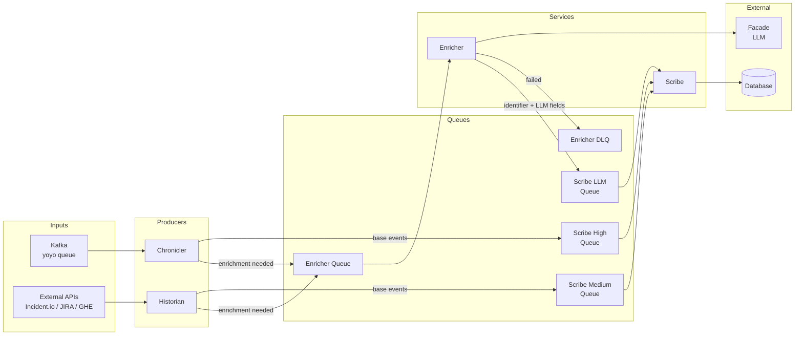
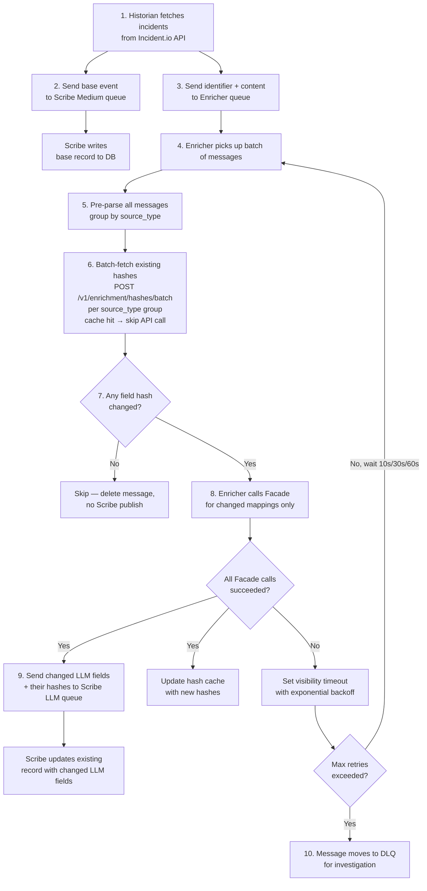

# Enricher Service Architecture

**Status:** Draft

> **Note:** Incident.io is used as the example data source throughout this document. All sources share the same `EnrichmentRequest` model — only the `source_type` value, prompt config, and expected `content`/`entity_id` keys differ per source.

## Overview

The Enricher is a dedicated service that handles all LLM enrichment for matik, decoupling the Historian and Chronicler from Facade calls and centralizing prompt management. Both services act as producers to the Enricher queue:

- **Historian** batch-crawls external APIs (Incident.io, JIRA, GHE) on a scheduled basis to ingest historical data.
- **Chronicler** consumes from the Kafka **yoyo queue** (owned and operated by prodeng) to process real-time webhook events as they arrive.

### Goals

1. **Decoupling for reliability** - Historian and Chronicler complete quickly without waiting on slow LLM calls; enrichment happens asynchronously
2. **Centralized prompt management** - One place to update prompts, models, and enrichment logic instead of scattered across services
3. **Unified write path** - Scribe is the sole database writer, consuming from three priority queues: High (real-time), Medium (historical), LLM (enrichment)

### Supported Data Sources

| Source | Raw Input (not persisted) | LLM Output (persisted via Scribe) | Hash Fields (Enricher-computed) |
|--------|--------------------------|----------------------------------|----------------------------------|
| Incident.io | `summary`, `resolution_statement` | `root_cause_summary`, `resolution_summary` | `root_cause_summary_hash`, `description_hash`, `resolution_hash` |
| GHE PRs | `original_description` (PR body) | `pull_request_summary` | `description_hash` |
| JIRA | `issue_description`, `aggregated_comments` | `issue_summary`, `issue_comments_summary` | `summary_hash`, `comments_hash` |

Raw source content is sent to the enricher in the message `content` field for LLM processing but is never persisted to the database. Only the LLM-generated output and the Enricher-computed hashes are written via Scribe. Producers no longer compute or send hashes — the Enricher fetches existing hashes from the DB via the API, computes new hashes from the incoming content, and skips mappings whose hashes are unchanged.

## Architecture

### High-Level Flow



**Write paths:**
- **Real-time base events:** Kafka (yoyo) → Chronicler → Scribe High queue → Scribe → DB
- **Historical base events:** External APIs → Historian → Scribe Medium queue → Scribe → DB
- **LLM enrichment:** Historian/Chronicler → Enricher queue → Enricher → Facade → Scribe LLM queue → Scribe → DB

Producers send all content to the Enricher without pre-computing hashes. After each SQS poll, the Enricher pre-parses all messages and makes one batch API call per source_type group (`POST /v1/enrichment/hashes/batch`) to fetch existing hashes up front, rather than one call per message. An in-memory TTL cache (`HashCache`) serves repeated lookups for the same entity within its TTL (default 300s), further reducing API and DB load. The Enricher computes new hashes from the incoming content and skips mappings whose hashes are all unchanged. If all mappings are skipped, no Scribe message is published. Records already exist in the DB when the Enricher processes them (Chronicler publishes to Scribe High queue before Enricher queue; Historian publishes to Scribe Medium queue before Enricher queue).

### Key Decisions

| Aspect | Decision | Rationale |
|--------|----------|-----------|
| Record identification | Source-specific unique identifiers | Used by Scribe to look up and upsert records (e.g., incident_id, issue_key, org_id/repo_id/pr_id) |
| Enricher message content | Identifier + content for LLM (no hash) | Minimal payload; record already exists in DB |
| Enricher output to Scribe | Identifier + changed LLM fields + their hashes | Scribe updates existing records; only changed fields + their hashes are written |
| DB writes | Via Scribe (no direct DAO) | Scribe is the sole writer to the database |
| Hash computation | In Enricher (via `POST /v1/enrichment/hashes` + SHA256) | Centralizes hash logic; producers stay simple; per-field granularity |
| Failure handling | All-or-nothing with SQS retry | Matches existing pattern, simpler implementation |
| Concurrency | Per-pod semaphore | Simple to reason about, scales linearly with replicas |
| Publishing | Generic SQS client + Pydantic models | Models serve as contract, reusable for validation |
| Prompt configuration | Environment variables / config | Matches existing patterns, simple deployment |
| Hash computed by Enricher | Enricher fetches + computes + compares hashes internally | Producers stay simple (no DB reads, no hash logic); per-field granularity; centralized in one service |
| Batch hash fetching | Pre-parse messages after each SQS poll; one `POST /v1/enrichment/hashes/batch` call per source_type group instead of N individual calls | Reduces DB load from O(messages) to O(source_types) per poll cycle; falls back to parallel individual calls if batch endpoint unavailable |
| In-memory hash cache | `HashCache` with configurable TTL (default 300s) and max size (default 10,000 entries) | Eliminates redundant API calls for the same entity within TTL — critical during retries and high-churn periods; lazy expiry and 10% LRU eviction on capacity |

## SQS Queues

Five SQS queues support the full architecture:

| Queue | Producer(s) | Consumer | Priority | Purpose |
|-------|------------|---------|----------|---------|
| `matik-scribe-high` | Chronicler | Scribe | High | Real-time base events from Kafka webhooks |
| `matik-scribe-medium` | Historian | Scribe | Medium | Bulk historical base events from API crawls |
| `matik-scribe-llm` | Enricher | Scribe | Low | LLM-enriched fields written back to existing records |
| `matik-enricher` | Historian, Chronicler | Enricher | — | Content needing LLM summarization |
| `matik-enricher-dlq` | SQS (auto) | Manual redrive | — | Failed enrichment messages (non-retryable or max retries exceeded) |

Scribe consumes all three write queues in priority order: High > Medium > LLM. This ensures real-time Chronicler events are not starved by large historical backfills from the Historian.

## Message Models

**Location:** `matik/common/models/enricher_messages.py`

The `source_type` field serves as the discriminator for message routing. Each source type has a fixed set of enrichments — if a message is on the queue, all enrichments for that source are performed. No `enrichments` field is needed.

```python
from typing import Literal

from pydantic import BaseModel, Field


class EnrichmentRequest(BaseModel):
    """Generic enrichment request for all data sources."""

    source_type: str = Field(
        ..., description="Data source discriminator (e.g. 'incidentio', 'ghe_pr', 'jira')"
    )
    producer: Literal["historian", "chronicler"] = Field(
        ..., description="Service that produced this request (for observability)"
    )
    task_id: str = Field(
        ..., description="Unique task ID for distributed tracing across producer → Enricher → Scribe"
    )
    entity_id: dict = Field(
        ..., description="Source-specific record identifier keys (see Entity ID table below)"
    )
    content: dict = Field(
        ..., description="Raw text fields for LLM processing — never persisted to the database"
    )
```

A single `EnrichmentRequest` model handles all data sources. The `source_type` string acts as a routing key — the Enricher uses it to select the correct prompt config and handler. Producers no longer compute or send hashes.

- **`entity_id`** — the record identifier keys passed through unchanged to Scribe so it can find and update the right DB record.
- **`content`** — the raw text fields the LLM processes. Never persisted; only the LLM output is stored. The Enricher computes SHA256 hashes of these fields internally.

The `producer` field (`"historian"` or `"chronicler"`) enables filtering enricher metrics and logs by source. The `task_id` is a unique ID generated by the producer that enables end-to-end distributed tracing across producer → Enricher → Scribe.

> **Scribe message format:** Messages published to the Scribe queues use a nested envelope structure with `source_type`, `write_type`, `entity_id`, and either `updates`/`hashes` (enrichment) or domain fields (base). The `write_type` field (`"base"` or `"enrichment"`) determines the DB operation: base messages trigger a full UPSERT; enrichment messages trigger a partial UPDATE of LLM fields only. See [Scribe Integration](#scribe-integration) for details.

### Entity ID Keys

Expected keys per source type — `entity_id` is passed through unchanged to Scribe; `content` keys feed the LLM. Hash fields are Enricher-computed and configured via `hash_fields` in each `SourceMappingEntry`.

| `source_type` | `entity_id` keys | `content` keys |
|---------------|-----------------|----------------|
| `incidentio` | `incident_id` (str) | `summary`, `resolution_statement` |
| `ghe_pr` | `org_id` (int), `repository_id` (int), `pull_request_id` (int) | `original_description` |
| `jira` | `issue_key` (str) | `issue_description`, `aggregated_comments` |

GHE PRs use a composite `entity_id` because no single field uniquely identifies a PR across the GitHub Enterprise instance. JIRA content keys can change independently — each has its own DB hash column configured in `hash_fields`.

### Enrichments per Source

| `source_type` | LLM enrichments | LLM output fields |
|---------------|----------------|-------------------|
| `incidentio` | root_cause + resolution | `root_cause_summary`, `resolution_summary` |
| `ghe_pr` | pr_summary | `pull_request_summary` |
| `jira` | issue_summary + comments_summary | `issue_summary`, `issue_comments_summary` |

## Service Structure

**Location:** `matik/enricher/`

```
matik/enricher/
├── __init__.py
├── __main__.py          # Entry point: asyncio.run(main())
├── main.py              # Error classes, backoff, consumer loop, bootstrap
├── processor.py         # Message parsing/routing (raises MalformedMessageError)
├── hash_cache.py        # In-memory TTL cache for entity hashes
└── handlers/
    ├── __init__.py
    └── enrichment_handler.py  # Single generic handler — all source types

matik/common/models/
├── enricher_messages.py       # EnrichmentRequest model
└── enricher_config.py         # EnricherConfig + SourceMappingEntry

matik/common/queues/
└── sqs_client.py              # Async boto3 SQS wrapper
```

**Additional file:** `matik/common/metrics/enricher_metrics.py` - Enricher-specific metrics (see [Observability](#observability))

### Retry Backoff

On failure, the enricher uses SQS visibility timeout to implement exponential backoff with jitter:

| Retry | Base Delay | With Jitter (±20%) |
|-------|------------|-------------------|
| 1     | 10s        | 8-12s             |
| 2     | 30s        | 24-36s            |
| 3+    | 60s (max)  | 48-72s            |

```python
import random

# Backoff sequence: 10s, 30s, 60s (max)
BACKOFF_DELAYS = [10, 30, 60]


def compute_backoff_with_jitter(receive_count: int) -> int:
    """
    Compute visibility timeout with exponential backoff and jitter.

    Args:
        receive_count: Number of times message has been received (1-based)

    Returns:
        Visibility timeout in seconds
    """
    # receive_count is 1-based; index into delays (capped at max)
    index = min(receive_count - 1, len(BACKOFF_DELAYS) - 1)
    base_delay = BACKOFF_DELAYS[index]

    # Add ±20% jitter to prevent thundering herd
    jitter = random.uniform(-0.2, 0.2)
    return int(base_delay * (1 + jitter))
```

When a message fails processing, SQS makes it invisible for a period before re-delivering it. This function computes that invisibility period. The `receive_count` is provided by SQS and increments each time the message is delivered. It indexes into the `BACKOFF_DELAYS` list to get the base delay, capping at 60 seconds for the third attempt onward. The ±20% jitter randomizes the exact delay so that if many messages fail simultaneously (e.g., during a Facade outage), they do not all retry at the same instant and overwhelm the LLM service.

### Main Loop

```python
from common.clients.facade_client import FacadeBadRequestError


class NonRetryableError(Exception):
    """Errors that should go directly to DLQ without retry."""
    pass


class MalformedMessageError(NonRetryableError):
    """Message failed to parse."""
    pass


class ContentFilteredError(NonRetryableError):
    """LLM response was filtered due to content policy violation.

    Raised when Facade returns finish_reason="content_filter" (HTTP 200).
    The same input will always trigger the same filter, so retrying is futile.
    """
    pass


async def run_consumer_loop(
    config: MatikConfig,
    sqs_client: SQSClient,
    processor: EnricherProcessor,
    enricher_metrics: EnricherMetrics | None,
    shutdown_event: asyncio.Event,
    handler: EnrichmentHandler | None = None,
):
    """Main SQS consumer loop with pre-parse + batch-fetch phase."""
    semaphore = asyncio.Semaphore(enricher_cfg.max_concurrent_llm_calls)

    while not shutdown_event.is_set():
        messages = await sqs_client.receive_messages(
            queue_url=enricher_cfg.enricher_queue_url,
            max_messages=enricher_cfg.sqs_max_messages,
            wait_time_seconds=enricher_cfg.sqs_wait_time_seconds,
            visibility_timeout=enricher_cfg.visibility_timeout_seconds,
        )

        if not messages:
            continue

        # --- Pre-parse + batch-fetch phase ---
        # Pre-parse all messages before dispatching tasks so that valid messages
        # can share a single batch API call for existing hashes (one call per
        # source_type group instead of N individual calls).
        parsed: list[tuple[dict, EnrichmentRequest | None]] = []
        for message in messages:
            body = message.get("Body", "")
            try:
                request = EnrichmentRequest.model_validate(json.loads(body))
                if request.source_type not in enricher_cfg.source_mappings:
                    raise ValueError(f"Unknown source_type '{request.source_type}'")
                parsed.append((message, request))
            except Exception:
                parsed.append((message, None))  # handled as MalformedMessageError in _process

        parseable = [req for _, req in parsed if req is not None]
        prefetched: dict[str, dict] = {}
        if parseable and handler is not None:
            try:
                prefetched = await handler.batch_fetch_hashes(parseable)
            except Exception:
                logger.warning("Batch hash fetch failed, will fetch individually")
                prefetched = {}

        # --- Dispatch individual tasks ---
        for message, request in parsed:
            receipt_handle = message["ReceiptHandle"]
            body = message.get("Body", "")
            receive_count = int(message.get("Attributes", {}).get("ApproximateReceiveCount", "1"))
            pre_hashes = prefetched.get(json.dumps(request.entity_id, sort_keys=True)) if request else None

            async def _process(body=body, receipt_handle=receipt_handle,
                                receive_count=receive_count, request=request,
                                pre_hashes=pre_hashes):
                async with semaphore:
                    try:
                        if request is not None and handler is not None:
                            await handler.enrich(request, existing_hashes=pre_hashes)
                        else:
                            await processor.process(body)   # raises MalformedMessageError -> DLQ
                        await sqs_client.delete_message(
                            queue_url=enricher_cfg.enricher_queue_url,
                            receipt_handle=receipt_handle,
                        )

                    except (NonRetryableError, FacadeBadRequestError) as err:
                        await sqs_client.send_message(
                            queue_url=enricher_cfg.enricher_dlq_url, message_body=body
                        )
                        await sqs_client.delete_message(
                            queue_url=enricher_cfg.enricher_queue_url,
                            receipt_handle=receipt_handle,
                        )
                        if enricher_metrics:
                            enricher_metrics.record_dlq(source_type, err)

                    except Exception as err:
                        backoff = compute_backoff_with_jitter(receive_count)
                        await sqs_client.change_message_visibility(
                            queue_url=enricher_cfg.enricher_queue_url,
                            receipt_handle=receipt_handle,
                            visibility_timeout=int(backoff),
                        )
                        if enricher_metrics:
                            enricher_metrics.record_backoff(source_type, receive_count)

            asyncio.create_task(_process())
```

The consumer loop introduces a **two-phase design** per poll cycle:

**Phase 1 — Pre-parse + batch-fetch:** All messages from the poll are parsed upfront. Parseable messages are grouped by `source_type` and a single `handler.batch_fetch_hashes()` call is made per group (one `POST /v1/enrichment/hashes/batch` API call per source_type, down from N individual calls). Unparseable messages are flagged for the fallback path. If `batch_fetch_hashes()` itself fails (e.g., API outage), the loop continues with empty pre-fetched hashes — each task will fall back to `_fetch_existing_hashes()` which checks the in-memory cache before calling the API.

**Phase 2 — Task dispatch:** Each message is dispatched as an `asyncio.Task` behind the semaphore. Pre-parsed messages call `handler.enrich(request, existing_hashes=pre_hashes)` directly — skipping re-parsing and using the pre-fetched hashes. Unparseable messages fall back to `processor.process(body)` which raises `MalformedMessageError` → DLQ.

Error classification is unchanged: non-retryable errors (malformed, content filtered, bad request) are forwarded to the DLQ and deleted; retryable errors trigger `change_message_visibility` with exponential backoff; successes delete the message.

### Handler Pattern

The Enricher uses a **single generic handler** (`EnrichmentHandler`) for all source types. There are no per-source handler classes. All enrichment logic — which content keys to read, what prompt to use, what output field to produce — is driven by `source_mappings` in the kubegen YAML config. **Adding a new source type or enrichment operation requires zero code changes.**

At init time, `EnrichmentHandler` pre-compiles all system prompts by iterating `config.source_mappings` and calling `config.build_prompt(entry.prompt)` for each `SourceMappingEntry`. The result is stored in `_compiled_mappings` so there is no per-message string formatting overhead.

```python
class EnrichmentHandler:
    def __init__(
        self,
        facade_client: FacadeClient,
        sqs_client: SQSClient,
        config: EnricherConfig,
        enricher_metrics: EnricherMetrics | None = None,
        matik_api_client: MatikApiClient | None = None,
        hash_cache: HashCache | None = None,
    ):
        self._facade = facade_client
        self._sqs_client = sqs_client
        self._config = config
        self._metrics = enricher_metrics
        self._matik_api_client = matik_api_client
        self._hash_cache = hash_cache

        # Pre-compile all system prompts at init: {source_type: [(mapping, full_prompt), ...]}
        self._compiled_mappings: dict[str, list[tuple[SourceMappingEntry, str]]] = {
            source_type: [(m, config.build_prompt(m.prompt)) for m in mappings]
            for source_type, mappings in config.source_mappings.items()
        }

    async def batch_fetch_hashes(
        self, requests: list[EnrichmentRequest],
    ) -> dict[str, dict]:
        """Batch-fetch hashes for multiple requests, using cache then API.

        Groups cache misses by source_type and makes one batch API call per group.
        Returns dict keyed by canonical entity_id JSON string -> hash dict.
        """
        results: dict[str, dict] = {}
        cache_misses: dict[str, list[dict]] = {}

        for req in requests:
            canon_key = json.dumps(req.entity_id, sort_keys=True)
            if self._hash_cache is not None:
                cached = self._hash_cache.get(req.source_type, req.entity_id)
                if cached is not None:
                    results[canon_key] = cached
                    continue
            cache_misses.setdefault(req.source_type, []).append(req.entity_id)

        # One batch API call per source_type for cache misses
        for source_type, entity_ids in cache_misses.items():
            fetched = await self._batch_fetch_from_api(source_type, entity_ids)
            for eid in entity_ids:
                canon_key = json.dumps(eid, sort_keys=True)
                hashes = fetched.get(canon_key, {})
                results[canon_key] = hashes
                if self._hash_cache is not None:
                    self._hash_cache.put(source_type, eid, hashes)

        return results

    async def _batch_fetch_from_api(
        self, source_type: str, entity_ids: list[dict],
    ) -> dict[str, dict]:
        """Call POST /v1/enrichment/hashes/batch for one source_type.

        Falls back to parallel individual calls if batch endpoint is unavailable.
        """
        if self._matik_api_client is None:
            return {}
        try:
            response_bytes = await asyncio.to_thread(
                self._matik_api_client.post_json_request,
                "/v1/enrichment/hashes/batch",
                {"source_type": source_type, "entity_ids": entity_ids},
            )
            return json.loads(response_bytes).get("results", {})
        except Exception:
            logger.warning("Batch hash fetch failed, falling back to parallel single calls")
            # Fallback: parallel individual calls via asyncio.gather
            results_list = await asyncio.gather(
                *[self._fetch_existing_hashes(source_type, eid) for eid in entity_ids],
                return_exceptions=True,
            )
            return {
                json.dumps(eid, sort_keys=True): h
                for eid, h in zip(entity_ids, results_list)
                if isinstance(h, dict)
            }

    async def enrich(
        self,
        request: EnrichmentRequest,
        existing_hashes: dict | None = None,
    ) -> None:
        """Process enrichment mappings, skipping fields whose hashes are unchanged.

        When existing_hashes is provided (pre-fetched by batch_fetch_hashes),
        the individual API call is skipped. After a Scribe publish, updates the
        hash cache with the newly computed hashes.
        """
        compiled = self._compiled_mappings[request.source_type]

        # Compute per-field hashes from content (keyed by input_key)
        all_input_keys = {k for m, _ in compiled for k in m.input_keys}
        field_hashes: dict[str, str | None] = {
            key: generate_string_hash(val) if (val := request.content.get(key, "")) else None
            for key in all_input_keys
        }

        # Use pre-fetched hashes if provided, otherwise fetch individually
        if existing_hashes is None:
            existing_hashes = await self._fetch_existing_hashes(
                request.source_type, request.entity_id
            )

        results: dict[str, str | None] = {}
        changed_hashes: dict[str, str] = {}

        for mapping, full_prompt in compiled:
            # Skip mapping only if ALL its input key hashes match existing
            all_match = all(
                field_hashes[k] is not None
                and field_hashes[k] == existing_hashes.get(mapping.hash_fields[k])
                for k in mapping.input_keys
            )
            if all_match:
                continue

            result = await self._call_facade(
                full_prompt, request.content, mapping.input_keys,
                mapping.output_field, request.source_type,
            )
            results[mapping.output_field] = result

            # Collect hashes keyed by configured DB column names
            for k in mapping.input_keys:
                if field_hashes[k] is not None:
                    changed_hashes[mapping.hash_fields[k]] = field_hashes[k]

        if not results:
            return  # All hashes match — nothing to publish

        scribe_message = {
            "source_type": request.source_type,
            "write_type": "enrichment",
            "entity_id": request.entity_id,
            "updates": results,
            "hashes": changed_hashes,
        }
        await self._sqs_client.send_message(
            queue_url=self._config.scribe_llm_queue_url,
            message_body=json.dumps(scribe_message),
        )

        # Update cache with newly computed hashes after successful publish
        if self._hash_cache is not None and changed_hashes:
            self._hash_cache.update(request.source_type, request.entity_id, changed_hashes)

    async def _fetch_existing_hashes(self, source_type: str, entity_id: dict) -> dict:
        """Check cache then call POST /v1/enrichment/hashes; return {} on any error."""
        if self._hash_cache is not None:
            cached = self._hash_cache.get(source_type, entity_id)
            if cached is not None:
                return cached
        if self._matik_api_client is None:
            return {}
        try:
            response_bytes = await asyncio.to_thread(
                self._matik_api_client.post_json_request,
                "/v1/enrichment/hashes",
                {"source_type": source_type, "entity_id": entity_id},
            )
            return json.loads(response_bytes)
        except Exception:
            logger.warning("Failed to fetch existing hashes, proceeding with full enrichment")
            return {}
```

`batch_fetch_hashes()` is called once per poll cycle (before dispatching individual tasks), grouping all requests from a single SQS poll by source_type and making one `POST /v1/enrichment/hashes/batch` call per group instead of N individual calls. Cache hits short-circuit the API entirely. The batch endpoint response is keyed by `json.dumps(entity_id, sort_keys=True)` — missing/new entities return `{}`. On batch endpoint failure (e.g., not yet deployed), it falls back to parallel individual `POST /v1/enrichment/hashes` calls via `asyncio.gather`, which already provides latency improvement over the prior sequential per-message fetching.

`enrich()` accepts an optional `existing_hashes` dict — when pre-fetched by `batch_fetch_hashes()`, the individual `_fetch_existing_hashes()` call is skipped entirely. After a successful Scribe publish, `hash_cache.update()` merges the newly computed hashes back into the cache so the next poll cycle hits the cache for this entity. `_fetch_existing_hashes()` is still used as the fallback path (when `enrich()` is called without pre-fetched hashes) and also checks the cache first.

`_call_facade()` handles three error paths: `FacadeContentFilteredError` is wrapped as `ContentFilteredError` (a `NonRetryableError` subclass) so the consumer loop routes it to the DLQ — the same prompt will always be blocked, so retrying wastes quota. `FacadeBadRequestError` propagates directly as another non-retryable error. All other exceptions propagate as retryable errors for the consumer loop to apply backoff. If the hash API fails, `_fetch_existing_hashes()` returns `{}` so all mappings are processed as the safe default.

## Configuration

**Location:** `matik/common/models/enricher_config.py`

```python
from sqlmodel import Field, SQLModel


class SourceMappingEntry(SQLModel):
    """A single enrichment mapping for a given source type."""

    input_keys: list[str] = Field(
        ...,
        description="Content keys from EnrichmentRequest.content to combine as LLM input. "
                    "Multiple keys are concatenated with labeled sections.",
    )
    output_field: str = Field(
        ...,
        description="Field name for the LLM output in the outbound Scribe message. "
                    "Also used as the operation label in Facade and metrics.",
    )
    prompt: str = Field(
        ...,
        description="Source-specific instructions substituted into general_prompt "
                    "via the {source_instructions} placeholder.",
    )
    hash_fields: dict[str, str] = Field(
        ...,
        description="Maps each input_key to its DB hash column name. "
                    "Used by the Enricher to store and compare per-field content hashes. "
                    "Keys must correspond to entries in input_keys.",
    )


class EnricherConfig(SQLModel):
    """Configuration for the Enricher service."""

    # SQS Configuration
    enricher_queue_url: str = Field(..., description="Enricher input queue URL")
    enricher_dlq_url: str = Field(..., description="Enricher dead letter queue URL")
    scribe_llm_queue_url: str = Field(..., description="Scribe LLM queue URL (Enricher writes here)")
    sqs_queue_region: str | None = Field(default=None, description="AWS region; defaults to us-east-1")
    sqs_max_messages: int = Field(default=10, description="Max messages per SQS receive call")
    sqs_wait_time_seconds: int = Field(default=20, description="Long-poll wait time in seconds")
    sqs_poll_error_delay: int = Field(default=5, description="Seconds to sleep after an SQS poll error")

    # Concurrency
    max_concurrent_llm_calls: int = Field(default=20, description="Global Facade concurrency cap")
    visibility_timeout_seconds: int = Field(default=300, description="SQS visibility timeout while processing")

    # Hash cache
    hash_cache_ttl_seconds: int = Field(default=300, description="TTL for in-memory hash cache entries")
    hash_cache_max_size: int = Field(default=10000, description="Max entries in in-memory hash cache")

    # LLM prompt configuration
    general_prompt: str = Field(
        ...,
        description="General system prompt template with {source_instructions} placeholder. "
                    "Common rules (PII scrubbing, output format) live here.",
    )
    source_mappings: dict[str, list[SourceMappingEntry]] = Field(
        ...,
        description="Per-source_type list of enrichment mappings. "
                    "Keys must match source_type values in EnrichmentRequest. "
                    "Adding a new source type requires only a config change — no code.",
    )

    def build_prompt(self, source_instructions: str) -> str:
        """Build a complete system prompt by substituting source-specific instructions."""
        return self.general_prompt.format(source_instructions=source_instructions)

    @property
    def region(self) -> str:
        """Resolved AWS region, falling back to us-east-1."""
        return self.sqs_queue_region or "us-east-1"
```

The configuration model has two layers. `EnricherConfig` holds all infrastructure settings (SQS URLs, concurrency, region) and the `general_prompt` template containing common rules (PII scrubbing, output format). `source_mappings` replaces the earlier per-source prompt fields — it is a dict keyed by `source_type` where each value is a list of `SourceMappingEntry` objects. Each entry fully describes one enrichment: which content keys to read (`input_keys`), what to name the output field (`output_field`), and the source-specific LLM instructions (`prompt`).

`build_prompt()` substitutes an entry's `prompt` into the `general_prompt` template at handler init time. Updating a shared rule (e.g., PII scrubbing) only requires changing `general_prompt`; it propagates to all sources automatically. **Adding a new source type or new enrichment operation is a config-only change** — no code changes are needed anywhere in the Enricher.

### Prompt Structure

The general prompt contains all common elements and a `{source_instructions}` placeholder for source-specific behavior:

**Common elements (in general prompt):**
- PII scrubbing rules (email, phone, names, IP addresses, SSN/employee IDs, etc.)
- Output format (plain string only)
- Summary format (single paragraph, plain text, no markdown/bullets/formatting)

**Source-specific elements (one `SourceMappingEntry.prompt` per enrichment, substituted via `{source_instructions}`):**

| `source_type` | `output_field` | `input_keys` | Role |
|---|---|---|---|
| `incidentio` | `root_cause_summary` | `["summary"]` | Root cause extractor, focus on root cause and effect only |
| `incidentio` | `resolution_summary` | `["summary", "resolution_statement"]` | Resolution summarizer, captures the resolution described |
| `ghe_pr` | `pull_request_summary` | `["original_description"]` | PR analyzer, captures main purpose and key changes |
| `jira` | `issue_summary` | `["issue_description"]` | Issue analyzer, captures key problem/request/change |
| `jira` | `issue_comments_summary` | `["aggregated_comments"]` | Comments analyzer, captures key themes and outcomes |

### YAML Config

All enricher configuration is loaded from `matik-enricher-config.yml` (kubegen-managed). Prompts and source mappings live in YAML, not environment variables, so adding or modifying enrichments does not require a code deploy.

```yaml
enricher:
  enricher_queue_url: "${ENRICHER_QUEUE_URL}"
  enricher_dlq_url: "${ENRICHER_DLQ_URL}"
  scribe_llm_queue_url: "{{ .Env.Params.scribe.medium.sqs_queue_url }}"  # sourced from scribe section in kube-gen
  max_concurrent_llm_calls: 20
  visibility_timeout_seconds: 300
  hash_cache_ttl_seconds: 300
  hash_cache_max_size: 10000

  general_prompt: >
    Your task is to process the provided content with the following requirements:
    1. PII Scrubbing: Remove or redact any Personally Identifiable Information (PII)
       including email addresses, phone numbers, names of individuals (unless they are
       public figures), IP addresses, personal addresses, social security numbers or
       employee IDs, and any other sensitive personal data.
    2. Summary Generation: {source_instructions}
       The summary must be written in a single paragraph, use plain text only with no
       markdown, no bullet points, and no special formatting, and be clear and concise
       without losing key information.
    3. Output Format: Return your response ONLY as a plain string.

  source_mappings:
    incidentio:
      - input_keys: ["summary"]
        output_field: "root_cause_summary"
        hash_fields:
          summary: root_cause_summary_hash
        prompt: >
          You are an expert in extracting root causes from incident descriptions.
          Create a concise summary that captures the root cause of the incident.
          Focus on the root cause and effect only, not the resolution.
      - input_keys: ["summary", "resolution_statement"]
        output_field: "resolution_summary"
        hash_fields:
          summary: description_hash
          resolution_statement: resolution_hash
        prompt: >
          You are an incident resolution summarizer. You will be given an incident
          summary and a resolution statement. Create a concise summary that captures
          the resolution described. Focus only on the resolution.
    ghe_pr:
      - input_keys: ["original_description"]
        output_field: "pull_request_summary"
        hash_fields:
          original_description: description_hash
        prompt: >
          You are a Pull Request Description Analyzer. Create a concise summary that
          captures the main purpose of the pull request and highlights key changes or features.
    jira:
      - input_keys: ["issue_description"]
        output_field: "issue_summary"
        hash_fields:
          issue_description: summary_hash
        prompt: >
          You are a Jira Issue Description Analyzer. Create a concise summary that
          captures the main purpose of the issue and highlights the key problem,
          request, or change described.
      - input_keys: ["aggregated_comments"]
        output_field: "issue_comments_summary"
        hash_fields:
          aggregated_comments: comments_hash
        prompt: >
          You are a Jira Issue Comments Analyzer. Create a concise summary that
          captures the key themes and outcomes from the issue comments.
```

Environment variables supply only the infrastructure values (`ENRICHER_QUEUE_URL`, `ENRICHER_DLQ_URL`) that differ per environment. The Scribe LLM queue URL is sourced from `scribe.medium.sqs_queue_url` in kube-gen (shared with the Scribe service). Everything else is static config in YAML.

## Historian as Producer

The Historian batch-crawls external APIs (Incident.io, JIRA, GHE) on a schedule. For each item fetched, it:

1. Sends the full base event to the **Scribe Medium queue** for database persistence.
2. Publishes an enrichment request to the **Enricher queue** (no hash computation required).

### Before (Current Pattern)

```python
async def _enrich_batch_with_llm(self, items: list[IncidentWithRawFields]) -> None:
    existing_llm_data = await self._fetch_existing_llm_data(incident_ids)

    for item in items:
        if hash_unchanged:
            # Reuse existing summaries
        else:
            item.incident.root_cause_summary = await self._summarize_root_cause(...)
            item.incident.resolution_summary = await self._summarize_resolution(...)

    await self._upsert_incidents_async(items)
```

### After (With Enricher + Scribe)

```python
async def _process_batch(self, items: list[IncidentWithRawFields]) -> None:
    for item in items:
        # Always send base event to Scribe queue (for DB write)
        await self._send_to_scribe(item)
        # Queue all items for enrichment — Enricher handles hash comparison
        await self._queue_for_enrichment(item)

async def _send_to_scribe(self, item: IncidentWithRawFields) -> None:
    """Send base event to Scribe Medium queue for DB write."""
    await self._sqs_client.send(
        self._scribe_medium_queue_url, item.model_dump_json()
    )

async def _queue_for_enrichment(self, item: IncidentWithRawFields) -> None:
    """Send identifier + LLM content to Enricher."""
    message = EnrichmentRequest(
        source_type="incidentio",
        producer="historian",
        task_id=str(uuid.uuid4()),
        entity_id={"incident_id": item.incident.incident_id},
        content={
            "summary": item.summary,
            "resolution_statement": item.resolution_statement,
        },
    )
    await self._sqs_client.send(
        self._enricher_queue_url, message.model_dump_json()
    )
```

The "Before" pattern shows the current historian behavior: it fetches incidents, calls the LLM inline for each one, and writes everything to the database in a single batch. This blocks the historian while waiting for potentially slow Facade responses.

The "After" pattern separates these concerns. For every item in the batch, the historian sends the base event to the Scribe queue for immediate database persistence and queues the item for enrichment. The Enricher handles all hash computation and comparison internally via `POST /v1/enrichment/hashes` — only changed fields trigger Facade calls and Scribe writes. Producers no longer need DB read access for hash comparison.

### Key Changes

1. Historian sends base events to **Scribe Medium queue** (Scribe writes to DB)
2. Historian queues all items for enrichment — no hash computation or DB read needed
3. Enricher fetches existing hashes, computes new hashes, skips unchanged mappings
4. Enricher calls Facade for changed mappings, sends changed fields to **Scribe LLM queue**
5. Scribe is the sole writer to the database

## Chronicler as Producer

The Chronicler consumes from the Kafka **yoyo queue** (owned and operated by prodeng) and processes real-time webhook payloads as they arrive. For each event, it:

1. Parses the webhook payload per source type (Incident.io, JIRA, etc.).
2. Sends the full base event to the **Scribe High queue** for immediate database persistence.
3. Publishes an enrichment request to the **Enricher queue** (no hash computation required).

The Enricher handles hash computation and comparison internally — skipping unchanged mappings and only calling Facade for fields that changed.

### Chronicler vs Historian: Key Differences

| Aspect | Historian | Chronicler |
|--------|-----------|-----------|
| Input source | External API batch crawl | Kafka yoyo queue (real-time webhooks) |
| Scribe queue | Scribe Medium | Scribe High |
| Enrichment trigger | Always queued (Enricher decides) | Always queued (Enricher decides) |
| Processing latency | Minutes (scheduled batch) | Seconds (event-driven) |
| Write priority | Medium | High |

## Scribe Integration

### Scribe Message Format

All Scribe messages use a nested envelope structure. The `write_type` discriminator determines the DB operation; `entity_id`, `updates`, and `hashes` are explicit nested keys rather than flat-spread fields:

```python
class ScribeMessageBase(BaseModel):
    """Base class for all Scribe messages."""

    source_type: str = Field(..., description="Data source discriminator for routing")
    write_type: Literal["base", "enrichment"] = Field(
        ...,
        description="base = full UPSERT of all non-LLM fields; enrichment = partial UPDATE of LLM fields + hashes only",
    )
    entity_id: dict[str, Any] = Field(..., description="Primary key fields used as the WHERE clause")
    updates: dict[str, Any] = Field(default_factory=dict, description="LLM output fields to SET (enrichment only)")
    hashes: dict[str, str] = Field(default_factory=dict, description="Hash fields keyed by DB column name (enrichment only)")
```

### Write Type Semantics

| `write_type` | Trigger | DB Operation | Fields Written |
|-------------|---------|-------------|----------------|
| `"base"` | Historian / Chronicler base event | Full UPSERT | All non-LLM fields |
| `"enrichment"` | Enricher output | Partial UPDATE | LLM summary fields + hash fields only |


> **DB access:** Scribe's specific DAO implementation and database access pattern are deferred to the Scribe service design doc.

## Data Flow



> **Note on ordering:** The enricher's Scribe LLM message (step 8) could theoretically arrive before the base event's Scribe Medium message (step 2) if the base event experiences a queue delay. In practice this is not a concern because the enricher must first deserialize the message, fetch hashes, make one or more Facade LLM calls (each taking seconds), and then publish — by which time the base event has long been written. Scribe should still handle the race condition.

## Error Handling

All retryable errors use SQS visibility timeout for exponential backoff (10s → 30s → 60s max, with ±20% jitter). This frees the worker immediately and allows the system to self-heal under load.

| Scenario | Behavior |
|----------|----------|
| Facade timeout | Exponential backoff via SQS visibility timeout |
| Facade 429 (rate limit) | Exponential backoff via SQS visibility timeout |
| Facade 5xx (server error) | Exponential backoff via SQS visibility timeout |
| Scribe queue send failure | Exponential backoff via SQS visibility timeout |
| Facade 400 (bad request / input content filtered) | Log error, move to DLQ immediately |
| Facade 200 with `finish_reason: "content_filter"` | Log error, move to DLQ immediately (same input will always be filtered) |
| Malformed message | Log error, move to DLQ immediately |

After SQS `maxReceiveCount` is exceeded (configured on the queue), the message moves to the DLQ for investigation.

### Content Filtering

LLM content filtering can trigger in two ways, both non-retryable:

1. **Input prompt filtered (HTTP 400):** The prompt itself triggers content policy. Facade returns `error.code: "content_filter"`. The OpenAI SDK raises `BadRequestError`, caught as `FacadeBadRequestError` → DLQ.

2. **Output completion filtered (HTTP 200):** The LLM generates content that violates policy. Facade returns `finish_reason: "content_filter"` with empty/partial content. `FacadeClient.send_message` should detect this and raise `FacadeContentFilteredError` → enricher wraps as `ContentFilteredError` → DLQ.

> **Required FacadeClient change:** `send_message` must check `completion.choices[0].finish_reason` and raise `FacadeContentFilteredError` when the value is `"content_filter"`. This prevents silent failures where filtered responses return empty strings and trigger infinite retries.

## Observability

### Logging

- Log `incident_id`/`issue_key`/`pull_request_id` with every operation for traceability
- Log `source_type` and `enrichment_type` for filtering
- Log backoff delays and retry attempts

### Telescope Integration

Initialize `TelescopeClient` at service startup following the existing pattern:

```python
from common.clients.facade_client import create_facade_client
from common.metrics import (
    ClientMetrics,
    FacadeMetrics,
    JobMetrics,
    TelescopeClient,
)
from common.metrics.enricher_metrics import EnricherMetrics


async def run_enricher(config: EnricherConfig):
    """Main entry point with Telescope initialization."""
    # Initialize Telescope if configured
    telescope: TelescopeClient | None = None
    job_metrics: JobMetrics | None = None
    facade_client_metrics: ClientMetrics | None = None
    facade_metrics: FacadeMetrics | None = None
    enricher_metrics: EnricherMetrics | None = None

    if config.telescope and config.telescope.enabled:
        config.telescope.service_name = "enricher"
        config.telescope.environment = config.common.environment

        telescope = TelescopeClient(config.telescope)
        telescope.start()
        meter = telescope.meter

        # Create metrics instances
        job_metrics = JobMetrics(meter, "enricher")
        facade_client_metrics = ClientMetrics(meter, "enricher", "facade")
        facade_metrics = FacadeMetrics(meter, "enricher")
        enricher_metrics = EnricherMetrics(meter)

    # Create FacadeClient with both metrics:
    # - ClientMetrics tracks HTTP request counts, durations, errors, retries
    # - FacadeMetrics tracks LLM-specific metrics (token usage, model, operation)
    facade_client = create_facade_client(
        facade_config=config.facade,
        common_config=config.common,
        metrics=facade_client_metrics,
        facade_metrics=facade_metrics,
    )

    try:
        await _run_consumer_loop(
            config, facade_client, job_metrics, enricher_metrics
        )
    finally:
        if telescope:
            telescope.shutdown()
```

This is the top-level entry point for the enricher process. It initializes Telescope (Airbnb's metrics platform) by creating a `TelescopeClient` from the service configuration, starting its OTLP HTTP exporter, and obtaining an OpenTelemetry `Meter`. From that meter it creates four metrics objects: `JobMetrics` for tracking overall enrichment job runs, `ClientMetrics` for Facade HTTP request instrumentation, `FacadeMetrics` for LLM-specific tracking (token usage, model, operation), and `EnricherMetrics` for enricher-specific counters and gauges. Both `ClientMetrics` and `FacadeMetrics` are passed into `create_facade_client` so that every Facade API call automatically records request-level and LLM-level metrics without any additional code in the handlers. The `finally` block ensures the Telescope client flushes pending metrics and shuts down cleanly when the process exits.

> **Note:** `FacadeClient` has built-in metrics support via `ClientMetrics` (HTTP request tracking) and `FacadeMetrics` (LLM token usage and operation tracking). When passed during creation, both are recorded automatically for all Facade API calls. No additional instrumentation is needed in the handlers.

### Enricher-Specific Metrics

**Location:** `matik/common/metrics/enricher_metrics.py`

```python
from typing import Any

from opentelemetry import metrics


class EnricherMetrics:
    """Metrics specific to the Enricher service."""

    def __init__(self, meter: metrics.Meter) -> None:
        self._messages_processed = meter.create_counter(
            name="matik_enricher_messages_processed_total",
            description="Total enrichment messages processed",
            unit="{message}",
        )

        self._message_duration = meter.create_histogram(
            name="matik_enricher_message_processing_duration_seconds",
            description="Time to process a single enrichment message",
            unit="s",
        )

        self._dlq_messages = meter.create_counter(
            name="matik_enricher_dlq_messages_total",
            description="Messages sent to DLQ",
            unit="{message}",
        )

        self._backoff_total = meter.create_counter(
            name="matik_enricher_backoff_total",
            description="Backoff retries triggered",
            unit="{retry}",
        )

        self._queue_depth = meter.create_gauge(
            name="matik_enricher_queue_depth",
            description="Approximate number of messages in queue",
            unit="{message}",
        )

    def record_message_processed(
        self,
        source_type: str,
        enrichment_type: str,
        status: str,
        duration_seconds: float,
    ) -> None:
        """Record a processed enrichment message."""
        attrs: dict[str, Any] = {
            "source_type": source_type,
            "enrichment_type": enrichment_type,
            "status": status,
        }
        self._messages_processed.add(1, attrs)
        self._message_duration.record(duration_seconds, attrs)

    def record_dlq_message(self, source_type: str, error_type: str) -> None:
        """Record a message sent to DLQ."""
        attrs: dict[str, Any] = {
            "source_type": source_type,
            "error_type": error_type,
        }
        self._dlq_messages.add(1, attrs)

    def record_backoff(self, source_type: str, retry_attempt: int) -> None:
        """Record a backoff retry."""
        attrs: dict[str, Any] = {
            "source_type": source_type,
            "retry_attempt": retry_attempt,
        }
        self._backoff_total.add(1, attrs)

    def set_queue_depth(self, queue_name: str, depth: int) -> None:
        """Set current queue depth from polling."""
        attrs: dict[str, Any] = {"queue": queue_name}
        self._queue_depth.set(depth, attrs)
```

`EnricherMetrics` defines five OpenTelemetry instruments specific to the enricher service. The `messages_processed` counter and `message_duration` histogram track how many enrichment messages are handled and how long each takes, broken down by data source, enrichment type, and success/failure status. The `dlq_messages` counter tracks messages routed to the dead letter queue, labeled by source and error type (e.g., `FacadeBadRequestError`, `ContentFilteredError`, `MalformedMessageError`), which enables alerting on specific failure categories. The `backoff_total` counter records each time a message is retried with exponential backoff, labeled by attempt number, which helps identify sustained Facade issues. The `queue_depth` gauge holds the most recent approximate message count for a given queue, updated by the polling background task. All metrics are emitted to Telescope via the OpenTelemetry meter passed during initialization.

### Queue Depth Polling

Poll SQS queue attributes periodically and emit to Telescope:

```python
import asyncio


async def poll_queue_depth(
    sqs_client: SQSClient,
    config: EnricherConfig,
    enricher_metrics: EnricherMetrics,
    interval_seconds: int = 60,
) -> None:
    """Background task to poll queue depth and emit metrics."""
    while True:
        try:
            # Poll main queue
            main_attrs = await sqs_client.get_queue_attributes(
                queue_url=config.enricher_queue_url,
                attribute_names=[
                    "ApproximateNumberOfMessages",
                    "ApproximateNumberOfMessagesNotVisible",
                ],
            )
            enricher_metrics.set_queue_depth(
                "enricher",
                int(main_attrs.get("ApproximateNumberOfMessages", 0)),
            )

            # Poll DLQ
            dlq_attrs = await sqs_client.get_queue_attributes(
                queue_url=config.enricher_dlq_url,
                attribute_names=["ApproximateNumberOfMessages"],
            )
            enricher_metrics.set_queue_depth(
                "enricher-dlq",
                int(dlq_attrs.get("ApproximateNumberOfMessages", 0)),
            )

        except Exception as e:
            logger.warning("Failed to poll queue depth", error=str(e))

        await asyncio.sleep(interval_seconds)
```

This coroutine runs as an `asyncio` background task alongside the main consumer loop. Every 60 seconds (configurable), it calls the SQS `get_queue_attributes` API to read the approximate message counts for both the enricher input queue and the dead letter queue, then records those values as Telescope gauge metrics. Polling both queues provides visibility into whether the enricher is keeping up with incoming messages (main queue depth growing means it is falling behind) and whether non-retryable errors are accumulating (DLQ depth above zero). Errors during polling are logged but do not interrupt the loop — the next iteration will try again. The SQS values are intentionally approximate (a property of the SQS API) and are sufficient for monitoring and alerting purposes.

### Metrics Summary

**Enricher-Specific Metrics** (new):

| Metric | Type | Labels | Description |
|--------|------|--------|-------------|
| `matik_enricher_messages_processed_total` | Counter | source_type, enrichment_type, status | Messages processed |
| `matik_enricher_message_processing_duration_seconds` | Histogram | source_type, enrichment_type, status | Processing time |
| `matik_enricher_dlq_messages_total` | Counter | source_type, error_type | Messages sent to DLQ |
| `matik_enricher_backoff_total` | Counter | source_type, retry_attempt | Backoff retries |
| `matik_enricher_queue_depth` | Gauge | queue | Current queue depth |
| `matik_enricher_hash_cache_operations_total` | Counter | result (hit/miss/evict) | Hash cache hit/miss rate |

**Existing Metrics** (reused from common):

| Metric | Type | Labels | Description |
|--------|------|--------|-------------|
| `matik_job_executions_total` | Counter | service, connector_type, status | Job executions (JobMetrics) |
| `matik_job_duration_seconds` | Histogram | service, connector_type, status | Job duration (JobMetrics) |
| `matik_client_requests_total` | Counter | service, client, method, endpoint, status | Facade API calls (ClientMetrics via FacadeClient) |
| `matik_client_request_duration_seconds` | Histogram | service, client, method, endpoint, status | Facade call duration (ClientMetrics via FacadeClient) |
| `matik_client_request_errors_total` | Counter | service, client, method, endpoint, status | Facade errors (ClientMetrics via FacadeClient) |
| `matik_client_retries_total` | Counter | service, client, method, endpoint, attempt | Facade retries (ClientMetrics via FacadeClient) |

### Alerting

> **Note:** CloudWatch alarms can also be configured on SQS metrics (`ApproximateNumberOfMessages`, `ApproximateNumberOfMessagesDelayed`) for alerting that works even when the Enricher service is down.

- **DLQ depth > 0**: Alert for investigation (non-retryable errors or max retries exceeded)
- **Queue depth growing**: Alert if main queue depth exceeds threshold (enricher falling behind)
- **High error rate**: Alert if `matik_enricher_dlq_messages_total` rate spikes

## Horizontal Scaling

The enricher supports horizontal scaling with multiple pods. SQS natively handles multi-consumer delivery — each pod calls `receive_messages` independently, and visibility timeout ensures a message is only processed by one consumer at a time.

**Per-pod semaphore:** The `asyncio.Semaphore(max_concurrent_llm_calls)` limits concurrency within a single pod. Total Facade concurrency across the deployment is:

```
total_concurrency = max_concurrent_llm_calls × replica_count
```

For example, with `max_concurrent_llm_calls=20` and 3 replicas, total concurrent Facade calls = 60. Set `max_concurrent_llm_calls` accordingly based on Facade rate limits and expected replica count.

| Component | Scaling Behavior |
|-----------|-----------------|
| SQS consumer | Each pod polls independently, no coordination needed |
| Semaphore | Per-pod; total concurrency scales linearly with replicas |
| Scribe queue sends | Stateless; concurrent sends from multiple pods are safe |
| Queue depth polling | Idempotent; multiple pods emitting the same gauge value is harmless |
| DLQ routing | Stateless; any pod can send to DLQ |

## Infrastructure Requirements

### New Components

- SQS queue: `matik-scribe-high` (real-time base events from Chronicler)
- SQS queue: `matik-scribe-medium` (historical base events from Historian)
- SQS queue: `matik-scribe-llm` (LLM-enriched fields from Enricher)
- SQS queue: `matik-enricher`
- SQS DLQ: `matik-enricher-dlq`
- Enricher service deployment
- Scribe service deployment

### Modified Components

| Component | Change |
|-----------|--------|
| `matik/common/models/enricher_messages.py` | New - Pydantic message models |
| `matik/common/models/enricher_config.py` | New - Centralized config |
| `matik/common/metrics/enricher_metrics.py` | New - Enricher-specific Telescope metrics |
| `matik/enricher/` | New - Enricher service (no DAO, sends to Scribe queue) |
| `matik/scribe/` | New - Scribe service (sole writer to database) |
| `matik/historian/incidentio/` | Send to Enricher + Scribe queues instead of DB/Facade calls |
| `matik/common/clients/ghe_client.py` | Send to Enricher + Scribe queues instead of DB/Facade calls |
| `matik/common/clients/jira_client.py` | Send to Enricher + Scribe queues instead of DB/Facade calls |

## Design Decisions

| Decision | Rationale |
|----------|-----------|
| Scribe as sole DB writer | Centralizes write logic; producers (Historian, Chronicler, Enricher) remain stateless with respect to the database |
| 3 priority queues for Scribe | Real-time events (High) must not be starved by large historical backfills (Medium); LLM enrichment (LLM) is lowest priority since it updates existing records |
| Last-write-wins for concurrent updates | Low event volume makes true conflicts rare; eventual consistency is acceptable for LLM-generated summaries |
| Chronicler always enriches active incidents | Active incidents change frequently; skipping enrichment would leave summaries stale during the most critical period |
| Hash comparison in both producers | Avoids publishing unnecessary enrichment messages, reducing LLM costs and Enricher queue depth |
| Enricher DLQ for failed messages | Non-retryable errors (content filtered, bad request, malformed) must not block the queue; manual investigation via DLQ redrive |
| `producer` field on enrichment messages | Enables observability: can filter metrics and logs by which service produced the enrichment request |
| `task_id` field on enrichment messages | Enables distributed tracing across Historian/Chronicler → Enricher → Scribe for end-to-end debugging |
| Single `EnrichmentRequest` model (not per-source classes) | `entity_id` and `entity_hash` are pure passthrough — the Enricher never validates them, only Scribe consumes them. `content` is already an unvalidated dict. A single class makes adding new sources zero-code; the schema lives in the Entity ID / Hash Keys table |
| Single generic `EnrichmentHandler` (not per-source handler classes) | Per-source handler classes (`IncidentIOEnrichmentHandler`, etc.) would require a code change for every new source type or new enrichment operation. A config-driven handler reads `source_mappings` from YAML, iterates `SourceMappingEntry` objects, and calls Facade generically. New sources and new enrichments are config-only changes — no code, no deploy of the Enricher service itself |
| `source_mappings` in YAML (not per-source env vars) | Flat per-source env vars (`ENRICHER_INCIDENTIO_ROOT_CAUSE_INSTRUCTIONS`, etc.) don't scale: adding a new enrichment requires both an env var and a code change to read it. A structured `source_mappings` dict in YAML is self-contained — adding a new `SourceMappingEntry` under any key is sufficient |
| Batch hash fetch before dispatch (not per-message fetch inside task) | With `sqs_max_messages=10` and `max_concurrent_llm_calls=20`, per-message fetching creates up to 20 concurrent DB reads per poll cycle. Pre-parsing and batching by source_type reduces this to O(distinct source_types) — typically 1-3 calls per poll. The pre-parse phase also avoids double-parsing: valid messages are handed to `handler.enrich()` directly with pre-fetched hashes, never re-parsed |
| Fallback to parallel individual calls when batch endpoint unavailable | `POST /v1/enrichment/hashes/batch` may not be deployed yet. Falling back to `asyncio.gather` over individual `POST /v1/enrichment/hashes` calls provides immediate latency improvement (parallel vs sequential) without blocking the optimization rollout on the API deployment |
| In-memory TTL cache (no external dependency) | A distributed cache (Redis, Elasticache) would add operational overhead and a new failure mode. The per-pod in-memory cache is sufficient: retries within a single SQS visibility window (typically 60-300s) hit the cache; the TTL (default 300s) matches visibility timeout. Cache misses are safe — they fall back to the API. No thread-safety concerns since the cache runs in a single asyncio event loop |

## Migration Path

1. Deploy Scribe service (reads from empty queues: High, Medium, LLM)
2. Deploy Enricher service (reads from empty queue)
3. Refactor Historian one source at a time to publish to Scribe Medium + Enricher queues (replaces direct DB writes and inline Facade calls)
4. Build Chronicler in parallel: Kafka yoyo consumer → Scribe High + Enricher queues
5. Monitor DLQ and enrichment latency after each source is migrated
6. Remove direct DB writes and Facade client dependencies from all producers
7. All prompts and source mappings are centralized in `matik-enricher-config.yml` — no prompt config remains in individual producer service configs
