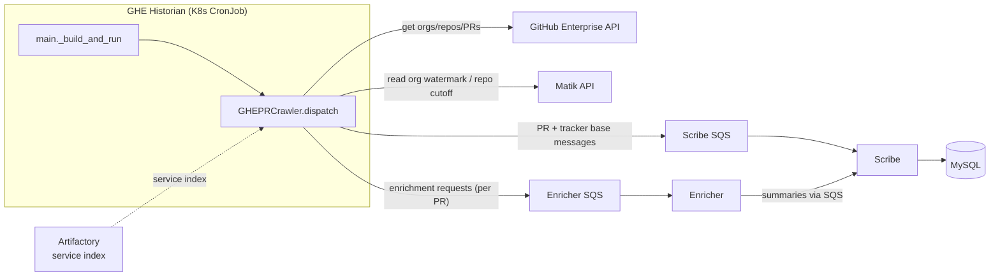

# GHE Historian Crawler Architecture

## Overview

The GHE (GitHub Enterprise) historian is a batch job that crawls pull requests
from configured GitHub organizations and publishes them into the Matik catalog. It
runs on the shared historian shell (`run_historian`) and publishes PRs to **Scribe**
(the sole DB writer) over SQS, while forwarding enrichment requests to the
**Enricher** for LLM summaries. It does **not** call the LLM/Facade itself.

Key traits (current implementation, Python):

- **Entry:** `historian/biztech_github/main.py` — a thin `_build_and_run(ctx)`
  callback passed to `run_historian`.
- **Crawler:** `historian/biztech_github/ghe_pr_crawler.py::GHEPRCrawler` — a
  `@dataclass` that owns its own async event loop and exposes
  `dispatch() -> CrawlerResult` (it does **not** subclass `BaseCrawler`; its
  fan-out shape differs from the streaming producer/consumer model).
- **Shape:** serial loop over configured orgs, each fanning out over repos with a
  bounded `asyncio.Semaphore` + `asyncio.gather`.
- **Incremental:** a per-org watermark (`GHEOrgCrawlTracker`) skips repos with no
  pushes since the last clean run; a per-(org, repo) cutoff (`GHEPRTracker`) bounds
  which PRs are fetched.

## System Architecture

The crawler reaches GitHub for org/repo/PR data, reads its trackers over the Matik
API, and writes nothing to MySQL directly — PR records and tracker updates are
published as SQS messages that Scribe consumes.

## Crawl Flow

1. **`run_historian`** loads + merges config (`matik-api-config.yml`,
   `matik-historian-biztech-github-config.yml`, `metrics.yml`,
   `matik-enricher-config.yml`), configures logging, validates the
   `biztech_github` / `api` / `enricher` config (hard-fail if enricher is missing),
   starts Telescope, and invokes `_build_and_run(ctx)`.
2. **`_build_and_run`** builds the metric objects (incl. `GHECacheMetrics`), the
   async GHE client (with the `EnrichmentPublisher` injected — enrichment is
   published per-PR inside the client), the Matik-API client, the base-record
   `SQSPublisher`, and an optional Artifactory client (for the repo→service index).
   It constructs `GHEPRCrawler` and calls `crawler.dispatch()`.
3. **`dispatch()`** runs `run()` inside `asyncio.run`, closes the GHE client on exit,
   and returns a `CrawlerResult`.
4. **`run()`** starts the `ghe_pr` job metric and loops over `config.organizations`:
   - `process_organization(org)`: fetch the org, compute `pushed_since` from the
     per-org watermark, list only repos pushed since then (skipping dormant +
     archived repos), then fan out `process_repository` across repos with a bounded
     semaphore + `asyncio.gather`.
   - `process_repository(org, repo)`: page PRs since the repo's cutoff, publish each
     as a `GHEPRBaseMessage` to the Scribe SQS queue; the GHE client publishes an
     enrichment request per PR to the Enricher SQS queue.
   - On a clean org run (no repo errors) the per-org watermark advances to the run
     start time, so the next run only re-scans repos pushed since now.

## Component Descriptions

### 1. Historian entry (`historian/biztech_github/main.py`)
`_build_and_run(ctx)` wiring + a `run_historian(spec=get_source("ghe_pr"),
caller_name=__name__, source_config_files=[...], build_and_run=_build_and_run,
source_config_attr="biztech_github")` call. `source_config_attr` is set because the
config section is `config.biztech_github` while the spec's `source_type` is
`"ghe_pr"`.

### 2. Crawler (`ghe_pr_crawler.py::GHEPRCrawler`)
`@dataclass` with injected `ghe_client`, `matik_client`, `sqs_publisher`,
`artifactory_client`, `config`, `job_metrics`, `cache_metrics`. Exposes
`dispatch() -> CrawlerResult` (owns the event loop + client teardown) and the async
`run()` fan-out. Constants: `DEFAULT_TRACKER_LOOKBACK_DAYS = 30`,
`DEFAULT_MAX_CONCURRENT_REPOS = 5`.

### 3. GitHub API integration (`common/clients/ghe_client.py`)
Async client for orgs/repos/PRs (+ file/service fetch). The `EnrichmentPublisher` is
injected here: the client publishes an `EnrichmentRequest` per PR to the Enricher
SQS queue. It does **not** call the LLM/Facade.

### 4. Trackers (via the Matik API → Scribe)
- **`GHEOrgCrawlTracker`** — per-org watermark, read over the Matik API; drives
  `pushed_since` so dormant repos are skipped.
- **`GHEPRTracker`** — per-(org, repo) cutoff bounding which PRs are fetched; tracker
  updates are published as `GHEPRTrackerBaseMessage` to Scribe (handled by the
  `ghe_pr_tracker` route).

### 5. Scribe (write path)
PRs are published as `GHEPRBaseMessage` and upserted by Scribe's `GenericHandler`
via the model-derived `BaseUpsertDAO` (`ghe_pull_requests` table). The base write
never clobbers the LLM columns (`pull_request_summary`, `description_hash`) — those
are written asynchronously by the Enricher. See [Scribe Design](scribe-design.md).

### 6. Enricher (LLM path)
The sole LLM caller. It consumes the per-PR enrichment requests, hash-gates the
call, and publishes summaries back to Scribe. See [Enricher Design](enricher-design.md).

## Configuration

Historian config (`local-configs/matik-historian-biztech-github-config.yml`,
env-substituted `${VAR}`), merged on top of the base + API + metrics + enricher
configs by `run_historian`.

### Key Parameters (`config.biztech_github`)
- `organizations` — list of GitHub orgs to crawl (from config, **not** hardcoded).
- `sqs_queue_url` / `sqs_queue_region` — the Scribe SQS queue for PR + tracker writes.
- pagination / lookback settings (default repo-activity lookback: 30 days).

## Cutoff & Watermark Logic

Two levels of incrementality keep each run bounded (this decision is still current —
see [ADR 006](../decisions/006-ghe-pr-incremental-crawling.md)):

- **Per-org watermark (`GHEOrgCrawlTracker`)**: `_get_repos_pushed_since` derives a
  `pushed_since` timestamp (watermark minus a small skew buffer). Only repos pushed
  since then are listed; the watermark advances to the run start time **only on a
  clean run** (no repo errors), so a failed repo is retried next run instead of being
  skipped.
- **Per-repo cutoff (`GHEPRTracker`)**: bounds which PRs in a repo are fetched.

## Error Handling

- **Tracker fetch failure** (API): logged; the crawler proceeds with the configured
  default cutoff for that scope.
- **GitHub API failure**: retried by the client with backoff; a repo that keeps
  failing is counted as a repo error (the org watermark then does not advance).
- **Per-repo / per-org errors**: caught and recorded in job metrics
  (`record_job_error`); other repos/orgs continue (`asyncio.gather(...,
  return_exceptions=True)`).
- **Enricher config missing**: `run_historian` hard-fails before crawling (the
  Enricher is the sole enrichment path).

## Related Documentation

- [Historian Services Design Guide](../development/historian.md)
- [Onboarding a Data Source](../development/onboarding-a-data-source.md)
- [Scribe Design](scribe-design.md) · [Enricher Design](enricher-design.md)
- [ADR 006 — GHE PR Incremental Crawling](../decisions/006-ghe-pr-incremental-crawling.md)
