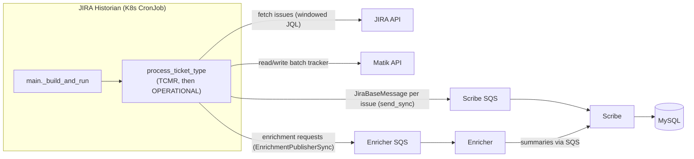

# JIRA Historian Crawler Architecture

## Overview

The JIRA historian is a batch job that catalogs JIRA issues (TCMRs and operational
tickets) from Airbnb's JIRA instance. It runs on the shared historian shell
(`run_historian`), publishes issues to **Scribe** (the sole DB writer) over SQS, and
forwards enrichment requests to the **Enricher** for LLM summaries. It does **not**
call the LLM/Facade itself.

Key traits (current implementation, Python):

- **Entry:** `historian/jira/main.py` — a `_build_and_run(ctx)` callback passed to
  `run_historian`. There is **no crawler class**; the crawl logic is module-level
  functions (`process_ticket_type`, `calculate_batch_window`, …).
- **Synchronous:** the JIRA historian is deliberately sync end-to-end — one-shot
  `fetch_issues` per window, per-record `sqs_publisher.send_sync(...)`, and a
  synchronous `EnrichmentPublisherSync`. It does not use `BaseCrawler`.
- **Two jobs per invocation:** `_build_and_run` runs `process_ticket_type` once for
  **TCMR** and once for **OPERATIONAL** (each gated on its config flag), with its own
  job label (`jira_tcmr` / `jira_operational`) and its own batch tracker.
- **Batch-window incrementality:** each ticket type has a `JiraBatchTracker` with a
  moving `(batch_start, batch_end)` window and a status state machine.

## System Architecture



## Crawl Flow

1. **`run_historian`** loads + merges config
   (`matik-historian-jira-config.yml`, `metrics.yml`, `matik-enricher-config.yml`),
   configures logging, validates `jira` / `api` / `enricher` config (hard-fail if
   enricher is missing), starts Telescope, and invokes `_build_and_run(ctx)`.
2. **`_build_and_run`** builds the metric objects (incl. `JiraCacheMetrics`), the
   **sync** `EnrichmentPublisherSync`, the JIRA client (with the enrichment publisher
   injected), the Matik-API client, a base-record `SQSPublisher`, and loads the
   JIRA→Backstage service mapping. Then it runs the two jobs:
   - **TCMR** (if `config.jira.tcmr_jql_enabled`): `start_job("jira_tcmr")` →
     `process_ticket_type(..., JiraIssueType.TCMR, config.jira.tcmr_jql,
     backstage_mapping=...)`.
   - **OPERATIONAL** (if `config.jira.operational_jql_enabled`):
     `start_job("jira_operational")` → `process_ticket_type(...,
     JiraIssueType.OPERATIONAL, config.jira.operational_jql)`.
   - Returns 0 only if all enabled jobs succeed.
3. **`process_ticket_type(...)`** (per ticket type):
   - `_get_batch_tracker` (Matik API) → refuse to run if the tracker is `ERROR` (see
     Batch Window Logic).
   - `calculate_batch_window(tracker, ...)` → the `(start, end)` window for this run.
   - Set the tracker to `PROCESSING` and persist it (`_update_batch_tracker`).
   - Build the windowed JQL (`build_final_jql`), `jira_client.fetch_issues(jql)`, then
     `jira_client.enrich_issues(...)` — which publishes an enrichment request per
     issue to the Enricher SQS queue (summaries are filled in asynchronously; the
     historian writes base fields only).
   - `_save_issues_via_sqs`: convert each issue to a `JiraIssueRecord` and
     `sqs_publisher.send_sync(JiraBaseMessage(...))` to the Scribe SQS queue.
   - On success set the tracker to `OK` and advance the window; on failure set `ERROR`
     with a message.

## Component Descriptions

### 1. Historian entry (`historian/jira/main.py`)
`_build_and_run(ctx)` + a `run_historian(spec=get_source("jira"),
caller_name=__name__, source_config_files=[...], build_and_run=_build_and_run)` call.
The two-ticket-type loop lives inside the callback (the shared shell runs one
`build_and_run`; JIRA owns its internal loop). Pure functions
(`calculate_batch_window`, `build_final_jql`, `convert_issue_to_record`,
`process_ticket_type`, tracker helpers) are module-level and unit-tested directly.

### 2. JIRA API integration (`common/clients/jira_client.py`)
`fetch_issues(jql)` (client-internal pagination, returns the full window in one
call) and `enrich_issues(...)`, which publishes an enrichment request per issue via
the injected `EnrichmentPublisherSync`. It does **not** call the LLM/Facade.

### 3. Batch tracker (via the Matik API → Scribe)
`JiraBatchTracker`, keyed per `ticket_type`: `batch_start`, `batch_end`,
`window_days`, and `status` (`None` / `OK` / `PROCESSING` / `ERROR`). Read and
written over the Matik API (`_get_batch_tracker` / `_update_batch_tracker`).

### 4. Scribe (write path)
Issues are published as `JiraBaseMessage` and upserted by Scribe's `GenericHandler`
via the model-derived `BaseUpsertDAO` (`jira_issues` table). The base write never
clobbers the LLM columns (`issue_summary`, `issue_comments_summary`, `summary_hash`,
`comments_hash`) — those are written asynchronously by the Enricher. JIRA's spec
declares `base_column_flags={"update_services": "services"}` so a crawl that skipped
service enrichment does not clobber previously-resolved services. See
[Scribe Design](scribe-design.md).

### 5. Enricher (LLM path)
The sole LLM caller — consumes the per-issue enrichment requests, hash-gates the
call, and publishes summaries back to Scribe. See [Enricher Design](enricher-design.md).

### 6. Service enrichment
`_enrich_with_services` resolves Backstage services from PR links + the
JIRA→Backstage mapping (`load_jira_backstage_mapping`). TCMR passes the mapping
(so `update_services=True`); operational does not.

## Configuration

Historian config (`local-configs/matik-historian-jira-config.yml`, env-substituted
`${VAR}`), merged on top of the base + metrics + enricher configs by `run_historian`.

### Key Parameters (`config.jira`)
- `tcmr_jql` / `tcmr_jql_enabled`, `operational_jql` / `operational_jql_enabled` — the
  JQL + enable flag per ticket type.
- `sqs_queue_url` / `sqs_queue_region` — the Scribe SQS queue for issue writes.
- lookback / window settings used by `calculate_batch_window`.

## Batch Window Logic

The crawler uses a state machine approach with a **batch tracker** for determining the date window:

1. **NULL (first run):** Use initial `batch_start` and `batch_end` from tracker table
2. **OK (previous success):** Advance to next window OR reset to lookback if caught up
3. **PROCESSING (crash recovery):** Resume same batch
4. **ERROR (previous failure):** Refuse to run until manually cleared

After each successful batch:
```
next_batch_start = batch_end
next_batch_end = batch_start + window_days
```

This ensures:
- Historical data is crawled in manageable windows
- Recent issues (last N days per lookback config) are continuously refreshed
- Crash recovery resumes from the same batch

### State Transitions

```
NULL (Initial) → PROCESSING → OK → PROCESSING → OK → ... → (caught up) → PROCESSING (lookback) → OK → ...
                                ↓
                              ERROR (refuse to run until cleared)
```

### State Descriptions

1. **NULL (Initial State)**
   - First time crawling this issue type
   - Uses `batch_start` and `batch_end` from tracker table initialization
   - Transition: → PROCESSING

2. **PROCESSING (In Progress)**
   - Batch currently being processed
   - If the run crashes, the next run **resumes the same batch** (the window is
     re-run from the persisted `batch_start`/`batch_end`)
   - Transition: → OK (success) or ERROR (failure)

3. **OK (Success)**
   - Previous batch completed successfully
   - Next run advances to the next batch OR resets to the lookback window
   - **Advancement logic:**
     - If `batch_end + window_days > now`: reset to lookback (caught up)
     - Else: advance normally (still catching up)
   - Transition: → PROCESSING

4. **ERROR (Failed)**
   - Previous batch failed (JIRA API error, database error, etc.)
   - The next run **refuses to proceed** and returns failure until the tracker is
     cleared, so a broken window is not silently skipped
   - Stores `error_message` for debugging

### Lookback Window Behavior

Once the crawler catches up to the present (next batch would be in the future):

```
Example: lookback_days = 185, window_days = 14

Historical catchup:
Run 1: 2023-11-16 to 2023-11-30 (OK) ← Normal advancement
Run 2: 2023-11-30 to 2023-12-14 (OK) ← Normal advancement
...
Run N: 2025-11-10 to 2025-11-24 (OK) ← Last historical batch

Caught up (next would be in the future):
Run N+1: (now - 185 days) to (+14 days) (OK) ← Reset to lookback
Run N+2: advance by 14 days ...
```

**Benefits:**
- Continuous coverage of the last N months (configurable)
- Captures late-added comments, status changes, new links
- Processes in `window_days` increments (manageable batch size)
- Automatically resets when reaching the present day

## Error Handling

### Tracker in ERROR state
- `process_ticket_type` refuses to run and returns failure until the tracker is
  cleared, so a broken window is never silently advanced past.

### JIRA API failure
- Errors surface from the client; the batch is marked `ERROR` (with a message) in the
  tracker. Idempotent upserts make re-running the same window safe.

### Database / Scribe write failure
- Base writes go through Scribe; a failed publish marks the batch `ERROR` so the same
  window is retried on a subsequent run after the tracker is cleared.

### Tracker update failure
- Logged with the ticket type; the next run uses the previous tracker state (safe for
  at-least-once processing).

### Invalid date handling
- Zero/invalid dates are converted to NULL with a warning during
  `convert_issue_to_record`, avoiding MySQL `Incorrect datetime value` errors.

## Related Documentation

- [Historian Services Design Guide](../development/historian.md)
- [Onboarding a Data Source](../development/onboarding-a-data-source.md)
- [Scribe Design](scribe-design.md) · [Enricher Design](enricher-design.md)
- [Database Migrations](../development/database-migrations.md)
