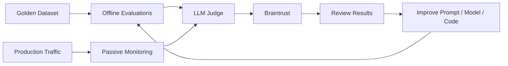
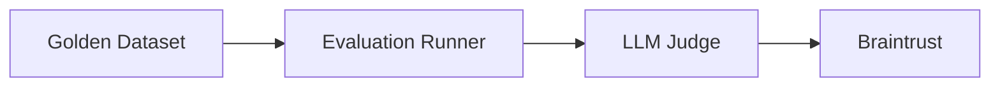
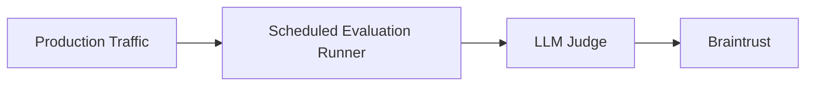
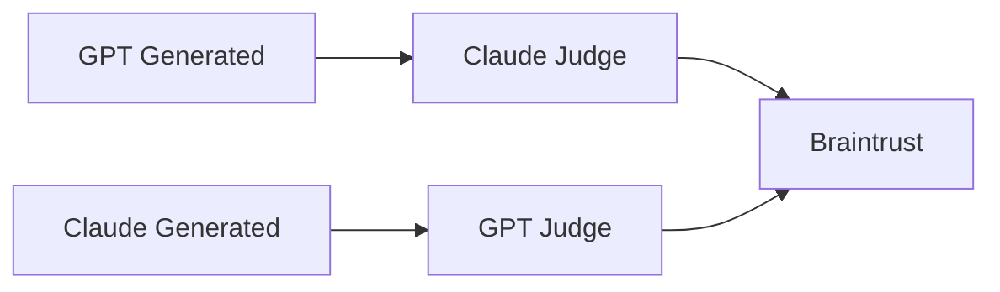
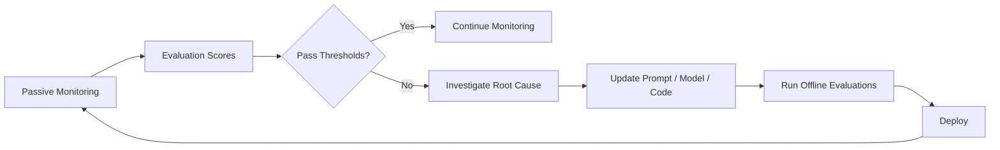

# LLM Evaluation Architecture

Matik uses a common evaluation framework for every LLM-powered feature. The framework ensures quality throughout a feature's lifecycle—from validating changes before release to continuously monitoring production performance after deployment.

Offline evaluations and passive monitoring both use the same evaluation process: responses are evaluated by an LLM judge and the results are stored in Braintrust. The difference is simply where the responses come from.

---

# Offline Evaluations

Offline evaluations validate prompt, model, or application changes before they are released.

A developer runs evaluations against a golden dataset containing predefined test cases. Since the expected behavior is known, results can be compared with previous runs to verify improvements and detect regressions before deployment.

## Characteristics

| Property | Value |
|----------|-------|
| Trigger | Manual |
| Input | Golden dataset |
| Purpose | Validate changes before release |
| Execution Environment | Local |
| Repository | `matik` |
| Results | Braintrust |

---

# Passive Monitoring

Passive monitoring continuously evaluates responses generated in production.

On a scheduled basis, production responses are sampled and evaluated by the same LLM judge used for offline evaluations. Since production traffic has no expected output, the judge evaluates each response directly instead of comparing it to a known answer.

This allows Matik to detect regressions that only appear in production, such as new input patterns, upstream data changes, or model drift.

## Characteristics

| Property | Value |
|----------|-------|
| Trigger | Scheduled |
| Input | Production traffic |
| Purpose | Continuously monitor production quality |
| Execution Environment | Bigair |
| Repository | `ml_models` |
| Results | Braintrust |

---

# Judge Selection

To reduce evaluation bias, Matik never uses the same model family to generate and judge a response.

For example:

- Responses generated by GPT are evaluated by Claude.
- Responses generated by Claude are evaluated by GPT.

---

# Evaluation Criteria

Each LLM-powered feature defines one or more evaluation criteria based on its purpose. Examples include faithfulness, correlation accuracy, summary quality, reasoning quality, and PII safety.

Both offline evaluations and passive monitoring use the same criteria whenever possible, ensuring scores remain comparable across development and production.

---

# Evaluation Thresholds

Evaluation scores are compared against predefined passing thresholds to determine whether a feature is performing as expected.

By default, all evaluation criteria require a **minimum passing score of 80%**. The only exception is **PII Safety**, which requires a perfect score of **100%**, as any leakage of personally identifiable information is considered a failed evaluation.

Thresholds may be adjusted for individual features when a different level of quality is required.

---

# Evaluation Feedback Loop

Evaluation results are continuously compared against the defined passing thresholds.

If all evaluation criteria meet or exceed their thresholds, no action is required.

If one or more criteria fall below their thresholds, engineers investigate the underlying cause. Depending on the findings, they may update the prompt, switch models, improve retrieval, or modify application logic. The proposed changes are then validated using offline evaluations before being deployed.

Once deployed, passive monitoring continues evaluating production traffic, completing the feedback loop.

---

# Viewing Results

Both offline evaluations and passive monitoring publish their results to the same Braintrust project.

Braintrust provides a centralized view for:

- Comparing evaluation runs over time
- Detecting regressions
- Monitoring long-term quality trends
- Investigating production failures

---

# Guides

- [Offline evaluations guide](../development/offline-evals.md) — how to run and create an offline evaluation.
- [Passive monitoring guide](../development/passive-monitoring.md) — how passive monitoring is implemented and how to extend it.
