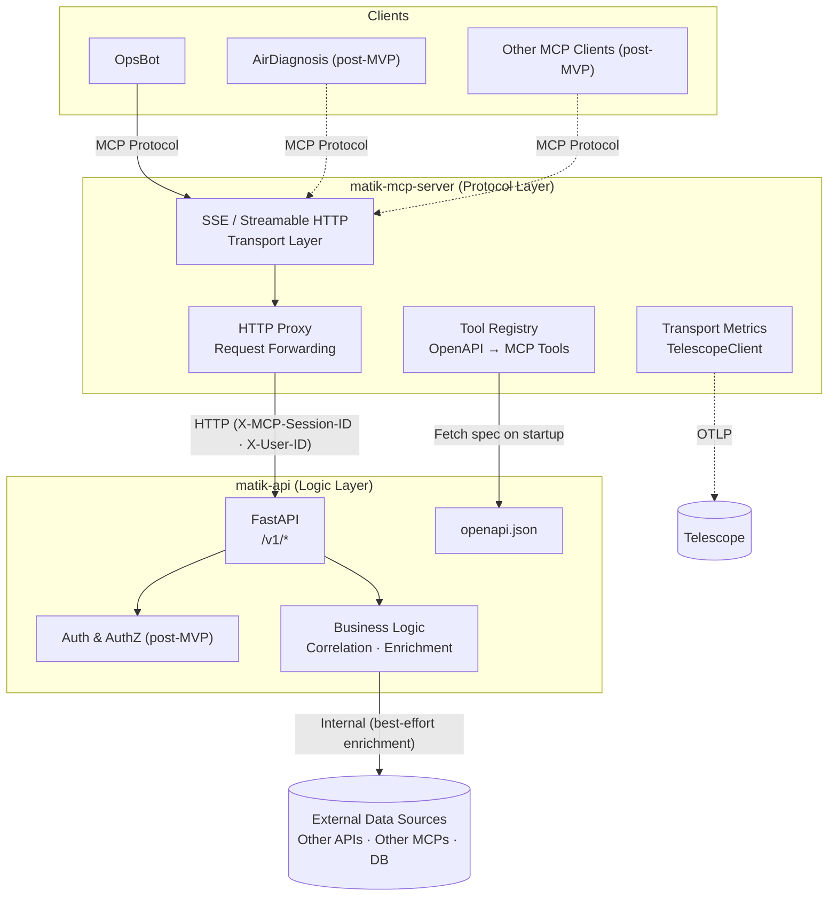
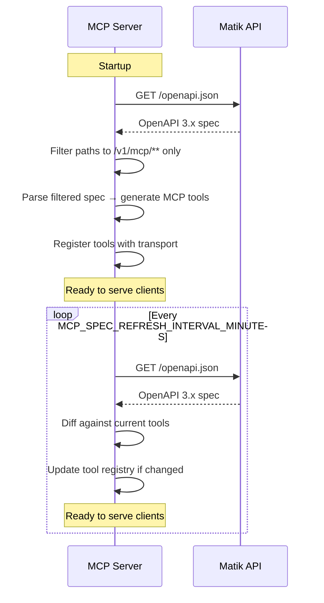
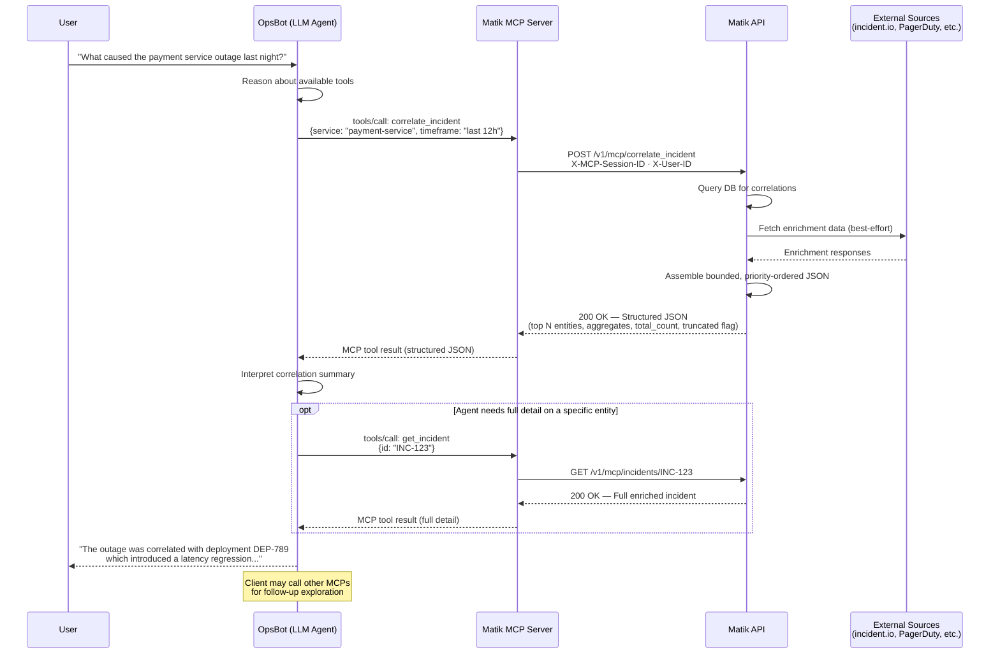
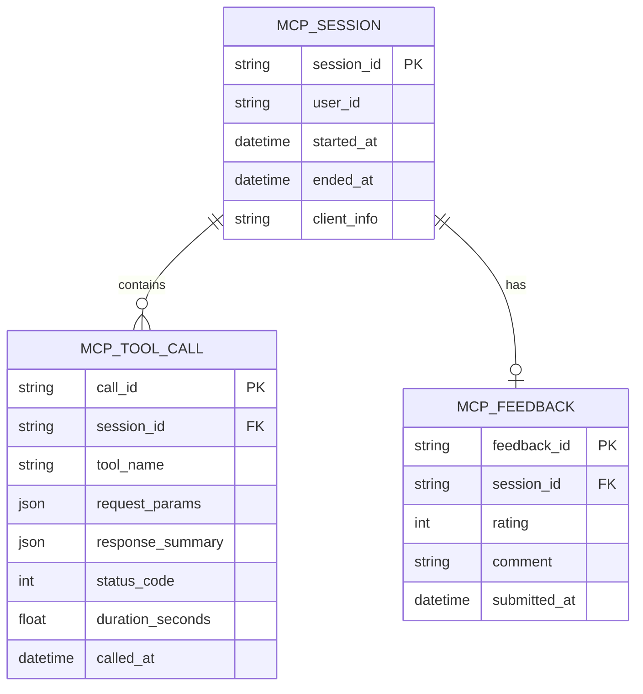

# Matik MCP Server Architecture

## Overview

The Matik MCP Server is a thin protocol gateway that exposes Matik's reliability data as tools consumable by MCP-compatible clients (OpsBot, AirDiagnosis, etc.). It handles MCP protocol transport only — all business logic, authentication, authorization, and data access live in the Matik API. The API returns structured JSON data; interpretation and analysis are the responsibility of the client's LLM agent.

**Key Principle:** The MCP server is a protocol adapter. The Matik API is the enforcer and the brain. The MCP server translates between MCP protocol and HTTP, forwarding every request to the API without making business decisions.

**Key Features:**
- Standalone deployed service with MCP protocol (SSE/Streamable HTTP transport)
- Proxies all operations through the Matik API (no direct DB or data source access)
- Mechanical tool registration from Matik API's OpenAPI spec (format conversion only)
- Forwards authentication context to the API; makes no auth decisions itself
- Propagates session context via headers; API owns session logging and audit
- Transport-level instrumentation via Telescope

## System Architecture



## Design Considerations

### 1. Tech Stack & MCP Library

**Runtime:** Python 3.13+ (aligned with the rest of the Matik Python codebase)

**MCP Server Library:** [`mcp` (Official Python SDK)](https://github.com/modelcontextprotocol/python-sdk)

The official SDK is the recommended choice. The MCP server's role is thin protocol translation — it has no custom auth middleware, no business logic, and no complex routing. The arguments for a custom FastAPI implementation (deep transport control, non-standard auth) don't apply to this architecture. The SDK provides:

- Protocol compliance out of the box (JSON-RPC 2.0 dispatch, capability negotiation, session management)
- Built-in SSE and Streamable HTTP transports
- Automatic compatibility with MCP spec evolution, reducing maintenance burden
- Auth hooks for forwarding credentials when needed post-MVP

Airbnb-specific integrations (AirMesh, Telescope) can be layered on via the SDK's middleware hooks and lifecycle events rather than requiring a from-scratch implementation.

<details>
<summary>Alternative considered: Custom on FastAPI + sse-starlette</summary>

Implementing the MCP protocol by hand on FastAPI/Starlette would give full control over transport and middleware, and reuse the existing Matik stack. However, this requires implementing JSON-RPC dispatch, tool registration, capability negotiation, and session management manually — a significant maintenance burden with risk of spec drift as MCP evolves. This trade-off is not justified for a service whose only job is protocol translation.

</details>

**Recommended Model (for MCP clients):** Claude Sonnet 4 — strong tool-use performance with low latency, well-suited for operational tooling where response speed matters. Claude Opus 4 can be offered as an option for complex multi-step analysis tasks.

### 2. Tool Registration (OpenAPI Spec as Source of Truth)

The MCP server must not hardcode tool definitions for Matik API endpoints. On startup, and periodically thereafter, it fetches `/openapi.json` from the Matik API and generates MCP tool definitions from the spec. The refresh interval is configured via the `MCP_SPEC_REFRESH_INTERVAL_MINUTES` environment variable (default: `5`). This allows the MCP server to pick up new or changed API endpoints without a restart.

Sandbox OpenAPI url: `https://api-matik-sandbox.a.musta.ch/openapi.json`

**MCP-eligible path prefix:** The Matik API should expose endpoints intended for MCP consumption under a dedicated prefix (e.g., `/v1/mcp/{path}`). This simplifies spec processing — rather than parsing the full OpenAPI spec and filtering out internal/admin routes, the MCP server only needs to extract paths matching `/v1/mcp/**`. It also gives the API team explicit control over which operations become MCP tools without requiring a separate allow/deny list in the MCP server config.

| Concern | Approach |
|---------|----------|
| Spec versioning | Pin to a specific API version (e.g., `/v1/openapi.json`) or use ETag-based caching |
| Spec refresh | Periodic refresh via `MCP_SPEC_REFRESH_INTERVAL_MINUTES` env var (default: `5` minutes) |
| Schema drift | Validate fetched spec against expected version; fail loudly on breaking changes |
| Tool naming | Derive tool names from `operationId` in the OpenAPI spec |
| Descriptions | Use `summary` and `description` fields from the spec for tool metadata |
| Scope filtering | Only register tools from paths under `/v1/mcp/` — all other paths are ignored |



**Note on upstream data sources:** The Matik MCP server does **not** aggregate tools from other MCP servers. Clients (OpsBot, AirDiagnosis) connect to other MCP servers independently, preserving fault isolation. If a Matik tool needs cross-source data for correlation (e.g., pulling from OpenSearch and incident.io to build a timeline), the **Matik API** handles those upstream calls internally. The MCP server never acts as an MCP client — it only exposes Matik's own tools.

### 3. Data Flow & Enrichment

The Matik API returns **structured JSON data only**. It does not perform LLM-powered interpretation or analysis of the data it returns. The client's LLM agent (e.g., OpsBot's) is responsible for interpreting the structured response and presenting it to the user.

**What Matik owns (data gathering and enrichment):**

- Query its own database for correlations and trends
- Fetch enrichment data from external sources (incident.io, PagerDuty, deployment systems, etc.) to make the correlation self-contained
- Return a structured JSON response containing the correlated entities with their enriched fields

**What the client agent owns (interpretation):**

- Receive the structured JSON from Matik
- Reason about the data and synthesize it into a human-readable answer
- Decide whether to make follow-up calls to other MCPs (OpenSearch, Grafana, etc.) for additional exploration

**Enrichment boundary:** Matik enriches its responses with enough context that the client agent can understand and explain the correlation without needing additional tool calls. For example, a correlation response includes incident severity, alert timestamps, deployment diffs, and service ownership — not just entity IDs. However, ad-hoc follow-up queries (e.g., "show me the logs for this service during that window") are the client's responsibility via its direct connections to other MCP servers.

> **Post-MVP:** The API will expand to perform follow-up queries on behalf of the client — such as querying logs, metrics, and other data sources — so the MCP server can return deeper diagnostic context in a single tool call rather than requiring the client to orchestrate multiple MCP servers.

**Enrichment failure handling:** External sources used for enrichment (incident.io, PagerDuty, deployment systems) are points of failure. If an enrichment source is unavailable or slow, the API should not fail the entire request. The API must treat enrichment as **best-effort**: always return the core correlation data from its own database, and include whatever enrichment it could successfully fetch. Fields from unavailable sources should be returned as `null` with a metadata flag indicating the source was unreachable, so the client agent can inform the user that partial data is available and suggest follow-up queries to other MCPs for the missing context. This ensures tool calls remain useful even during partial upstream outages and stay within OpsBot's timeout constraints.

**Response size and payload shape:** MCP tool results go directly into the client LLM's context window. A correlation that returns dozens of alerts, incidents, and deployments with full enriched fields can easily consume thousands of tokens, reducing the LLM's available space for reasoning. Large responses also risk being truncated by the client before the LLM sees them.

The API should follow the **list/detail pattern** combined with **server-side aggregation**:

- **Bounded defaults:** Correlation tools return a compact response by default — top N most relevant entities per category (e.g., top 10), with key fields only (ID, name, severity, timestamp, status). Include `total_count` and `truncated: true` metadata when results are clipped, so the client agent knows more data is available.
- **Detail tools:** Separate tools (e.g., `get_incident({id: "INC-123"})`) return the full enriched object for a single entity. The client agent sees the overview from the correlation tool and makes targeted follow-up calls for entities it needs to examine closely.
- **Server-side aggregation:** Where appropriate, return computed aggregates instead of raw lists. For example, instead of 30 individual alerts, return: "15 alerts on payment-service (12 resolved, 3 active), 8 alerts on auth-service (all resolved)." This is standard SQL aggregation (GROUP BY, COUNT), not LLM interpretation — it reduces payload size while preserving signal.
- **Priority-ordered responses:** Structure responses with the most important information first — correlation summary, severity, and key timestamps at the top; raw details and historical data at the bottom. If the client truncates the response, the highest-value data survives.

This pattern matches how major MCP implementations handle response size (GitHub MCP, Slack MCP, database MCP servers) and works naturally with the OpenAPI-to-MCP tool generation — list endpoints and detail endpoints are just additional routes under `/v1/mcp/`.



### 4. Authentication & Authorization

The Matik API owns all authentication and authorization decisions. The MCP server's only responsibility is forwarding credentials and user context.

**MCP server responsibilities:**
- Extract auth credentials from the MCP client connection (token, API key, etc.)
- Forward credentials and user identity to the API via headers on every request (e.g., `X-User-ID`, `Authorization`)
- Propagate `401`/`403` responses from the API back to the client as MCP auth errors

**API responsibilities:**
- Validate credentials and authenticate the user
- Enforce tool-level authorization (which users can call which tools)
- Return `401` for invalid credentials, `403` for unauthorized tool access

**Tool-level authorization (post-MVP):** This is a concern that must be addressed: Matik surfaces reliability data that may include sensitive operational information (incident details, service ownership, post-mortem content), and we need to ensure this data is not exposed to users without appropriate access.

**Note:** Authentication and authorization will not be implemented during MVP. The MCP server will accept connection from only OpsBot for speed of implementation. Support for additional clients (AirDiagnosis, etc.) will be added post-MVP alongside a proper auth mechanism.

**Open questions:**
- What is the identity provider? (Airbnb SSO, API keys, OAuth2?)
- Where do tool-level permissions live? (Config file, database, IAM?)
- Should we support scoped API keys (e.g., read-only vs full-access)?

### 5. Session Tracking & Feedback

Session tracking and audit logging are owned by the Matik API. The MCP server's role is limited to generating a session ID and propagating it as context.

**MCP server responsibilities:**

- Generate a unique `session_id` when an MCP connection is established
- Include `X-MCP-Session-ID`, `X-User-ID`, and `X-MCP-Client-Info` headers on every API request
- No direct database access; no session storage

**API responsibilities:**

- Log session context using the headers received from the MCP server
- Use `X-MCP-Session-ID` for request tracing and correlation across log entries

**MVP approach:** For MVP, session tracking is limited to structured logging. The API logs every tool call with the `X-MCP-Session-ID` and `X-User-ID` headers as structured fields, providing traceability and auditability without dedicated session tables. This data can be queried via existing log infrastructure (OpenSearch/Kibana).

**Post-MVP:** If usage patterns require persistent session history, feedback collection, or analytics, introduce dedicated session tables and a `submit_feedback` endpoint. The data model below outlines the target state:

<details>
<summary>Post-MVP session data model</summary>



</details>

### 6. Metrics & Instrumentation

Metrics are split by ownership. The MCP server reports transport-level metrics only. The API reports business-level metrics.

**MCP server metrics (transport only):**

| Metric | Description | Labels |
|--------|-------------|--------|
| Active sessions | Number of open MCP connections | `client_type`, `transport` |
| Connection duration | How long MCP sessions stay open | `client_type`, `transport` |
| Messages sent/received | MCP protocol message throughput | `client_type`, `transport` |
| Proxy latency | Round-trip time for forwarded API calls | `endpoint`, `status_code` |

**API metrics (business logic):**

| Metric | Description | Labels |
|--------|-------------|--------|
| Tool call count | Number of tool invocations | `tool_name`, `user_id`, `status` |
| Tool call latency | End-to-end tool execution time | `tool_name`, `status` |
| Tool error rate | Failed tool calls | `tool_name`, `error_type` |
| Upstream data source latency | Time to fetch from external sources during correlation | `source`, `status_code` |

Both services report to Telescope via OTLP.

### 7. Error Handling

The MCP server performs mechanical HTTP-to-MCP error mapping. It does not implement circuit breaking, retry logic, or error recovery — those are the API's responsibility for its own upstream calls.

| Scenario | MCP Server Behavior |
|----------|-------------------|
| API unreachable | Return MCP error indicating service unavailable |
| API returns 401/403 | Return MCP auth error; pass through the API's error message |
| API returns 4xx | Map to MCP tool error; pass through the API's error message |
| API returns 429 | Return MCP error with rate limit context from API response |
| API returns 5xx | Return MCP internal error; pass through the API's error message |
| Spec fetch failure | Serve stale spec if available; alert on staleness |

### 8. Transport

MCP supports multiple transports. The server runs both simultaneously on the same port:

| Transport | Endpoint | Status | Use Case |
|-----------|----------|--------|----------|
| **SSE** | `/sse` (GET) + `/messages/` (POST) | Live | Legacy clients (Claude Desktop, older integrations) |
| **Streamable HTTP** | `/mcp` (GET · POST · DELETE) | Live | New clients; spec-preferred transport |
| **stdio** | — | Not applicable | Local dev only |

Both transports share the same `Server` instance and tool registry. `notifications/tools/list_changed` is delivered to connected clients on both transports when the OpenAPI spec changes. SSE sessions are tracked via `request_ctx`; Streamable HTTP sessions are managed by `StreamableHTTPSessionManager` (stateful mode, 30-minute idle timeout by default).

### 9. Additional Considerations

- **Rate limiting:** Enforced by the API. The MCP server propagates `429` responses back to clients as MCP errors with rate limit context.
- **Caching:** Owned by the API. The MCP server may cache the OpenAPI spec (with TTL or ETag) but does not cache tool call responses.
- **Health checks:** `/health` endpoint for k8s liveness/readiness probes. Should verify the MCP server can reach the Matik API.
- **Deployment:** Kubernetes deployment in `airbnb-prod` account; AirMesh for service-to-service communication with `matik-api`.
- **Testing:** Mock MCP client for integration tests; contract tests against OpenAPI spec to verify tool generation.
- **Logging:** Structured JSON logging with `X-MCP-Session-ID` propagation from MCP server through to API calls for request tracing.

## Component Summary

```
matik-mcp-server/
├── transport/          # SSE and Streamable HTTP handlers
├── tools/              # OpenAPI spec fetcher + mechanical MCP tool generation
├── proxy/              # HTTP client to forward tool calls to matik-api
└── config/             # Service configuration (API URL, refresh interval, transport settings)
```

## Responsibility Matrix

| Concern | MCP Server | API |
|---------|-----------|-----|
| MCP protocol (SSE/Streamable HTTP) | Owns | — |
| Tool definitions | Generates from OpenAPI (mechanical) | Owns (defines endpoints under `/v1/mcp/`) |
| Authentication | Forwards credentials via headers | Validates and enforces |
| Authorization | — | Enforces; optionally serves filtered spec |
| Business logic (correlation, enrichment) | — | Owns |
| Data interpretation & analysis | — | — (client agent's responsibility) |
| Session/audit logging | Propagates `X-MCP-Session-ID` header | Structured logging (MVP); persistent storage (post-MVP) |
| Feedback | — (post-MVP) | Post-MVP: owns endpoint and storage |
| Rate limiting | Propagates `429` errors | Enforces |
| Upstream data fetching (other APIs/MCPs) | — | Owns (internal implementation) |
| Transport metrics | Owns | — |
| Business metrics (tool calls, errors) | — | Owns |
| Error handling | Mechanical HTTP→MCP mapping | Owns retry/circuit-breaking for upstream calls |
