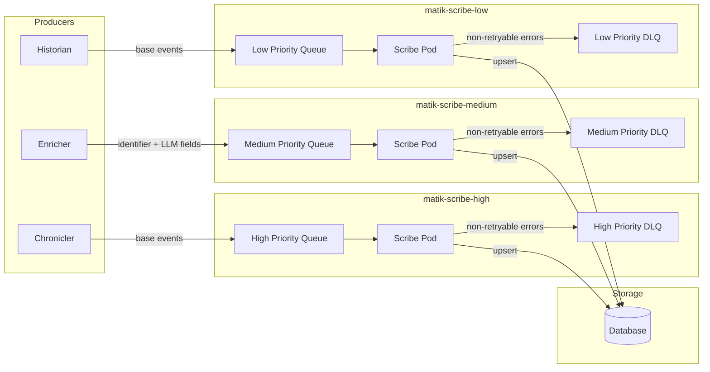

# Scribe Service Architecture

**Status:** Draft

> **Note:** Incident.io is used as the example data source throughout this document. The same patterns apply to GHE PRs, JIRA, and Correlations with their respective message models and handlers.

## Overview

The Scribe is a dedicated K8s service that acts as the **sole writer to the database** for all Matik domain tables. It decouples data producers (Historians, Chroniclers, Enricher) from direct DB writes by consuming messages from an SQS queue and routing them to the appropriate DAO.

### Goals

1. **Single write path** — All DB writes flow through one service, making data consistency and schema migrations easier to reason about
2. **Decoupling producers from persistence** — Historians and Chroniclers finish quickly by publishing to a queue; they never wait on a DB round-trip
3. **Centralized write logic** — Upsert semantics, timestamp normalization, and JSON serialization live in one place instead of scattered across services

### Supported Data Sources

| Source | Table | Unique Key | Base Event Fields | LLM Enrichment Fields |
|--------|-------|------------|-------------------|-----------------------|
| Incident.io | `incidentio_incidents` | `incident_id` | All incident fields (status, severity, timestamps, custom fields) | `root_cause_summary`, `root_cause_summary_hash`, `description_summary`, `description_hash` |
| Incident channel summary | `incidentio_incidents` (shared) | `reference_id` | _(enrichment-only — no base write)_ | `incident_channel_summary`, `incident_channel_summary_hash` |
| GHE PRs | `ghe_pull_requests` | `pull_request_id` + `repository_id` | All PR fields (title, state, merged, timestamps, services) | `pull_request_summary`, `description_hash` |
| GHE PR Tracker | `ghe_pr_trackers` | `org_id` + `repo_id` | Crawler state (org_id, repo_id, cutoff_date) | _(no LLM fields)_ |
| JIRA | `jira_issues` | `issue_key` | All issue fields (summary, status, timestamps, services, TCMR fields) | `issue_summary`, `issue_comments_summary`, `summary_hash`, `comments_hash` |
| Correlations | `reliability_correlations` | `anchor_entity_id` + `entity_id` + `entity_type` | All correlation fields (correlation_type, services, scores, reasoning) | _(no LLM fields)_ |

## Architecture

### High-Level Flow

Scribe runs as three dedicated K8s deployments — one per priority tier. Each deployment polls exactly one SQS queue and writes to the shared database.



**Write paths:**
- **Base events:** Chronicler/Historian → Scribe queue → Scribe → DB (creates/updates full records)
- **LLM enrichment:** Enricher → Scribe queue → Scribe → DB (targeted UPDATE of LLM columns on existing records)
- **Priority isolation:** Each tier runs as an independent deployment with its own SQS queue and DLQ. High-priority (real-time) writes are never delayed by low-priority (batch) writes.
- **Support for future write types:** The `message_type` discriminator allows for additional patterns like soft deletes or partial updates without changing the overall architecture.

Historians retain read access to the database for hash comparison and deduplication. The Scribe holds the only write path.

### Key Decisions

| Aspect | Decision | Rationale |
|--------|----------|-----------|
| Dedicated deployments per priority tier | Three separate K8s deployments (`matik-scribe-high`, `matik-scribe-medium`, `matik-scribe-low`), each with one SQS queue | High-priority (real-time) writes are never delayed by low-priority (batch) writes; each tier scales independently |
| Message routing | Two-field discriminator: `source_type` + `message_type` | Unambiguous routing without inspecting payload shape |
| Base event writes | Full domain model serialized as flat JSON `data` dict | Handlers can deserialize directly into existing SQLModel and call existing DAO upsert |
| Update writes | Identifier + update fields only | Targeted `UPDATE ... SET ... WHERE unique_key = ?` avoids overwriting already existing fields |
| Direct DAO access | Scribe calls DAOs directly (no HTTP to other services) | Lowest latency write path; no additional hop |
| Upsert semantics | Base writes go through the model-derived `BaseUpsertDAO.upsert_batch` (`ON DUPLICATE KEY UPDATE`) | Idempotent — safe if the same message is delivered more than once |
| Batched base writes | Messages are grouped by route and flushed as a batch to `upsert_batch` (see ADR 018) | One DB round-trip per flush group instead of per message |
| Failure handling | Non-retryable → DLQ; retryable → SQS visibility timeout backoff | Matches enricher pattern; simpler than application-level retry queues |
| Concurrency | Per-pod semaphore | Scales linearly with replicas; no coordination between pods needed |

## Message Models

**Location:** `matik/common/models/scribe_messages.py`

Each message carries two discriminator fields: `source_type` identifies which domain table is the target, and `message_type` determines the type of write operation.

The following matrix shows the supported `(source_type, message_type)` combinations:

Base event messages carry the full domain model as a flat JSON `data` dict. This matches `model.model_dump()` output from the producer side and allows the Scribe handler to call `Model.model_validate(data)` to reconstruct the SQLModel before passing it to the DAO.

As example enrichment messages carry only the unique identifier(s) and LLM-generated fields. The `source_type` + `message_type` combination makes the intent unambiguous — there is no need to inspect which fields are null to determine the write strategy. JIRA uses two separate hashes (`summary_hash`, `comments_hash`) because the issue description and comments can change independently. GHE PRs use a composite key (`pull_request_id` + `repository_id`) because no single field uniquely identifies a PR across the entire GitHub Enterprise instance.

### Routing Validation

The processor (`processor.py`) maintains a `VALID_ROUTES` dict as the canonical allowlist of valid `(source_type, message_type)` combinations. Invalid combinations are rejected at the processor level before any handler is invoked. The `VALID_ROUTES` dict is also the single place to extend routing when new message types are added.

### Future `message_type` Extensibility

The `message_type` discriminator is designed to be expanded as new write patterns are needed. Example of two additional types are identified for possible future use:

| Type | Description | SQL Operation |
|------|-------------|---------------|
| `delete` | Soft-delete a record by unique key | `UPDATE ... SET deleted_at = NOW() WHERE unique_key = ?` |
| `patch` | Partial update of non-LLM fields (e.g. status change) | `UPDATE ... SET field = ? WHERE unique_key = ?` |

Neither type is implemented in the current version. When a new `message_type` is added, it must be added to the relevant `frozenset` in `VALID_ROUTES` in `processor.py`, the corresponding `handle_<type>()` method must be added to each affected handler, and a dispatch branch must be added in `ScribeProcessor.process()`.

## Service Structure

**Location:** `matik/scribe/`

```
matik/scribe/
├── __init__.py
├── errors.py            # NonRetryableError, MalformedMessageError, BaseRecordNotFoundError
├── main.py              # Entry point, SQS consumer loop
├── processor.py         # Message parsing/routing (raises MalformedMessageError)
└── handlers/
    ├── __init__.py
    ├── _base.py          # HandlerHooks container
    ├── generic.py        # GenericHandler — spec-driven, serves ALL catalog sources
    ├── ghe_pr_tracker.py # GHE PR tracker state writes (base only, bespoke)
    ├── correlation.py    # Correlation writes (base only, bespoke)
    └── correlation_group.py # Correlation group writes (base only, bespoke)
```

**Additional file:** `matik/common/metrics/scribe_metrics.py` — Scribe-specific metrics (see [Observability](#observability))

### Main Loop

The consumer loop runs indefinitely, polling SQS for up to `sqs_max_messages` messages at a time. Messages are grouped by route and handed to the batcher, which flushes each group to the handler's `handle_base_batch` / `handle_enrichment_batch` (base writes become a single `upsert_batch` call — see ADR 018/019). A semaphore caps concurrent DB writes per pod.

After processing, each result falls into one of three categories. Non-retryable errors (malformed messages, Pydantic validation failures) are forwarded to the DLQ and deleted from the main queue. Retryable errors (DB connection failures, transient errors) trigger `change_message_visibility` for exponential backoff — the message stays on the queue but becomes invisible until the computed delay expires. Successes simply delete the message from the queue.

### Retry Backoff

Same pattern as the Enricher:

| Retry | Base Delay | With Jitter (±20%) |
|-------|------------|-------------------|
| 1     | 10s        | 8–12s             |
| 2     | 30s        | 24–36s            |
| 3+    | 60s (max)  | 48–72s            |

## Handler Pattern

All **catalog** sources share one spec-driven `GenericHandler`
(`scribe/handlers/generic.py`) — there are no per-source handler classes. Each
source is declared once as a `DataSourceSpec` (`common/datasources/`), and the
handler reads the spec for its record model, DAO, routing, enrichment key, and
post-write hook target. `main.py` builds each with `_build_generic(source_type,
hooks)` (`spec = get_source(source_type); GenericHandler(spec,
spec.dao_factory(engine, metrics), hooks=hooks)`).

For base events, `GenericHandler.handle_base_batch` validates each `data` dict into
`spec.record_model` and calls `dao.upsert_batch(records, dropped_columns=...)`. A
Pydantic `ValidationError` propagates as `MalformedMessageError` (non-retryable); a
`None` DAO return propagates as `RuntimeError` (retryable).

For enrichment messages, `handle_enrichment_batch` validates against
`spec.enrichment_message_model` and calls `dao.update_llm_fields_from_message(...)`,
then runs the enrichment hook on the message or the re-fetched record per
`spec.enrichment_hook_target`. Same non-retryable/retryable distinction.

The only **bespoke** handlers are the non-catalog sources — `GHEPRTrackerHandler`,
`CorrelationHandler`, `CorrelationGroupHandler` — which are base-only and excluded
from enrichment in `VALID_ROUTES`.

## DAO: LLM enrichment update

The enrichment update is inherited from `BaseUpsertDAO`
(`update_llm_fields_from_message`, `common/daos/base_dao.py`), not implemented per
source. It performs a targeted `UPDATE ... WHERE <enrichment_key> = ?` that writes
only the spec's `llm_columns` (never base fields) via `execute_with_retry`.

The enrichment key + LLM columns come from each source's `DataSourceSpec` /
enrichment message, so there is no per-source `update_llm_fields` method:

| Source | `enrichment_key` | LLM columns (`spec.llm_columns`) |
|--------|------------------|----------------------------------|
| `incidentio` | `incident_id` | `root_cause_summary`, `root_cause_summary_hash`, `description_summary`, `description_hash` |
| `jira` | `issue_key` | `issue_summary`, `issue_comments_summary`, `summary_hash`, `comments_hash` |
| `ghe_pr` | `pull_request_id` | `pull_request_summary`, `description_hash` |

The base returns `True` (updated) / `False` (row not present yet →
`BaseRecordNotFoundError`) / `None` (DB error → retry). Metrics via the
`DBMetrics.start_query()` idiom.

## Configuration

**Location:** `matik/common/models/scribe_config.py`

`ScribeConfig` is registered in `MatikConfig` alongside `EnricherConfig` and `EnigmatologistConfig`.

### `ScribeQueueConfig` Fields (per deployment)

| Field | Type | Required | Description |
|-------|------|----------|-------------|
| `queue_url` | `str` | Yes | SQS input queue URL |
| `dlq_url` | `str` | Yes | Dead letter queue URL for non-retryable failures |
| `max_receive_count` | `int` | No (default 5) | SQS redrive policy `maxReceiveCount`; used to detect final delivery attempt before SQS silently redrives to DLQ |

### `ScribeConfig` Fields

| Field | Type | Default | Description |
|-------|------|---------|-------------|
| `queue` | `ScribeQueueConfig` | required | The single SQS queue pair for this deployment |
| `sqs_queue_region` | `str \| None` | `None` | AWS region; resolves to `us-east-1` if unset or empty |
| `sqs_max_messages` | `int` | `10` | Max messages per SQS receive call |
| `sqs_wait_time_seconds` | `int` | `20` | SQS long-poll wait time in seconds |
| `sqs_visibility_timeout` | `int` | `300` | SQS message visibility timeout in seconds |
| `sqs_poll_error_delay` | `int` | `5` | Seconds to wait after a poll error before retrying |
| `max_concurrent_writes` | `int` | `10` | Max concurrent DB writes per pod |
| `enrichment_base_not_found_delay` | `int` | `60` | Visibility timeout (seconds) applied when an enrichment message arrives before its base record exists |

## Error Handling

All retryable errors use SQS visibility timeout for exponential backoff (10s → 30s → 60s max, with ±20% jitter). This frees the worker immediately and allows the system to self-heal under transient DB failures.

| Scenario | Behavior |
|----------|----------|
| DB connection error | Exponential backoff via SQS visibility timeout |
| DB transient error (deadlock, timeout) | Exponential backoff via SQS visibility timeout |
| Malformed JSON | Log error, move to DLQ immediately |
| Pydantic validation failure | Log error, move to DLQ immediately |
| Unknown `source_type` | Log error, move to DLQ immediately |
| Unknown `message_type` | Log error, move to DLQ immediately |
| Missing `data` field on base message | Log error, move to DLQ immediately |

After SQS `maxReceiveCount` is exceeded (configured on the queue), the message moves to the DLQ for investigation.

**Non-retryable vs retryable distinction:** Malformed and invalid messages will always fail regardless of how many times they are retried — the message content is the problem. These go to the DLQ immediately. DB errors are transient — the connection pool may be exhausted, the DB may be under load — and the system can recover on the next attempt.

## Observability

### Logging

- Log `incident_id` / `issue_key` / `pull_request_id` with every write operation for traceability
- Log `source_type` and `message_type` for filtering
- Log backoff delays and retry attempt numbers
- Log DLQ routing with the error type and message body excerpt

### Telescope Integration

Initialize `TelescopeClient` at service startup following the existing pattern used by other services. Set `service_name = "scribe"` on the telescope config before constructing the client. Instantiate `JobMetrics`, `DBMetrics`, and `ScribeMetrics` from the resulting meter. Pass `scribe_metrics` through to the consumer loop so it is available at the per-message level.

### Scribe-Specific Metrics

**Location:** `matik/common/metrics/scribe_metrics.py`

**Scribe-Specific Metrics** (new):

| Metric | Type | Labels | Description |
|--------|------|--------|-------------|
| `matik_scribe_messages_processed_total` | Counter | source_type, message_type, status | Messages processed |
| `matik_scribe_message_processing_duration_seconds` | Histogram | source_type, message_type, status | Processing time per message |
| `matik_scribe_dlq_messages_total` | Counter | source_type, error_type | Messages sent to DLQ |
| `matik_scribe_backoff_total` | Counter | source_type | Backoff retries triggered |
| `matik_scribe_queue_depth` | Gauge | queue | Current approximate queue depth |

**Existing Metrics** (reused from common):

| Metric | Type | Labels | Description |
|--------|------|--------|-------------|
| `matik_job_executions_total` | Counter | service, connector_type, status | Job executions (JobMetrics) |
| `matik_job_duration_seconds` | Histogram | service, connector_type, status | Job duration (JobMetrics) |
| `matik_db_query_total` | Counter | service, operation, table, status | DB query counts (DBMetrics) |
| `matik_db_query_duration_seconds` | Histogram | service, operation, table, status | DB query latency (DBMetrics) |


## Horizontal Scaling

The Scribe supports horizontal scaling with multiple pods. SQS natively handles multi-consumer delivery — each pod calls `receive_messages` independently, and visibility timeout ensures a message is only processed by one consumer at a time.

The `asyncio.Semaphore(max_concurrent_writes)` limits DB concurrency within a single pod. Total write concurrency across the deployment is `max_concurrent_writes × replica_count`. Set `max_concurrent_writes` and `mysql.max_open_conns` together so the pool can satisfy all concurrent writes (`mysql.max_open_conns >= max_concurrent_writes`).

| Component | Scaling Behavior |
|-----------|-----------------|
| SQS consumer | Each pod polls independently, no coordination needed |
| Semaphore | Per-pod; total concurrency scales linearly with replicas |
| DB writes | Stateless per-message; no cross-pod coordination required |
| Queue depth polling | Idempotent; multiple pods emitting the same gauge value is harmless |
| DLQ routing | Stateless; any pod can route to DLQ |
