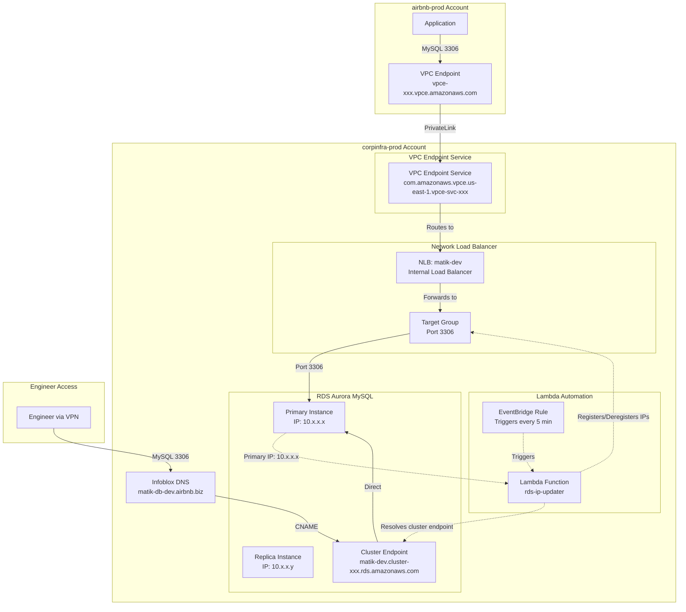

>
> :warning: This will be deprecated as soon as we fully migrate to the RDS cluster that is in the Prod Environment
>

# VPC Endpoint Architecture for Cross-Account RDS Access

## Data Flow Diagram



## Component Description

### 1. Application Connection (airbnb-prod → RDS)
- **Application** in airbnb-prod connects to **VPC Endpoint** DNS name
- **VPC Endpoint** uses AWS PrivateLink to connect to **VPC Endpoint Service** in corpinfraprod
- **VPC Endpoint Service** is backed by the **Network Load Balancer**
- **NLB** forwards traffic to **Target Group** containing RDS IP addresses
- **Target Group** routes to actual **RDS instances**

### 2. Lambda Automation
- **EventBridge Rule** triggers Lambda every 5 minutes
- **Lambda Function** resolves the RDS **cluster endpoint** (primary instance) using Python's `socket.gethostbyname_ex()` to get the current primary IP
- Lambda queries AWS to get current IPs in Target Group
- Lambda compares and **registers new IPs** / **deregisters old IPs** automatically
- Ensures Target Group always points to the current primary instance, even after failover
- **Note**: The cluster endpoint only resolves to the primary instance for writes

### 3. Engineer Access (Direct)
- **Engineers** connect via VPN to **Infoblox DNS** entry
- DNS CNAME points directly to **RDS Cluster Endpoint** (not NLB)
- Provides direct database access for development/debugging

```

## Resources Created

| Resource | Purpose |
|----------|---------|
| Network Load Balancer | Routes traffic to RDS instances |
| Target Group | Contains RDS IP addresses |
| VPC Endpoint Service | Exposes NLB via PrivateLink |
| Lambda Function | Auto-updates RDS IPs in target group |
| EventBridge Rule | Triggers Lambda every 5 minutes |
| IAM Role & Policy | Grants Lambda permissions |
| Infoblox CNAME | DNS entry for engineer access |
