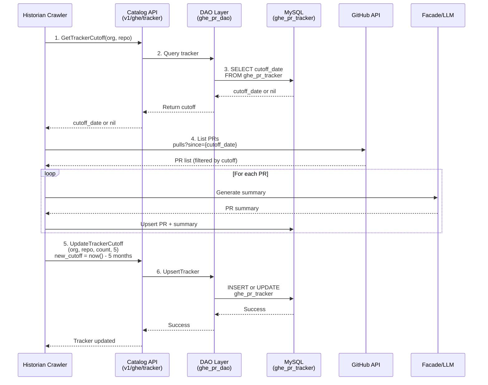
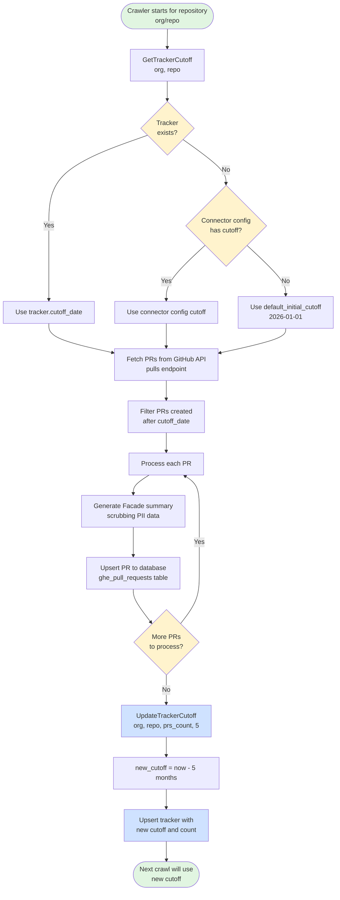

# Matik - GHE PR Incremental Crawling with Tracker

## Status

Date: 2025-11-25

Status: `Accepted`

> **Note (2026-07):** The incremental-crawling decision below (tracker + per-org
> watermark / cutoff so each run only re-scans recently-pushed repos) is still in
> force. However, the *LLM-summary* framing here is stale: the "paved path"
> refactor moved all LLM summarization out of the crawler and into the **Enricher**
> service (the crawler no longer calls Facade — see
> [ADR 008](008-hash-based-facade-optimization.md) and
> [Enricher Design](../architecture/enricher-design.md)). Read the Facade/summary
> references below as historical context only.

Collaborators: @sumit_chachadi

## Context

The Matik platform crawls GitHub Enterprise (GHE) pull requests to catalog PRs and generate LLM-powered summaries via the Facade service. The original implementation performed full crawls of all pull requests on every execution, which became increasingly unsustainable as data volume grew.

### Current Implementation Issues

The full-scan approach created several compounding problems:

1. **Large Data Volume**
   - Over 35,000 PRs exist in the Airbnb-ITX organization
   - Each full crawl processes all PRs regardless of whether they've been modified
   - Crawler execution time exceeded 30 minutes per run

2. **Redundant Facade API Calls**
   - Every PR requires an LLM summary generation via the Facade API
   - Facade returns non-deterministic summaries (same input → different output)
   - This causes unnecessary database updates even when PR content is unchanged
   - Wasted LLM API quota on generating duplicate summaries

3. **Low Change Frequency**
   - PRs older than 5 months are very unlikely to be modified
   - Yet they were being re-crawled and re-summarized on every run
   - Historical PRs consuming resources without providing new value

4. **API Rate Limiting**
   - GitHub Enterprise API rate limits were being exhausted
   - Facade/LLM API rate limits were being hit frequently
   - Risk of API quota exhaustion affecting other services

5. **Database Connection Exhaustion**
   - Volume of simultaneous database updates approaching max connection limits
   - Potential for connection pool exhaustion during crawls

6. **Resource Waste**
   - Significant compute resources spent re-processing unchanged data
   - High network bandwidth usage
   - Increased infrastructure costs

### Business Impact

- Crawler runs taking 150+ minutes to complete
- Delayed ingestion of recent/relevant PRs
- Increased infrastructure costs (compute, API quotas, database)
- Risk of service degradation due to resource exhaustion

## Decision

**Implement an incremental crawling system with per-repository tracking and rolling time windows.**

### Core Components

1. **Tracker Table**: `ghe_pr_tracker`
   - Stores crawl state per repository: `org_id`, `repo_id`, `cutoff_date`, `prs_crawled_count`
   - Indexed on `(org_id, repo_id)` for fast lookups
   - Foreign keys to `ghe_organizations` and `ghe_repositories` with CASCADE deletes

2. **Rolling Time Window**: 30-day lookback window for active PR tracking
   - **First crawl**: Uses configured `default_initial_cutoff` (default: 2026-01-01) or connector config `cutoff_date`
   - **Subsequent crawls**: Uses tracker's `cutoff_date` (set to `now - 30 days` after each successful crawl)
   - Configurable via `tracker_lookback_days` (default: 30)

3. **Incremental GitHub API Queries**
   - Only fetch merged PRs created after the cutoff date: `pulls?state=closed&sort=created&since={cutoff_date}`
   - Dramatically reduces API calls and data transfer

4. **Automatic Tracker Updates**
   - After successful crawl: `new_cutoff = now() - lookback_days`
   - Update tracker with new cutoff and PRs crawled count
   - Tracker only updated after successful processing (idempotent retries)

### Architecture



## Implementation Details

### Database Schema

```sql
CREATE TABLE IF NOT EXISTS ghe_pr_tracker (
    id BIGINT NOT NULL AUTO_INCREMENT,
    org_id BIGINT NOT NULL COMMENT 'Database FK to ghe_organizations(id)',
    repo_id BIGINT NOT NULL COMMENT 'Database FK to ghe_repositories(id)',
    cutoff_date DATETIME NOT NULL COMMENT 'Only crawl PRs after this date',
    prs_crawled_count INT DEFAULT 0,
    created_at DATETIME DEFAULT CURRENT_TIMESTAMP,
    updated_at DATETIME DEFAULT CURRENT_TIMESTAMP ON UPDATE CURRENT_TIMESTAMP,
    PRIMARY KEY (id),
    UNIQUE KEY unique_repo_tracker (org_id, repo_id),
    INDEX idx_cutoff_date (cutoff_date),
    FOREIGN KEY (org_id) REFERENCES matik.ghe_organizations(id) ON DELETE CASCADE,
    FOREIGN KEY (repo_id) REFERENCES matik.ghe_repositories(id) ON DELETE CASCADE
);
```

**Key Design Decisions**:
- **Database IDs not GitHub IDs**: `org_id` and `repo_id` reference internal database auto-increment IDs, not GitHub's numeric IDs
- **Unique constraint**: One tracker per `(org_id, repo_id)` combination
- **Cascade deletes**: Tracker automatically deleted when org/repo is deleted
- **Index on cutoff_date**: Enables efficient queries for tracker maintenance

### Configuration

```yaml
biztech_github:
  # Initial cutoff for first-time crawls (default: 2026-01-01)
  default_initial_cutoff: "2026-01-01T00:00:00Z"

  # Lookback window for subsequent crawls (default: 30 days)
  tracker_lookback_days: 30
```

### Crawl Flow



### Error Handling

- **Tracker fetch failure**: Falls back to connector config cutoff, then default cutoff
- **Tracker update failure**: Logs error but continues (next crawl will use old cutoff, safe for retries)
- **GitHub API failure**: Backoff and retry logic; crawler run fails if unrecoverable
- **Facade API failure**: Backoff and retry

## Consequences

### Positive

**Performance Improvements**
- Crawler execution time reduced
- 95%+ reduction in GitHub API calls
- 95%+ reduction in Facade API calls
- Faster ingestion of recent PRs (no blocking on historical data)

**Cost Savings**
- Fewer LLM API calls → lower Facade costs
- Reduced compute time → lower infrastructure costs
- Fewer database operations → better resource utilization
- Reduced network bandwidth usage

**API Rate Limit Mitigation**
- GitHub API usage well within limits
- Facade API quota preserved for other services
- Room to add more repos and PRs without hitting limits

**Better Data Freshness**
- Recent PRs (last 5 months) are always up-to-date
- Historical PRs remain accessible but not re-crawled
- Focus on data that matters for current analysis

**Scalability**
- System scales linearly with **new PR volume**, not total PR count
- Can handle organization growth without performance degradation
- Per-repository tracking enables parallel processing

**Operational Simplicity**
- Clear state management with database-backed tracker
- Easy to query tracker state for debugging (`SELECT * FROM ghe_pr_tracker`)
- Idempotent crawler runs (safe to retry)

### Negative

**Historical Data Updates**
- PRs older than 5 months won't receive updates (by design)
- If a 6-month-old PR is reopened, it won't be detected until cutoff shifts backward
- **Mitigation**: Configurable lookback period; manual re-crawl possible by adjusting tracker cutoff

**Initial Crawl Still Heavy**
- First crawl of a new repository still processes all PRs since `default_initial_cutoff`
- Can take 10-15 minutes for large repositories
- **Mitigation**: Staggered onboarding; initial cutoff can be set closer to present (e.g., 2026-01-01)

**Additional Database Table**
- Adds schema complexity (new table, foreign keys, indexes)
- Requires migration for existing deployments
- **Mitigation**: Well-tested DAO layer; comprehensive test coverage (87 tests)

**State Management Complexity**
- Need to handle tracker creation, updates, and edge cases
- Risk of tracker drift if updates fail repeatedly
- **Mitigation**: Robust error handling; tracker updates only after successful crawls; fallback to config cutoff

## Alternatives Considered

### Alternative 1: Cutoff Stored in Memory
**Rejected**:
- Volatile state lost on restarts
- Not persistent across multiple crawler instances
- Difficult to manage per-repository state
- Doesn't scale with multiple historians or deployments

### Alternative 2: Fixed Cutoff Date (Never Moving)
**Rejected**:
- Data staleness increases over time
- Recent PRs still get re-crawled unnecessarily
- Doesn't solve the long-term scaling problem

### Alternative 3: Event-Based Webhooks
**Considered for Future with Matik Listener**:
- Would provide real-time updates
- Requires webhook infrastructure setup (receiver, queue, retry logic)
- More complex error handling and replay logic
- Could complement (not replace) periodic crawling for reliability


## Review and Maintenance

Last reviewed: 2025-11-25
Next review: 2026-02-25 (3 months)
