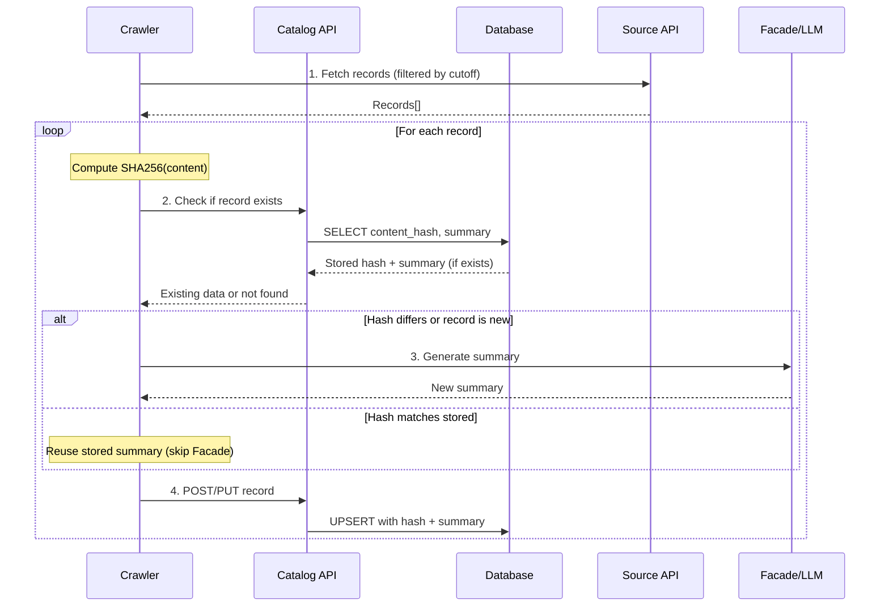
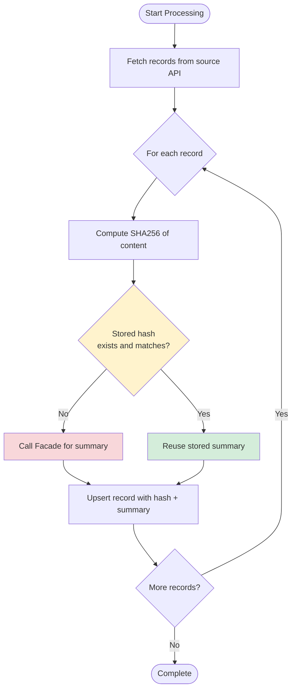

# Matik - Hash-Based Facade Optimization for Crawlers

## Status

Date: 2025-12-04

Status: `Superseded`

> **Superseded (2026-07):** The "paved path" refactor removed inline-Facade
> summarization from the historians/crawlers entirely. LLM enrichment — and the
> hash-based change detection that gates it — now lives solely in the **Enricher**
> service, not in the crawlers described below. Historians forward every record to
> the Enricher SQS queue unconditionally and no longer call Facade or fetch a hash
> cache. The decision below is retained as a point-in-time record; for the current
> design see [Enricher Design](../architecture/enricher-design.md).

Collaborators: @sumit_chachadi, @camille-bustamante

## Context

The Matik platform generates LLM-powered summaries for various data sources (GitHub PRs, incidents, tickets, etc.) via the Facade service. Even with incremental crawling strategies, crawlers still call Facade for every record within the rolling time window on each crawl, regardless of whether the source content has changed.

### Current Implementation Issues

1. **Redundant Facade API Calls**
   - Every record within the crawl window triggers a Facade call on each crawl
   - Most content doesn't change after initial creation
   - Wasted LLM API quota on generating identical summaries
   - Higher infrastructure costs from unnecessary API calls

2. **Non-Deterministic Summaries**
   - Facade/LLM returns different summaries for the same input
   - This causes unnecessary database updates even when source content is unchanged
   - Database churn without data value

3. **Rate Limiting Pressure**
   - Facade API rate limits being consumed by redundant calls
   - Risk of throttling affecting new record processing

### Business Impact

- Unnecessary LLM costs for unchanged records
- Slower crawl times due to API call overhead
- Risk of hitting Facade rate limits during high-volume periods

## Decision

**Implement hash-based change detection to skip Facade calls when source content hasn't changed.**

This pattern applies to any crawler that uses Facade for generating summaries, including:
- GHE Pull Requests (PR descriptions)
- Incidents (incident descriptions/timelines)
- JIRA tickets (ticket descriptions)

### Core Pattern

1. **Content Hash Storage**: Store a hash of the source content in the database
   - SHA256 hash of the original content (before any transformation/scrubbing)
   - Used to detect content changes between crawls

2. **Hash Comparison**: Compare current content hash with stored hash
   - If record exists in database, retrieve its stored hash
   - Compare against newly computed hash to detect changes

3. **Conditional Facade Call**:
   - Compute hash of current source content
   - Compare with stored hash (if exists)
   - Only call Facade if hash differs or record is new

### General Architecture



### Processing Flow



## Implementation Guidelines

### Database Schema Pattern

Add a `content_hash` column (or similar) to tables that store Facade-generated summaries:

```sql
ALTER TABLE <table_name>
ADD COLUMN content_hash VARCHAR(64) DEFAULT ''
    COMMENT 'SHA256 hash of source content for change detection';
```

### Hash Computation

- Use SHA256 for consistent, collision-resistant hashing
- Hash the **original content before any transformation** (e.g., before PII scrubbing)
- Handle empty/null content consistently (hash empty string or use sentinel value)

## Consequences

### Positive

**Cost Reduction**
- 90%+ reduction in Facade/LLM API calls for subsequent crawls
- Lower infrastructure costs from reduced API usage
- Preserved API quota for new records and other services

**Performance Improvement**
- Faster crawl times by skipping expensive LLM calls
- Reduced network overhead from fewer external API calls
- More efficient use of crawler compute resources

**Data Stability**
- Summaries remain stable when source content doesn't change
- Reduced database churn from non-deterministic LLM outputs
- Consistent data for downstream consumers

**Scalability**
- Can handle larger volumes without proportional cost increase

### Negative

**Additional Database Query**
- Hash lookup adds a query per record (or per batch if optimized)
- **Mitigation**: Minimal overhead compared to Facade API call savings

**Code Complexity**
- Additional hash computation and comparison logic per crawler
- New API endpoints to maintain
- **Mitigation**: Well-tested implementation; clear separation of concerns; reusable patterns

**Storage Overhead**
- 64-character hash column per record
- **Mitigation**: Minimal compared to summary text storage

## Alternatives Considered

### Alternative 1: Store Original Content for Comparison
**Rejected**:
- PII/security concerns - original content may contain sensitive data
- Storage overhead - content can be large
- Hash provides same change detection with minimal storage

### Alternative 2: Use Last-Modified Timestamps
**Rejected**:
- Source timestamps often include non-content changes (metadata updates, status changes)
- Would still trigger unnecessary Facade calls for non-content changes
- Content hash provides content-specific change detection

### Alternative 3: Per-Record Database Query for Hash
**Rejected**:
- N+1 query problem - one query per record
- Poor performance for large batches
- Batch fetch is significantly more efficient

## Crawler-Specific Implementations

For implementation details specific to each crawler:

| Crawler | Architecture Document |
|---------|----------------------|
| GHE Pull Requests | [GHE Historian Crawler Architecture](../architecture/ghe_historian_crawler.md#hash-based-facade-optimization) |

## Related Documentation

- [Facade Client](../../../common/clients/facade_client.go)

## Review and Maintenance

Last reviewed: 2025-12-04
Next review: 2026-03-04 (3 months)
