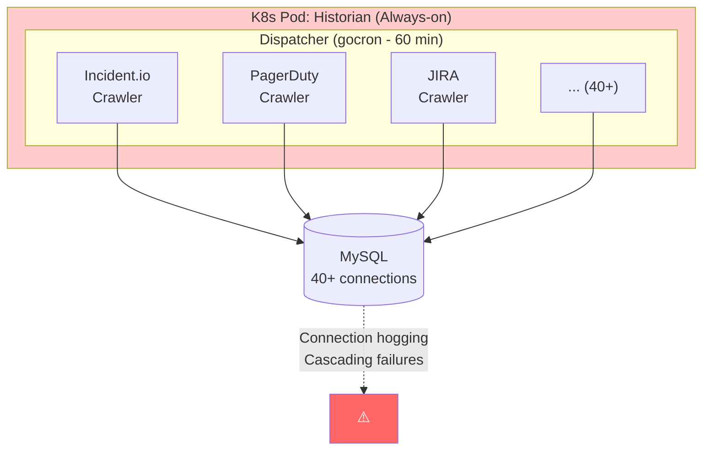
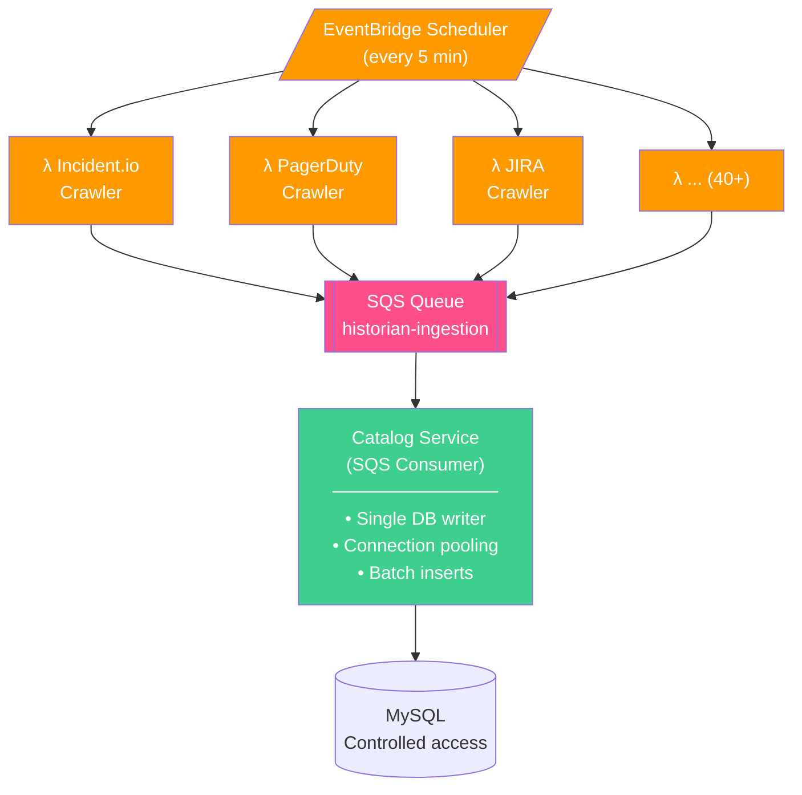
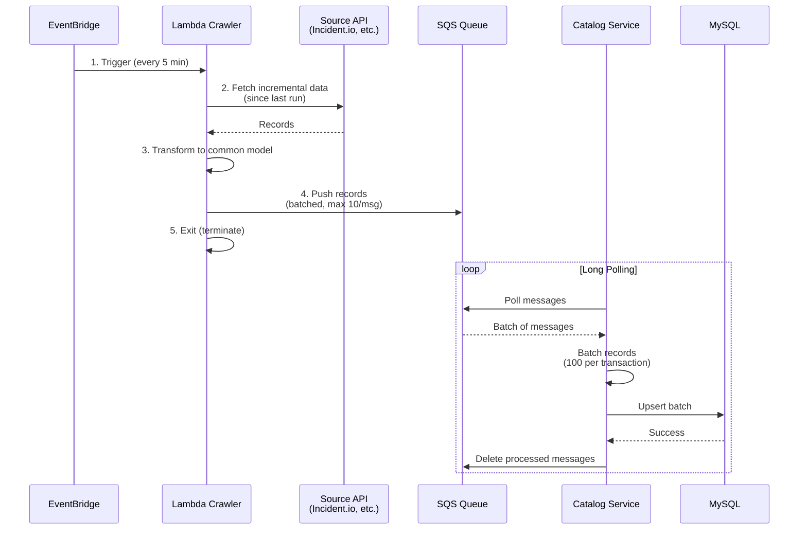
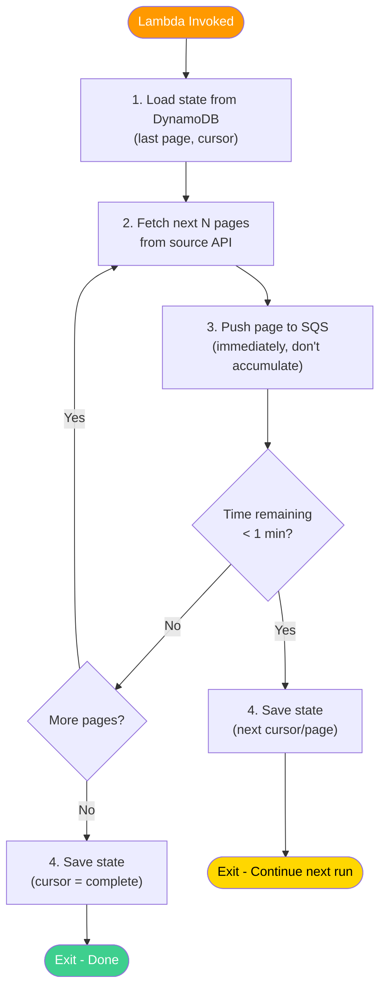

# Matik - Historian Lambda Architecture

Date: 2025-12-18

Status: `rejected` - superseded by [012-historian-k8s-cronjob-architecture.md](012-historian-k8s-cronjob-architecture.md)

Collaborators: @alfredo-moreira

## Context

The Historian service currently runs as a monolithic K8s deployment that crawls 40+ data sources on a scheduled basis (every 60 minutes). As the number of integrations grows, this architecture presents several challenges around cost efficiency, fault isolation, and database connection management.

### Current Architecture



**Schedule:** Every 60 minutes (gocron)
**Runtime:** Always-on K8s pod

### Current Issues

| Issue | Impact |
|-------|--------|
| **Cost inefficiency** | Pod runs 24/7 but only actively crawls ~10-20% of the time |
| **Connection hogging** | 40+ crawlers compete for MySQL connections |
| **Cascading failures** | One failing crawler can affect others in the same pod |
| **No isolation** | Memory leak or crash in one crawler takes down all crawlers |
| **Reprocessing cost** | If pod crashes mid-crawl, expensive API calls must be repeated |
| **Scaling inflexibility** | Cannot scale individual crawlers independently |
| **Long scheduling intervals** | 60-minute intervals to avoid overloading shared resources |

## Decision

**Decouple the Historian into independent Lambda functions per data source, with SQS-based data ingestion through the Catalog service.**

### Proposed Architecture



**Schedule:** Every 5 minutes (EventBridge)
**Runtime:** Pay-per-execution

### Data Flow



**SQS Configuration:**
- FIFO queue for ordering guarantees
- Dead letter queue for failed messages
- Message retention: 4 days
- Visibility timeout: 5 minutes

### Key Changes

| Aspect | Current | Proposed |
|--------|---------|----------|
| **Deployment** | Single K8s pod | 40+ independent Lambdas |
| **Scheduling** | gocron (60 min) | EventBridge (5 min) |
| **Data volume per run** | Large (60 min of data) | Small (5 min of data) |
| **DB access** | Direct from crawlers | Via Catalog (SQS consumer) |
| **Failure isolation** | None (shared pod) | Complete (per-Lambda) |
| **Cost model** | Always-on | Pay-per-execution |
| **Runtime limit** | Unlimited | 15 min max (Lambda) |

## Pros and Cons

### Pros

| Benefit | Description |
|---------|-------------|
| **Cost savings** | Pay only for execution time; no idle pod costs |
| **Fault isolation** | One crawler failure doesn't affect others |
| **Independent scaling** | Scale each crawler based on its data volume |
| **Shorter intervals** | 5-minute crawls feasible (less data per run) |
| **Connection management** | Single SQS consumer controls DB connections |
| **Resilience** | Data in SQS survives crawler crashes; no reprocessing |
| **Decoupled deployment** | Update one crawler without touching others |
| **Rate limit friendly** | Smaller batches spread API calls over time |
| **Cold start acceptable** | Scheduled crawlers tolerate 1-2s startup |

### Cons

| Drawback | Mitigation |
|----------|------------|
| **Increased complexity** | 40+ Lambda deployments vs 1 K8s pod | Infrastructure-as-code (Terraform); shared Lambda layers |
| **Lambda runtime limit (15 min)** | 5-minute scheduling keeps data volume small; pagination within Lambda |
| **SQS costs** | ~$0.40 per million requests | Batch messages (10 per send); cost is minimal vs compute savings |
| **Eventual consistency** | Data not immediately in DB | Acceptable for historical data; SQS provides ordering |
| **Cold starts** | 1-2s latency on first invocation | Scheduled crawlers tolerate this; provisioned concurrency if needed |
| **Shared library deployment** | Must package common/ with each Lambda | Lambda layers for shared code; container images |
| **Monitoring complexity** | 40+ functions to monitor | CloudWatch dashboards; centralized logging |
| **DLQ handling** | Failed messages need attention | Alerting on DLQ depth; manual replay capability |

## Implementation Details

### Lambda Configuration (per crawler)

```yaml
# Example: Incident.io Lambda
Runtime: python3.12  # or provided.al2 for Go
Memory: 256MB
Timeout: 5 minutes
Environment:
  SOURCE_TYPE: incidentio
  SQS_QUEUE_URL: !Ref HistorianIngestionQueue
  API_KEY: !Ref IncidentioApiKey
Trigger:
  Type: EventBridge Schedule
  Rate: rate(5 minutes)
```

### SQS Message Format

```json
{
  "source_type": "incidentio",
  "record_type": "incident",
  "records": [
    {
      "external_id": "INC-123",
      "data": { ... },
      "crawled_at": "2025-12-18T10:00:00Z"
    }
  ],
  "metadata": {
    "lambda_request_id": "abc-123",
    "batch_number": 1,
    "total_batches": 5
  }
}
```

### Catalog SQS Consumer

```python
# Pseudocode for Catalog SQS processor
def process_sqs_messages():
    while True:
        messages = sqs.receive_messages(
            QueueUrl=QUEUE_URL,
            MaxNumberOfMessages=10,
            WaitTimeSeconds=20  # Long polling
        )

        if not messages:
            continue

        # Batch records for efficient DB writes
        batch = []
        for msg in messages:
            payload = json.loads(msg.body)
            batch.extend(payload['records'])

            if len(batch) >= 100:
                upsert_batch(batch)
                batch = []

        # Flush remaining
        if batch:
            upsert_batch(batch)

        # Delete processed messages
        sqs.delete_message_batch(...)
```

### Cost Comparison (Estimated)

| Component | Current (K8s) | Proposed (Lambda) |
|-----------|---------------|-------------------|
| Compute | ~$50-100/month (always-on pod) | ~$5-15/month (execution only) |
| SQS | N/A | ~$1-5/month |
| EventBridge | N/A | ~$1/month |
| **Total** | **~$50-100/month** | **~$10-20/month** |

*Estimates based on 40 crawlers, 5-minute intervals, ~1 minute execution time each.*

### Migration Path

1. **Phase 1**: Build SQS consumer in Catalog (parallel to existing)
2. **Phase 2**: Migrate one crawler (e.g., Incident.io) to Lambda
3. **Phase 3**: Validate data parity and performance
4. **Phase 4**: Migrate remaining crawlers incrementally
5. **Phase 5**: Decommission K8s Historian pod

## Consequences

### Positive

- **70-80% cost reduction** on compute
- **Complete fault isolation** between crawlers
- **Fresher data** (5-minute vs 60-minute intervals)
- **Database stability** (single controlled writer)
- **Operational simplicity** (no connection pool tuning per crawler)
- **Resilience** (data persists in SQS during outages)

### Negative

- **Increased deployment complexity** (40+ functions)
- **New infrastructure components** (SQS, EventBridge, DLQ)
- **Learning curve** for Lambda patterns
- **Eventual consistency** (acceptable for historical data)

### Required Refactoring

**Crawler restructuring for sub-5-minute execution:**

Current crawlers may run for extended periods (10-30+ minutes) due to:
- Large data backfills
- Pagination through entire datasets
- Sequential processing patterns

To fit within Lambda's constraints, crawlers must be restructured:

| Current Pattern | Required Change |
|-----------------|-----------------|
| Full dataset crawls | Incremental crawls only (use tracker cutoff) |
| Unbounded pagination | Limit pages per invocation; continue next run |
| Sequential API calls | Parallel fetches where API allows |
| In-memory accumulation | Stream to SQS as data arrives |
| Monolithic execution | Chunked execution with state persistence |

**Example: Restructured Crawler Flow**



**State Management Options:**

| Option | Use Case |
|--------|----------|
| DynamoDB | Cursor/pagination state (low latency) |
| S3 | Larger state objects if needed |
| SQS message attributes | Batch continuation tokens |

This refactoring effort is non-trivial but aligns with best practices for incremental crawling (see [006-ghe-pr-incremental-crawling.md](006-ghe-pr-incremental-crawling.md)).

## Alternatives Considered

### Alternative 1: Multiple K8s Pods (One per Crawler)

**Rejected**: Higher cost than Lambda (always-on pods), doesn't solve connection hogging (each pod still connects to DB), more K8s resources to manage.

### Alternative 2: K8s CronJobs per Crawler

**Rejected**: Similar to Lambdas but without pay-per-execution; still have cold start issues; harder to manage 40+ CronJobs than 40+ Lambdas with EventBridge.

### Alternative 3: Keep Monolith, Add SQS Only

**Partially adopted**: SQS-based ingestion is valuable regardless; however, keeping the monolith doesn't solve fault isolation or cost efficiency.

## References

- [006-ghe-pr-incremental-crawling.md](006-ghe-pr-incremental-crawling.md) - Incremental crawling pattern
- [009-language-decision-python.md](009-language-decision-python.md) - Language decision (Python works well with Lambda)
- [AWS Lambda Best Practices](https://docs.aws.amazon.com/lambda/latest/dg/best-practices.html)
- [SQS + Lambda Integration](https://docs.aws.amazon.com/lambda/latest/dg/with-sqs.html)

---

## Review and Maintenance

Last reviewed: 2025-12-18
Next review: Upon decision acceptance
