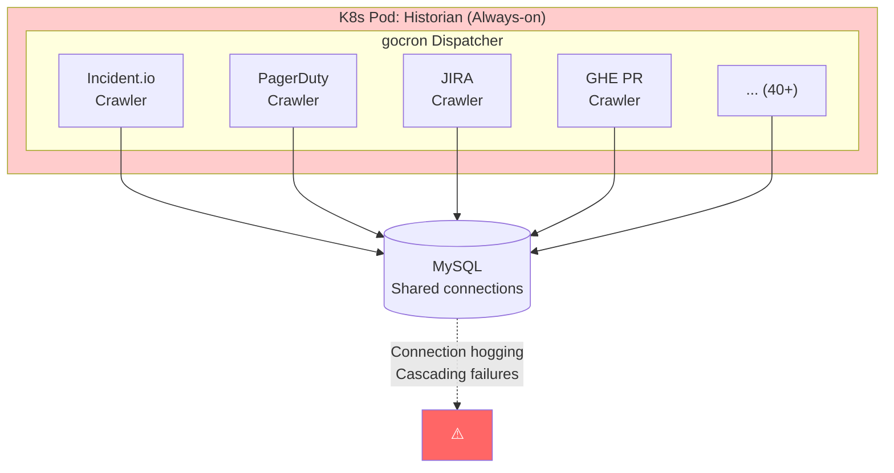
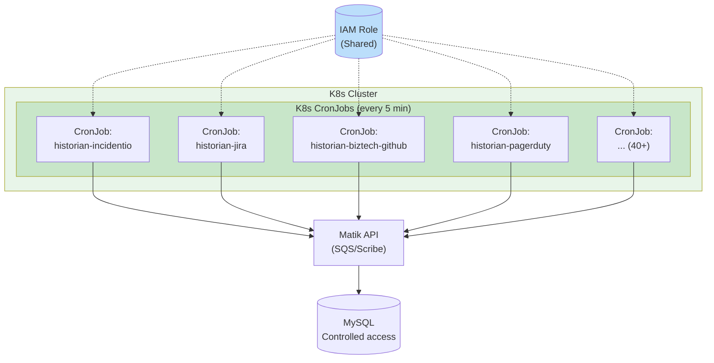

# Matik - Historian K8s CronJob Architecture

Date: 2025-01-26

Status: `accepted`

Collaborators: @alfredo-moreira, @camille_bustamante, @sumit_chachadi

Supersedes: [010-historian-lambda-architecture.md](010-historian-lambda-architecture.md) (rejected)

## Context

The Historian service originally ran as a monolithic K8s deployment with an internal gocron scheduler managing 40+ crawlers. This architecture presented challenges around fault isolation, connection management, and operational flexibility. A Lambda-based architecture was proposed ([010-historian-lambda-architecture.md](010-historian-lambda-architecture.md)) but was **rejected** in favor of K8s CronJobs for the following reasons:

- **IAM Role Continuity**: Maintaining the same IAM roles used by other Matik services simplifies security management
- **Centralized Infrastructure**: Keeping all services in K8s provides a single operational plane for deployment, monitoring, and debugging
- **Simpler Deployment Pipeline**: No need to maintain separate Lambda deployment infrastructure alongside K8s
- **Familiar Tooling**: Team already proficient with K8s patterns and kube-gen tooling

### Previous Monolithic Architecture (Go)



**Issues with monolithic approach:**

| Issue | Impact |
|-------|--------|
| **Cost inefficiency** | Pod runs 24/7 but only actively crawls ~10-20% of the time |
| **Connection hogging** | 40+ crawlers compete for MySQL connections |
| **Cascading failures** | One failing crawler can affect others in the same pod |
| **No isolation** | Memory leak or crash in one crawler takes down all crawlers |
| **Scaling inflexibility** | Cannot scale individual crawlers independently |
| **Deployment coupling** | Updating one crawler requires redeploying entire service |

## Decision

**Decouple the Historian into independent K8s CronJobs per data source, each running as a separate scheduled job.**

### New Architecture



**Schedule:** Every 5 minutes (K8s CronJob)
**Runtime:** On-demand (job completes and terminates)
**Concurrency:** `Forbid` - prevents overlapping runs

### Code Organization

```
matik/
├── historian/
│   ├── __init__.py
│   ├── incidentio/
│   │   ├── __init__.py
│   │   ├── __main__.py      # Entry point: python -m historian.incidentio
│   │   └── main.py          # Crawler logic
│   ├── jira/
│   │   ├── __init__.py
│   │   ├── __main__.py      # Entry point: python -m historian.jira
│   │   └── main.py          # Crawler logic
│   ├── biztech_github/
│   │   ├── __init__.py
│   │   ├── __main__.py      # Entry point: python -m historian.biztech_github
│   │   └── main.py          # Crawler logic
│   └── <new_source>/        # Add new crawlers here
│       ├── __init__.py
│       ├── __main__.py
│       └── main.py
```

### K8s Configuration Structure

```
_infra/kube/apps/
├── matik-historian-incidentio.yml
├── matik-historian-jira.yml
├── matik-historian-biztech-github.yml
├── matik-historian-pagerduty.yml      # Future
└── matik-historian-<source>.yml       # Add new sources here
```

Each CronJob configuration follows a consistent pattern:

```yaml
workload:
  cronJob:
    schedule: "*/5 * * * *"           # Every 5 minutes
    restartPolicy: OnFailure
    concurrencyPolicy: Forbid          # No overlapping runs
    suspend: false
    successfulJobsHistoryLimit: 1
    failedJobsHistoryLimit: 1
    activeDeadlineSeconds: 60          # Configurable per crawler

mainContainer:
  name: matik-historian-<source>
  imageSpec: historian-dockerfile       # Shared Docker image
  command:
    - python
    - -m
    - historian.<source>               # Source-specific entry point

  resources:
    requests:
      cpu: 500m                         # Configurable per crawler
      memory: 1000Mi
    limits:
      memory: 1000Mi
      ephemeral-storage: 512Mi

  fileMounts:
    - filename: matik-historian-config.yaml
      mountPath: /app/config/matik-historian-config.yaml
    - filename: facade-config.yaml
      mountPath: /app/config/facade-config.yaml

iamRole: {{ .Env.Params.iamRole }}      # Shared IAM role
```

### Configuration Separation

Each crawler can have its own configuration while sharing common settings:

| Configuration | Scope | Description |
|---------------|-------|-------------|
| `matik-historian-config.yaml` | Shared | Common settings (DB, logging, environment) |
| `facade-config.yaml` | Shared | LLM/Facade integration settings |
| `schedule` | Per-crawler | CronJob schedule (default: `*/5 * * * *`) |
| `activeDeadlineSeconds` | Per-crawler | Maximum job runtime |
| `resources` | Per-crawler | CPU/memory requests and limits |
| Environment variables | Per-crawler | Source-specific API keys, JQL queries, etc. |

**Per-crawler configuration examples:**

```yaml
# JIRA crawler - may need more memory for large result sets
resources:
  requests:
    memory: 2000Mi
  limits:
    memory: 2000Mi
activeDeadlineSeconds: 300  # 5 minutes for large JQL queries

# GitHub crawler - API rate limits may require longer runs
schedule: "*/15 * * * *"    # Every 15 minutes
activeDeadlineSeconds: 600  # 10 minutes
```

### Key Changes from Monolithic Architecture

| Aspect | Monolithic (Go) | CronJob (Python) |
|--------|-----------------|------------------|
| **Deployment** | Single always-on pod | Independent CronJobs per source |
| **Scheduling** | Internal gocron | K8s CronJob scheduler |
| **Fault isolation** | None (shared pod) | Complete (per-CronJob) |
| **Resource allocation** | Shared across all crawlers | Configurable per crawler |
| **Scaling** | Vertical only | Independent per crawler |
| **Configuration** | Single config for all | Per-crawler config possible |
| **Runtime** | Always-on | On-demand (job terminates) |
| **DB connections** | All crawlers share pool | Sequential, no contention |

## Pros and Cons

### Pros

| Benefit | Description |
|---------|-------------|
| **Fault isolation** | One crawler failure doesn't affect others |
| **Independent scaling** | Scale CPU/memory per crawler based on workload |
| **Flexible scheduling** | Each crawler can have its own schedule |
| **Configuration separation** | Per-crawler tuning for resources, timeouts, env vars |
| **Cost efficiency** | Jobs run only when needed, no idle pod costs |
| **Simplified debugging** | Isolated logs per crawler, clear job history |
| **IAM role consistency** | Same IAM role as other Matik services |
| **Centralized management** | All infrastructure in K8s, single operational plane |
| **Familiar deployment** | Uses existing kube-gen patterns |
| **No new infrastructure** | No Lambda, EventBridge, or DynamoDB state management |

### Cons

| Drawback | Mitigation |
|----------|------------|
| **Multiple K8s configs** | Consistent template pattern; each config is simple |
| **Shared Docker image** | Single image keeps builds fast; code is modular |
| **No pay-per-ms billing** | CronJob scheduling provides similar cost benefits |
| **Limited to K8s job constraints** | `activeDeadlineSeconds` provides timeout control |

## Benefits Retained from Lambda Proposal

The K8s CronJob architecture achieves many benefits originally proposed for Lambda:

| Lambda Benefit | Achieved in K8s CronJobs |
|----------------|--------------------------|
| **Fault isolation** | ✅ Each crawler runs in its own job |
| **Independent scaling** | ✅ Per-crawler resource configuration |
| **Shorter intervals** | ✅ 5-minute CronJobs (vs 60-min gocron) |
| **Cost reduction** | ✅ Jobs run on-demand, not always-on |
| **Decoupled deployment** | ✅ Update one crawler config independently |
| **Rate limit friendly** | ✅ Smaller batches spread API calls |
| **Resilience** | ✅ `restartPolicy: OnFailure` handles transient errors |

## Implementation Details

### Adding a New Crawler

1. **Create Python module** in `matik/historian/<source>/`:
   ```python
   # matik/historian/<source>/__main__.py
   import sys
   from historian.<source>.main import main

   if __name__ == "__main__":
       sys.exit(main())
   ```

2. **Create K8s CronJob config** at `_infra/kube/apps/matik-historian-<source>.yml`:
   ```yaml
   workload:
     cronJob:
       schedule: "*/5 * * * *"
       # ... standard config

   mainContainer:
     name: matik-historian-<source>
     command:
       - python
       - -m
       - historian.<source>
   ```

3. **Add to kube-gen apps** to enable deployment

### Exit Code Convention

Crawlers must return appropriate exit codes for K8s job management:

| Exit Code | Meaning | K8s Behavior |
|-----------|---------|--------------|
| `0` | Success | Job marked successful |
| `1` | Failure | Job marked failed, may restart |

```python
def main() -> int:
    try:
        # Crawler logic
        logger.info("job completed successfully")
        return 0
    except Exception:
        logger.exception("job failed")
        return 1
```

### Monitoring

| Metric | Source | Description |
|--------|--------|-------------|
| Job success/failure | K8s job history | `successfulJobsHistoryLimit`, `failedJobsHistoryLimit` |
| Job duration | K8s metrics | Time from job start to completion |
| Crawler-specific metrics | Telescope | Records processed, API calls, errors |

## Consequences

### Positive

- **Complete fault isolation** between crawlers
- **Fresher data** (5-minute vs 60-minute intervals)
- **Per-crawler tuning** of resources and schedules
- **Simplified operational model** (all K8s, no Lambda)
- **IAM role consistency** across Matik services
- **Reduced cost** compared to always-on pod

### Negative

- **Multiple K8s configs** to maintain (mitigated by consistent pattern)
- **No sub-minute scheduling** (K8s CronJob minimum is 1 minute)

### Migration Path

1. **Phase 1**: ✅ Python module structure created (`matik/historian/`)
2. **Phase 2**: ✅ K8s CronJob configs created per crawler
3. **Phase 3**: Implement crawler logic (in progress)
4. **Phase 4**: Deploy to staging, validate data parity
5. **Phase 5**: Deploy to production, decommission Go historian

## Alternatives Considered

### Alternative 1: AWS Lambda (Rejected)

See [010-historian-lambda-architecture.md](010-historian-lambda-architecture.md).

**Rejected because:**
- Requires separate deployment infrastructure (Terraform, SAM)
- Different IAM role management
- Team would need to maintain two deployment paradigms
- EventBridge, DynamoDB state storage adds complexity
- Lambda cold starts and 15-minute runtime limits

### Alternative 2: Keep Monolithic with Internal Scheduler (Rejected)

**Rejected because:**
- No fault isolation
- Resource contention between crawlers
- Cannot scale individual crawlers
- Connection hogging issues persist

### Alternative 3: Multiple Always-On Pods (Rejected)

**Rejected because:**
- Higher cost than CronJobs (always-on pods)
- Still have connection management complexity
- Overkill for batch jobs that run briefly

## References

- [010-historian-lambda-architecture.md](010-historian-lambda-architecture.md) - Rejected Lambda proposal
- [009-language-decision-python.md](009-language-decision-python.md) - Python language decision
- [006-ghe-pr-incremental-crawling.md](006-ghe-pr-incremental-crawling.md) - Incremental crawling pattern
- [K8s CronJob Documentation](https://kubernetes.io/docs/concepts/workloads/controllers/cron-jobs/)
