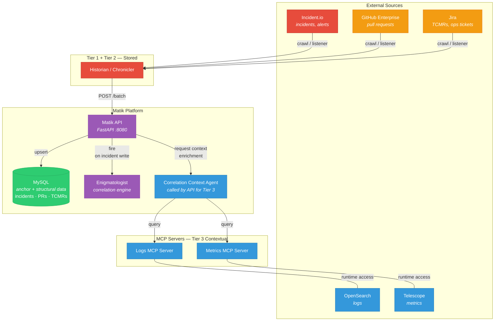

# Data Tiering

Date: 2026-02-20

Status: `proposed`

Collaborators: @camille-bustamante

## Context
We continuously change our systems. The application running today is not the same system that was running two years ago — in terms of architecture, ownership, deployment patterns, and operational behavior. Incidents and events from that period often reflect a different system state.

Currently, we ingest data from January 2023 onward, and that volume will continue to increase as we integrate more sources. If we treat all historical data equally, Matik will accumulate a large and continuously growing set of indexed events — many of which may no longer contribute meaningful signal to present-day correlation.

Correlation quality does not scale linearly with retention length. Beyond a certain window, older events tend to provide diminishing value while still incurring storage.

## Decision

We should introduce an explicit data tiering model to define:
- What data is required for deterministic correlation
- What data improves scoring but can be minimally indexed
- What data should not be stored and instead accessed on demand

This allows us to bound growth intentionally, keep correlation logic grounded in current system reality, and avoid indexing high-volume narrative systems unnecessarily.

The goal is not to reduce data arbitrarily, but to align storage and indexing decisions with how each source actually contributes to correlation.

### Data Tiering Model

Correlations are computed and stored **only when a Tier 1 event arrives**.
Tier 1 events represent an **end signal** (e.g., incident, alert) and act as the boundary for correlation. The system answers:

> “What led to this event?”

All other tiers exist to support explaining that end signal.

#### Tier 1 – Anchor Sources

End-state signals that initiate correlation computation.

These represent something observable and actionable that has already happened (e.g., incident declared, alert fired). When a Tier 1 event is ingested, Matik evaluates prior activity to determine what likely contributed to it.

##### Characteristics
- Low–moderate volume
- Clearly mark when something went wrong
- Define the cutoff point for correlation analysis
- Required for deterministic correlation

##### Store
- Metadata
- LLM-summarized description

##### Retention
- 12 months sliding window
- Correlations retained only while the raw data is retained
- When anchor expires → associated correlations is archived or deleted

##### Example
- Incident.io incidents
- Alerts

#### Tier 2 – Structural Sources

High-signal system activity that may have contributed to a Tier 1 event.

These do **not** trigger correlation. They are evaluated when a Tier 1 event arrives to determine whether they likely contributed to it.

##### Characteristics
- Moderate volume
- Occur before the Tier 1 event

##### Store
- Minimal metadata
- LLM-summarized description

##### Retention
- 12-month sliding window
- Events not linked to any retained Tier 1 anchor within 90 days are eligible for deletion

This keeps storage bounded while preserving deterministic recomputation within the retention window.

##### Example
- GitHub PR merged
- Jira TCMR
- Deploy events (Terraform runs, Jenkins builds)

#### Tier 3 – Contextual Sources

Used only to enrich the explanation of an already-computed correlation.

These do not influence scoring or deterministic linkage.

##### Characteristics
- High volume
- Narrative-heavy
- Used for explanation only

##### Store
- Nothing

##### Use
- Queried via MCP at runtime
- Optional short-lived cache

##### Example
- Slack conversations
- Logs
- Metrics

#### Governing Principle

A source belongs in a higher tier only if removing it from storage would break deterministic correlation for a Tier 1 event.

If removing it does not break deterministic correlation, it belongs in a lower tier.

#### System Boundary

- Tier 1 defines **when** correlation happens.
- Tier 2 defines **what happened before it that may have contributed**.
- Tier 3 defines **how we explain it**.

This keeps Matik focused on answering:

> “What led to this incident or alert?”

without becoming an unbounded historical archive.

#### The Core Difference Between Tiers

| Tier        | Stored?        | Used For            | Deterministic? | Retained?        |
|------------|---------------|---------------------|----------------|------------------|
| Anchor     | Yes  | Triggering correlation (the event to explain)     | Yes  | Yes (bounded)    |
| Structural | Yes  | Candidate contributors evaluated at trigger time  | Yes  | Yes (bounded)    |
| Contextual | No   | Enriching explanation after correlation           | No   | No               |

### Architecture Diagram

### Retention Enforcement & Cleanup

Retention is enforced via an automated cleanup job aligned with the tier rules already defined.

#### Cleanup Job

A scheduled job will:

- Identify expired Tier 1 events based on their retention policy
- Delete associated correlation records
- Identify Tier 2 events that:
  - Exceed their retention window, or
  - Are not linked to any retained Tier 1 event within the allowed timeframe
- Mark eligible records for deletion

Correlation records are retained only while their associated Tier 1 event is retained.

The job must be incremental and idempotent.

#### Deletion Strategy

##### 1. Soft Delete (First)

When data becomes ineligible:

- Set `deleted_at`
- Exclude from correlation
- Preserve temporarily for audit/debugging

##### 2. Permanent Delete (Later)

After a safety window (e.g., 30–90 days):

- Permanently delete soft-deleted records
- Reclaim storage

> Deletion must not break deterministic correlation within the defined retention window.

## Consequences
- Loss of historical RCA beyond retention period - after the retention window, correlations will no longer exist nor can they be recomputed
- Tier creep - over time, more data sources may gradually be moved into higher tiers “just in case.” This weakens the boundaries of the model and can result in storing and indexing everything, increasing cost and complexity.
- Additional operational overhead – Introducing the Correlation Context Agent and the cleanup job increases the number of services to operate, monitor, and maintain
