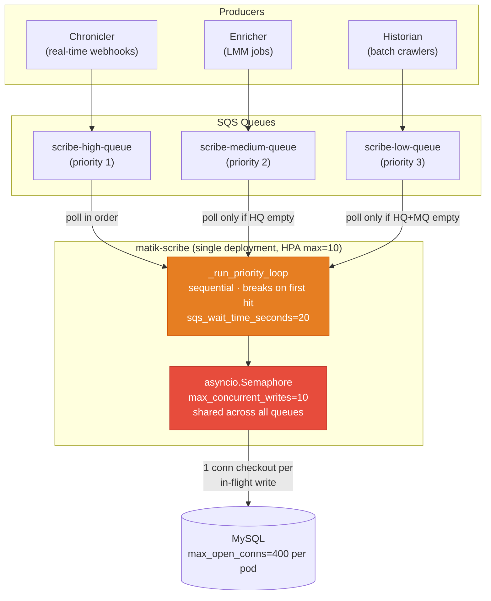
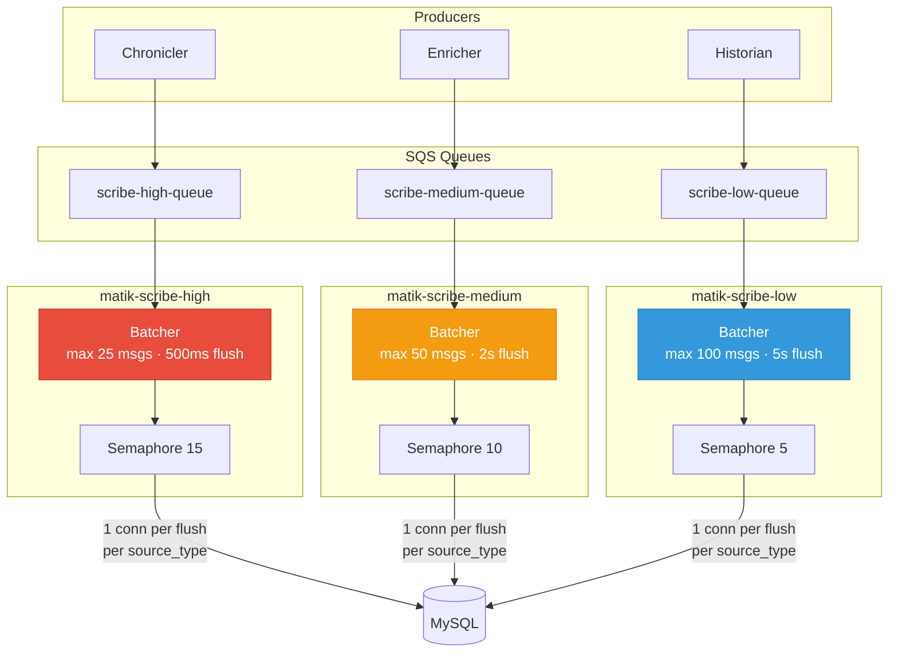
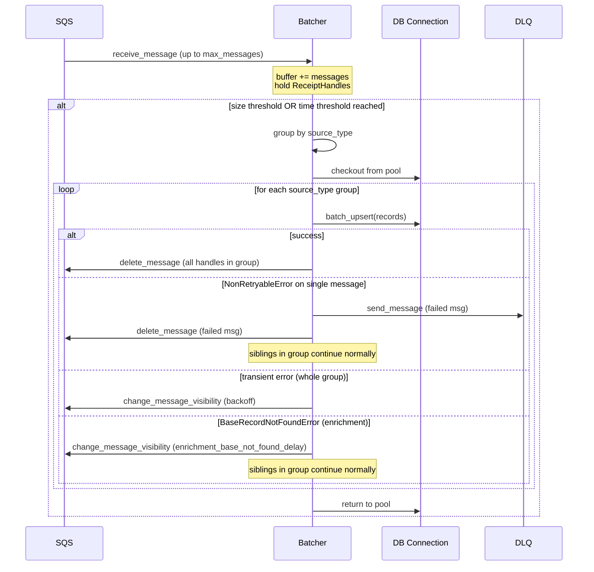

# Scribe Dedicated Deployments and Batched Writes

Date: 2026-05-01

Status: `proposed`

Collaborators: @alfredo-moreira

## Context

Scribe is the sole database writer for Matik. It runs as a single Kubernetes deployment, polls three SQS queues (high / medium / low priority) inside a single `_run_priority_loop` coroutine, and gates every write behind a global `asyncio.Semaphore(max_concurrent_writes=10)` shared across all queues. The HPA scales on `max by (queue_name)` of visible messages across all three queues with a target of 200, so additional pods distribute write budget evenly rather than directing capacity toward the lane that is actually lagging.

Two problems are addressed by this decision:

**Problem 1 — Lane contention.** The polling loop walks queues in priority order and stops at the first queue that returns messages. When the high-priority queue is empty it long-polls for `sqs_wait_time_seconds=20` before the loop can even attempt medium or low. When high is genuinely busy it can consume all 10 write slots, blocking progress on medium and low indefinitely (modulo the starvation guard, which only fires after 300–900 s). Adding pods through HPA does not fix per-pod fairness.

**Problem 2 — One pool connection per in-flight write.** Each handler method (`handle_base`, `handle_enrichment`) calls `asyncio.to_thread(self._dao.some_method, ...)`, and each DAO method opens a fresh connection with `with self._engine.connect() as conn` (e.g. `common/daos/incidentio_incident_dao.py:84,142,205,326,451`). At `max_concurrent_writes=10` per pod × 10 pods this produces up to 100 simultaneous checkouts from Scribe. Scaling to three isolated deployments at max replicas pushes this toward 300. The DAOs already support batch upserts (e.g. `IncidentIOIncidentDAO.upsert_incidents_batch` at `incidentio_incident_dao.py:451` chunks internally at 500 rows), but Scribe today calls them with a single-element list, discarding the amortization.

### Current Architecture

---

Alternatives considered

### Option A — Parallel pollers only

Replace the single sequential loop with one polling coroutine per queue started via `asyncio.gather`. Raise `max_concurrent_writes` (10 → 30) to absorb concurrent arrivals across three independent pollers.

| Pros | Cons |
|---|---|
| Smallest diff — one `main.py` refactor. | A sustained high surge still consumes the lion's share of a shared 30-slot budget; medium/low have no hard floor. |
| Fixes the exact empty-high / 20s long-poll blocking symptom. | Single deployment: one crash takes all three lanes offline. |
| Easy to revert. | Connection-per-write problem is unchanged. |

**Why not chosen:** Doesn't provide blast isolation or fix the connection-per-write problem. Appropriate as a rapid-response patch but not a durable architecture.

---

### Option B — Parallel pollers + per-queue write semaphores

Option A plus replacing the single global semaphore with a per-queue semaphore (e.g. high=20, medium=15, low=10).

| Pros | Cons |
|---|---|
| Hard guarantee: medium/low always have reserved DB slots even during sustained high surges. | Idle lanes leave their slots unused while a backlogged lane may need more — wasted unless paired with a shared overflow budget. |
| Natural extension of A. | Adds config surface (three semaphore sizes to tune). |
| | Single deployment: one crash still takes all lanes offline. |

**Why not chosen:** Per-queue semaphores give better guarantees than A but don't address blast isolation or connection pressure. Adding the shared overflow pattern approaches Option D in complexity without its operational clarity.

---

### Option C — Option B + per-queue HPA signals

Everything in B, plus rewriting the HPA `telescopeMetrics` block to scale on per-queue depth rather than a `max by (queue_name)` collapse.

| Pros | Cons |
|---|---|
| Scale-up decisions are made per-lane; a medium backlog no longer competes with high for pod budget. | Biggest diff of the single-deployment options; touches production-path HPA YAML. |
| Age-of-oldest-message signal (if available) is a more honest lag indicator than depth. | Still a single deployment: blast radius, connection pressure, and zero per-connection amortization unchanged. |
| | Per-queue thresholds need independent tuning; HPA misconfiguration can cause flapping. |

**Why not chosen:** Moves the per-lane scaling needle but leaves the root causes (shared blast radius, connection-per-write) unaddressed. Adds HPA complexity that Option D achieves more cleanly through deployment isolation.

---

### Option D — Three dedicated Scribe deployments (chosen)

See the Decision section below.

---

## Decision

Deploy three independent Scribe instances — `matik-scribe-high`, `matik-scribe-medium`, `matik-scribe-low` — each configured with exactly one SQS queue and its own HPA. Add an in-process batching layer that accumulates messages in memory, flushes them on a size-or-time trigger, and issues one connection checkout per flush grouped by `source_type`.

### Target Architecture

The Scribe container image is unchanged — only config and infra YAML differ per deployment.

---

### Priority Imposition via SQS and Concurrency Knobs

With dedicated deployments there is no polling order to enforce priority. Priority is instead expressed through three knobs tuned asymmetrically per lane:

| Knob | How it expresses priority | High | Medium | Low |
|---|---|:---:|:---:|:---:|
| `sqs_wait_time_seconds` | Short wait → pod reacts within milliseconds when messages arrive; long wait → pod yields CPU when idle. | **1s** | **5s** | **20s** |
| `sqs_max_messages` | Maximum messages pulled per receive call (SQS hard ceiling = 10). Feeds the batcher buffer each cycle. | **10** | **10** | **10** |
| `max_concurrent_writes` | Ceiling on simultaneous DB-write tasks per pod. More slots → higher sustained throughput per pod. | **15** | **10** | **5** |

**Interaction:**

- The **high** lane polls almost continuously (`sqs_wait_time_seconds=1`), drains up to 15 in-flight writes per pod, and flushes every 500ms or 25 messages — whichever comes first. This minimises end-to-end latency at the cost of slightly higher SQS API call rate when idle.
- The **medium** lane uses a 5s wait, allowing the pod to rest between bursts while still maintaining moderate throughput.
- The **low** lane uses the full 20s SQS long-poll, so idle pods burn virtually no CPU or API budget. The 5-slot concurrency cap ensures that even a large backlog does not crowd out the shared RDS connection pool.

---

### Batching Layer — Single Connection per Flush, Grouped by `source_type`

Messages accumulate in an in-memory buffer per pod. A flush is triggered by whichever condition fires first:

| Lane | Max messages in buffer | Max time since oldest message | SQS visibility timeout |
|---|:---:|:---:|:---:|
| High | 25 | 500ms | 300s |
| Medium | 50 | 2s | 300s |
| Low | 100 | 5s | 300s |

**Invariant — timeout × delivery.** The SQS visibility timeout (300s) must exceed the maximum possible flush duration. At ~20ms per upsert:

- High worst case: `500ms + 25 × 20ms = 1s` << 300s ✓
- Low worst case: `5s + 100 × 20ms = 7s` << 300s ✓

If flush intervals are ever increased, this math must be re-verified before deploying.

**Grouping rule.** Within a single flush the batcher groups messages by `source_type` (`incidentio`, `jira`, `ghe_pr`, `ghe_pr_tracker`, `correlation`). One pool connection is checked out for the entire flush; each group's upsert runs sequentially on that connection using the existing batch DAO methods (e.g. `IncidentIOIncidentDAO.upsert_incidents_batch` at `incidentio_incident_dao.py:451`, which already chunks at `BATCH_SIZE=500`). The connection is returned to the pool when the flush completes.

**Message acknowledgement.** Each message's `ReceiptHandle` is retained in the batcher and sent to `sqs.delete_message` only after its group's upsert succeeds. This ensures at-least-once delivery.

#### Flush Sequence

**Failure semantics** preserve the existing contract:

- `NonRetryableError` (malformed/invalid message) — that message is forwarded to DLQ individually; all other messages in the flush continue unaffected.
- Transient error during a group's batch upsert — all messages in that *group* have their visibility extended via `compute_backoff_with_jitter` (`main.py:40`). Messages in other groups that have already succeeded are not affected.
- `BaseRecordNotFoundError` (enrichment arriving before its base record) — the individual message's visibility is extended by `enrichment_base_not_found_delay`; siblings continue.

---

### HPA Per Lane

Each deployment's `telescopeMetrics` block targets only its own queue name. The `max by (queue_name)` collapse used today is removed.

| Deployment | Queue pattern | HPA target (visible messages) | Rationale |
|---|---|:---:|---|
| `matik-scribe-high` | `matik-scrb-high-{env}-queue` | **50** | Aggressive scale-up; high lane must drain in near-real-time. |
| `matik-scribe-medium` | `matik-scrb-medium-{env}-queue` | **200** | Parity with today's combined-queue target. |
| `matik-scribe-low` | `matik-scrb-low-{env}-queue` | **500** | Conservative scale-up; occasional backlog is tolerable. |

All three share `minReplicas=1, maxReplicas=10` and retain `targetCPUUtilizationPercentage=50` as a secondary signal.

---

### DB Connection Budget

| Scenario | Concurrent checkouts |
|---|:---:|
| Today (1 deployment, 10 pods, 10 writes) | 100 |
| 3 deployments at max replicas, per-message (no batcher) | 300 |
| 3 deployments at max replicas, with batcher (steady-state) | ~30–60 (1 conn per active flush per pod) |
| `max_open_conns` per pod (sandbox) | 400 |

Steady-state checkout rate drops dramatically with the batcher because a single connection handles a full flush batch rather than one record. The worst-case ceiling (all flush slots active simultaneously) remains bounded by `max_concurrent_writes` per pod and does not exceed today's pool configuration.

Confirm `max_open_conns` values in staging and production before rollout — sandbox is currently set to 400 in `kube-gen.yml`.

---

### New Infrastructure Files

| File | Purpose |
|---|---|
| `_infra/kube/apps/matik-scribe-high.yml` | Deployment + HPA for high lane |
| `_infra/kube/apps/matik-scribe-medium.yml` | Deployment + HPA for medium lane |
| `_infra/kube/apps/matik-scribe-low.yml` | Deployment + HPA for low lane |
| `_infra/kube/files/matik-scribe-high-config.yml` | Single-queue config for high lane |
| `_infra/kube/files/matik-scribe-medium-config.yml` | Single-queue config for medium lane |
| `_infra/kube/files/matik-scribe-low-config.yml` | Single-queue config for low lane |
| `_infra/kube/kube-gen.yml` | Three new app blocks replacing the single `scribe` block |
| `_infra/cd/pipelines/*.yml` | Deploy stages updated from one app to three |

### Code Changes Required

| File | Change |
|---|---|
| `matik/scribe/main.py` | Add batching layer; `_run_priority_loop` remains for single-queue mode compatibility. Starvation guard (`_get_poll_order`, `last_polled` bookkeeping) removed once all lanes are cutover. |
| `matik/common/models/scribe_config.py` | Add `batch_max_messages: int` and `batch_flush_interval_ms: int` to `ScribeConfig`; `max_starvation_seconds` on `ScribeQueueConfig` deprecated. |

---

## Consequences

### Positive

- **Complete blast isolation.** A crash, memory leak, or backlog in one lane has zero effect on the other two at every layer — polling, write concurrency, pod count.
- **Operationally transparent.** If medium is lagging, inspect `matik-scribe-medium` pods and its HPA in isolation; no need to reason about shared state across lanes.
- **Knob-per-lane tuning.** `sqs_wait_time_seconds`, `max_concurrent_writes`, and flush thresholds can be adjusted independently per lane without touching the others.
- **Connection pressure reduced.** The batcher amortises pool checkouts from N-per-message to 1-per-flush, exercising `upsert_incidents_batch` and equivalent batch DAOs as originally designed.
- **Dead code removal.** The starvation guard (`main.py:72–103`), `last_polled` bookkeeping, and `max_starvation_seconds` config field are all meaningless in a single-queue deployment and can be deleted cleanly.

### Negative / Risks

- **3× infra surface.** Three deployments, three config files, three HPA objects, and three Spinnaker pipeline stages to maintain. Mitigated by consistent templating and the fact that the Scribe image is shared.
- **Latency floor per non-full batch.** In a low-traffic period the batcher waits up to `batch_flush_interval_ms` before flushing, introducing a latency floor that did not exist in the per-message path. For the high lane this is 500ms; acceptable given current SLOs.
- **Partial-batch failure bookkeeping.** A bug in per-message ack/DLQ bookkeeping within a flush could drop or double-process messages. Comprehensive unit tests for the batcher are a hard prerequisite for production rollout.
- **Visibility-timeout math must be re-validated** if flush intervals are ever tuned upward.
- **Future new queue lanes** require a fourth full deployment rather than a single config entry.

## References

- [`012-historian-k8s-cronjob-architecture.md`](012-historian-k8s-cronjob-architecture.md) — prior precedent for per-source dedicated deployments
- [`015-data-tiering.md`](015-data-tiering.md) — collapsible section and mermaid style reference
