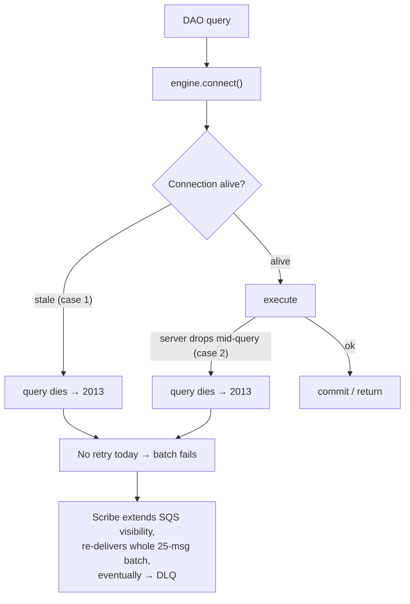
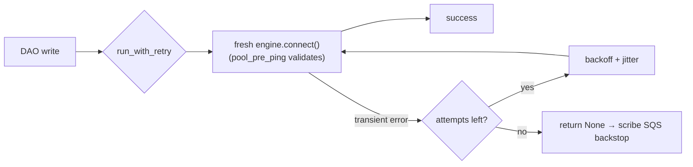

# Retrying Transient MySQL Connection Failures

Date: 2026-06-01

Status: accepted

Collaborators: @sumit_chachadi <sumit.chachadi@airbnb.com>

## The Issue

Scribe (our sole DB writer) intermittently fails to persist data with:

```
(pymysql.err.OperationalError) (2013, 'Lost connection to MySQL server during query')
```

Seen on two write paths:
- `ghe_pr_dao.py` — the repo-ID resolution `SELECT` aborts a PR batch upsert.
- `incidentio_incident_dao.py` — `batch upsert failed`, which bubbles up to the batcher as a
  "group-level transient failure".

When this fires, a whole batch of up to 25 SQS messages is re-delivered, and repeated failures
push otherwise-good data toward the DLQ.

## Why It's Happening

Error `2013` is a **connection-level** failure, not a query bug. It happens in two ways, and today
we defend against neither:

1. **Stale pooled connection** — RDS/network idle timeout or a failover silently kills a connection
   still sitting in the pool. The next query handed that connection dies immediately. We have **no
   `pool_pre_ping`** (no liveness check at checkout) and scribe never sets
   `conn_max_lifetime_minutes`, so **`pool_recycle` is off** — dead connections linger indefinitely.
2. **Connection dropped mid-query** — the server goes away while a query is in flight. Nothing can
   prevent this; only re-running the query on a fresh connection recovers it.

There is **no query-level retry anywhere** in the DAO layer. The single error propagates straight up.



## What Needs to Change

A two-layer fix, applied in the shared DB layer so every service benefits:

1. **Harden the engine** (`common/utils/db_utils.py`): enable `pool_pre_ping=True` and a default
   `pool_recycle` (10 min) on the long-lived engine. Pre-ping validates and transparently replaces
   a dead connection *before* the query runs — this removes the dominant **case 1** outright.
2. **Add query-level retry** (reuse `common/utils/retry_utils.py`): a small `run_with_retry` helper
   that re-runs an operation on a **fresh** connection when it sees a transient error
   (pymysql `2006/2013/2003/1205/1213`, or SQLAlchemy's `connection_invalidated`), with bounded
   exponential backoff + jitter. This is the only thing that recovers **case 2**. DAO **write**
   methods adopt it; their existing `return None` stays as the final fallback after retries are
   exhausted. Writes are idempotent (`INSERT … ON DUPLICATE KEY UPDATE`, soft-deletes), so retrying
   is safe.



## Design Impact

- **No architectural change.** No new services, dependencies, or interfaces — the fix lives entirely
  in the shared engine config and DAO write methods. SQLAlchemy + pymysql only; no `tenacity`.
- **Resilience moves to the right layer.** Transient blips now self-heal in-process (sub-second)
  instead of bouncing a 25-message batch through SQS. This **reduces re-deliveries and DLQ pressure**
  measurably; `record_group_failure`/DLQ metrics dropping is the success signal.
- **All writers benefit, not just scribe.** Historian and API share these DAOs and previously had no
  safety net at all; they inherit the same protection.
- **SQS backoff is intentionally kept** as the backstop for *sustained* outages (DB down for
  minutes). We do **not** stack a third retry tier — DAO retry (3×) handles blips, SQS handles
  outages.
- **One known follow-up:** the IAM `checkout` token-refresh listener runs *after* a pre-ping–triggered
  reconnect. With `pool_recycle` retiring connections before tokens stale, steady state is fine; if
  reconnect-time auth failures appear under IAM, move token refresh into a connect-time event. Out of
  scope here (the affected deployments run without IAM).
