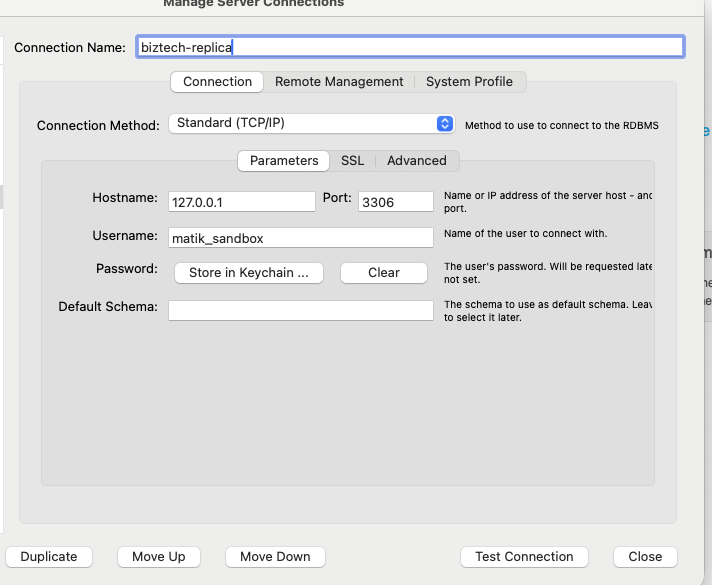

# Overview
Our database engine is MySQL, running on an [RDS Aurora](https://developers.a.musta.ch/docs/default/component/core-storage-docs/rds/about/) instance. It's a shared BizTech instance that hosts all three Matik databases.

| Environment | Database |
|---|---|
| Sandbox | `matik_sandbox` |
| Staging | `matik_staging` |
| Production | `matik_production` |

# Important links
- [Porter](https://porter.a.musta.ch/mysql/clusters/biztech) - View Matik database details including endpoints.

# Database Management

## Adding users and granting permissions
Permissions are managed via [garantador-ot](https://developers.a.musta.ch/docs/default/component/core-storage-docs/rds/permissions/).

Examples:
1. [PR for adding Matik users and granting permissions](https://git.musta.ch/airbnb/grantador-ot/pull/2663)

## Connecting to the database from Database Manager
We have a database manager pod used to access the database via [Adminer](https://www.adminer.org/). This is the recommended way to inspect data without needing a local SSH tunnel.

Navigate to the Adminer UI for the relevant environment:

| Environment | URL |
|---|---|
| Sandbox | https://dbmanager-matik-sandbox.a.musta.ch/ |
| Staging | https://dbmanager-matik-staging.a.musta.ch/ |
| Production | https://dbmanager-matik-production.a.musta.ch/ |

Log in using the following credentials:

| Field | Value |
|---|---|
| System | MySQL / MariaDB |
| Server | `biztech-replica.proxysql-production:3306` |
| Username | `matik_<environment>` |
| Password | Found in 1Password |
| Database | `matik_<environment>` |

> **Note:** Replace `<environment>` with `sandbox`, `staging`, or `production` as appropriate.

## Connecting from your local machine
The database runs inside the mesh network and cannot be accessed directly from your laptop. Access is only available to services — personal account connections are not currently supported.

1. Request [prod/SSH bastion access](https://gandalf-lite.airbnb.tools/search/request?toNamespace=ssh&namespace=ssh&type=ec2&id=bastion&access=prod%2Fssh&q=bastion).
2. Open a terminal and start an SSH tunnel. The tunnel is needed because MySQL Workbench uses its own bundled SSH library and ignores `~/.ssh/config`. If you're using a different client, you may be able to connect via SSH directly.
```
ssh -L 3306:aurora-biztech-cluster.cluster-ro-cqmqbyzxdwlk.us-east-1.rds.amazonaws.com:3306 <ldap_username>@bastion1.musta.ch -N
```
> **Note:**
> - Keep the terminal open in the background — your MySQL client will use this tunnel to connect to the database.
> - Always use the replica endpoint, as it is read-only and avoids any risk of accidentally modifying production data.

3. Set up the connection in MySQL Workbench using the settings shown below.



> **Note:**
> - Use the environment-specific username (password is in 1Password):
>   - sandbox: database `matik_sandbox`, username `matik_sandbox`
>   - staging: database `matik_staging`, username `matik_staging`
>   - production: database `matik_production`, username `matik_production`
