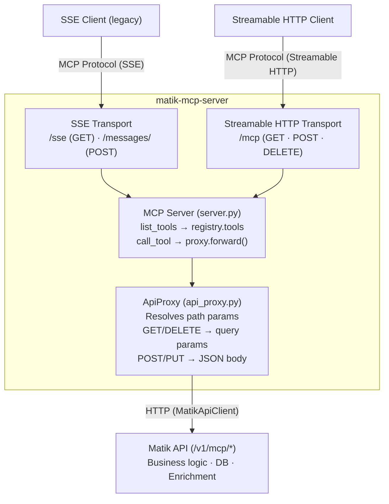

# MCP Server Guide

## Overview

The Matik MCP server is a protocol gateway that exposes Matik API endpoints as MCP tools for LLM agents (OpsBot, AirDiagnosis, etc.). It performs no business logic — it translates between the MCP protocol and HTTP, forwarding every request to the Matik API.

### Technology Stack

- **mcp** (Official Python SDK): MCP protocol implementation with SSE and Streamable HTTP transports
- **Starlette**: ASGI framework hosting the SSE transport routes
- **uvicorn**: ASGI server
- **Location:** `matik/mcp_server/`

### Design Principles

1. **Thin protocol adapter**: All business logic, authentication, and data access live in the Matik API
2. **OpenAPI-driven tools**: Tool definitions are generated from the API's `/openapi.json` spec, not hardcoded
3. **No direct data access**: The MCP server has no database connections or external API clients (except the Matik API)
4. **Mechanical forwarding**: The proxy translates MCP tool calls to HTTP requests without applying business rules

---

## Project Structure

```
matik/mcp_server/
├── __init__.py          # Package init
├── __main__.py          # Module entry point
├── main.py              # Service entry point (config, transport, startup)
├── server.py            # MCP Server initialization (list_tools, call_tool handlers)
├── tools/
│   ├── __init__.py      # Exports McpToolRegistry, parse_openapi_spec
│   └── tool_registry.py # OpenAPI spec parser and tool registry
├── proxy/
│   ├── __init__.py      # Exports ApiProxy
│   └── api_proxy.py     # HTTP proxy for forwarding tool calls to the API
├── server_test.py       # Tests for server.py
├── main_test.py         # Tests for tool_registry.py
└── proxy/
    └── api_proxy_test.py  # Tests for api_proxy.py
```

---

## How It Works

### Startup Sequence

1. Load config and create a `MatikApiClient` pointing at the Matik API
2. `McpToolRegistry` fetches `/openapi.json` from the API
3. The registry parses the spec, keeping only paths under `/v1/mcp/`
4. `create_mcp_server()` creates a low-level `Server` with `list_tools` and `call_tool` handlers
5. Starlette mounts SSE transport routes (`/sse` and `/messages/`); the Streamable HTTP session manager is initialized for `/mcp`
6. A background task refreshes the OpenAPI spec on a configurable interval, emitting `notifications/tools/list_changed` to all connected clients (both SSE and Streamable HTTP) when tools change

### Request Flow



---

## Components

### Tool Registry (`tools/tool_registry.py`)

The registry fetches and parses the Matik API's OpenAPI spec into MCP tool definitions.

**Key behavior:**
- Fetches `/openapi.json` via `MatikApiClient` (inherits retry logic)
- Filters paths to `/v1/mcp/` prefix only — all other endpoints are ignored
- Derives tool names from `operationId`, descriptions from `summary` or `description`
- Merges OpenAPI `parameters` and `requestBody` into a flat JSON Schema for `inputSchema`
- Periodic refresh detects added, removed, or modified tools without requiring a restart
- When refresh detects changes, the server must emit a `notifications/tools/list_changed` notification so connected MCP clients re-fetch the tool list

```python
from mcp_server.tools import McpToolRegistry

registry = McpToolRegistry(api_client=api_client)
tools = registry.fetch_and_parse()  # Initial fetch

# Later — background refresh
changed = registry.refresh()  # Returns True if tools changed
if changed:
    # Notify connected clients to re-fetch tools
    await server.request_context.session.send_tools_list_changed()

# Lookup by name
tool = registry.get_tool("correlate_incident")
```

### API Proxy (`proxy/api_proxy.py`)

The proxy forwards MCP tool calls to the Matik API as HTTP requests.

**Key behavior:**
- Resolves `{path_params}` in the URL template and tracks which arguments were consumed
- Remaining arguments are sent as query parameters (GET/DELETE) or JSON body (POST/PUT/PATCH)
- Forwards additional headers (e.g., `X-MCP-Session-ID`) when provided
- Returns raw response bytes — the server handles JSON parsing and MCP result wrapping

```python
from mcp_server.proxy import ApiProxy

proxy = ApiProxy(api_client=api_client)

# GET /v1/mcp/incidents/INC-123?fields=summary
result = proxy.forward(tool, {"incident_id": "INC-123", "fields": "summary"})

# POST /v1/mcp/correlate_incident with JSON body
result = proxy.forward(tool, {"incident_id": "INC-123", "lookback_minutes": 60})
```

### MCP Server (`server.py`)

Creates the MCP `Server` instance and registers protocol handlers.

**Why low-level Server instead of FastMCP?** Tool definitions are dynamically generated from the OpenAPI spec, not statically declared with decorators. The low-level `Server` from `mcp.server.lowlevel` allows registering tools programmatically.

**Handlers:**

| Handler | What it does |
|---------|-------------|
| `list_tools` | Returns current tools from the registry as `mcp.types.Tool` objects |
| `call_tool` | Looks up the tool, forwards via proxy, wraps response as `CallToolResult` |

**Error handling in `call_tool`:**
- Unknown tool name → `CallToolResult` with `isError=True`
- Proxy failure (network, HTTP error) → `CallToolResult` with `isError=True` and error message
- Non-JSON API response → returned as plain text content (no `structuredContent`)
- Valid JSON API response → returned as text content with `structuredContent` for typed access

**Async bridging:** The proxy uses synchronous `MatikApiClient` (httpx sync). The `call_tool` handler uses `asyncio.to_thread()` to run `proxy.forward()` without blocking the event loop.

```python
from mcp_server.server import create_mcp_server

server = create_mcp_server(registry=registry, proxy=proxy)
```

### Entry Point (`main.py`)

Wires everything together and starts both transports.

```python
uv run python -m matik.mcp_server
```

**Configuration:**
- `config.api.api_endpoint`: Matik API base URL (required)
- `config.mcp.spec_refresh_interval_minutes`: How often to re-fetch the OpenAPI spec (default: 5)
- `config.mcp.http_session_idle_timeout_seconds`: Idle timeout before reaping inactive Streamable HTTP sessions (default: 1800)
- `config.common.port`: Port for both transports
- `config.common.log_level`: Logging level
- `config.common.environment`: Environment name (for structured logging)

**Transport routes:**

| Route | Method | Transport | Purpose |
|-------|--------|-----------|---------|
| `/sse` | GET | SSE (legacy) | SSE event stream — one per client session |
| `/messages/` | POST | SSE (legacy) | JSON-RPC message endpoint for SSE clients |
| `/mcp` | GET · POST · DELETE | Streamable HTTP | Single endpoint for Streamable HTTP clients |
| `/health` | GET | — | Liveness/readiness probe |

Both transports share the same `Server` instance and tool registry. SSE is the legacy transport; new clients should use Streamable HTTP (`/mcp`).

---

## Adding MCP-Exposed API Endpoints

To make a new Matik API endpoint available as an MCP tool, add it to the API under `/v1/mcp/`. The MCP server discovers it automatically on the next spec refresh.

### 1. Create the Route on the API

```python
# api/routes/mcp_my_feature.py
"""MCP endpoints for my feature."""

from fastapi import APIRouter

router = APIRouter(prefix="/v1/mcp", tags=["mcp"])


@router.post(
    "/my_feature",
    operation_id="my_feature",
    summary="Short description for the LLM to understand the tool",
)
def my_feature(request: MyRequest) -> MyResponse:
    """Business logic here."""
    ...
```

**Key points:**
- Path must start with `/v1/mcp/` to be picked up by the tool registry
- `operation_id` becomes the MCP tool name — keep it descriptive and snake_case
- `summary` becomes the tool description shown to the LLM — write it for an LLM audience
- Parameters and request body schemas become the tool's `inputSchema`

### 2. Register the Router

Follow the standard API route registration pattern documented in [api.md](api.md):

```python
# api/routes/__init__.py
from api.routes.mcp_my_feature import router as mcp_my_feature_router

# api/main.py
app.include_router(mcp_my_feature_router)
```

### 3. Verify Discovery

After the API is running with the new endpoint:

```bash
# Check the endpoint appears in the OpenAPI spec
curl http://localhost:8080/openapi.json | jq '.paths["/v1/mcp/my_feature"]'
```

The MCP server will pick up the new tool on its next refresh cycle (default: 5 minutes), or on restart. When the refresh detects the new tool, it emits `notifications/tools/list_changed` so connected MCP clients automatically re-fetch their tool list.

---

## MCP Health Endpoint

The API exposes `/v1/mcp/health` as a lightweight connectivity check. This endpoint is registered as an MCP tool (`operation_id="mcp_health"`) so the MCP server can verify API reachability.

**Location:** `api/routes/mcp_health.py`

**Response:**
```json
{
    "status": "healthy",
    "service": "matik-api",
    "checks": {
        "database": "ok"
    }
}
```

Returns `503` with `status: "unhealthy"` if database connectivity fails.

---

## Model

The `McpToolDefinition` Pydantic model represents a single MCP tool derived from an OpenAPI operation. It is shared across the registry, proxy, and server components.

**Location:** `common/models/mcp_tool_definition.py`

| Field | Type | Description |
|-------|------|-------------|
| `name` | `str` | Tool name from `operationId` |
| `description` | `str` | Tool description from `summary` or `description` |
| `input_schema` | `dict[str, Any]` | JSON Schema for tool parameters |
| `method` | `str` | HTTP method (GET, POST, etc.) |
| `path` | `str` | API path (e.g., `/v1/mcp/correlate_incident`) |

---

## Testing

### Running Tests

```bash
# All MCP server tests
uv run pytest matik/mcp_server/ -v

# Specific test files
uv run pytest matik/mcp_server/server_test.py -v
uv run pytest matik/mcp_server/main_test.py -v
uv run pytest matik/mcp_server/proxy/api_proxy_test.py -v

# MCP health endpoint tests (lives in api/)
uv run pytest matik/api/routes/mcp_health_test.py -v
```

### Test Patterns

**Server tests (`server_test.py`):** Create the MCP server with mock registry and proxy, then invoke handlers directly via `server.request_handlers[types.ListToolsRequest]`. Handlers return `ServerResult` — access the actual result via `.root`.

```python
server = create_mcp_server(registry=mock_registry, proxy=mock_proxy)
handler = server.request_handlers[types.CallToolRequest]

server_result = await handler(
    types.CallToolRequest(
        method="tools/call",
        params=types.CallToolRequestParams(
            name="correlate_incident",
            arguments={"incident_id": "INC-123"},
        ),
    )
)
result = server_result.root

assert result.isError is not True
assert json.loads(result.content[0].text) == expected_data
```

**Registry tests (`main_test.py`):** Mock `MatikApiClient.get_request` to return OpenAPI spec JSON. Test parsing, filtering, refresh detection, and edge cases.

**Proxy tests (`api_proxy_test.py`):** Mock `MatikApiClient` methods (`get_request`, `post_json_request`). Verify path param resolution, query param vs body forwarding, and header propagation.

---

## Instrumentation

The MCP server emits OpenTelemetry metrics via the same Telescope/OTLP pipeline used by other Matik services. Metrics are transport-level only — the API's HTTP middleware handles business-level request tracking.

### Metrics emitted

| Metric | Type | Description |
|--------|------|-------------|
| `matik_mcp_tool_calls_total` | Counter | Total tool calls by `tool_name`, `status` |
| `matik_mcp_tool_call_duration_seconds` | Histogram | End-to-end call duration by `tool_name`, `status` |
| `matik_mcp_tool_call_errors_total` | Counter | Errors by `tool_name`, `error_type` |
| `matik_mcp_active_sessions` | Gauge | Current active MCP client sessions |
| `matik_mcp_spec_refreshes_total` | Counter | Spec refresh outcomes by `status` |

Full label definitions and histogram buckets are in [observability/metrics.md](../observability/metrics.md).

### Enabling metrics

Metrics are optional — they are no-ops when `TELESCOPE_ENABLED=false`. When enabled, `McpMetrics` is initialized in `main.py` and passed to `create_mcp_server()` and `McpToolRegistry`:

```python
from common.metrics.mcp_metrics import McpMetrics
from common.metrics.telescope import TelescopeClient

mcp_metrics = None
telescope = None
if config.telescope and config.telescope.enabled:
    config.telescope.service_name = "mcp-server"
    config.telescope.environment = config.common.environment
    telescope = TelescopeClient(config.telescope)
    telescope.start()
    mcp_metrics = McpMetrics(telescope.meter)

registry = McpToolRegistry(api_client=api_client, metrics=mcp_metrics)
mcp_server, _ = create_mcp_server(registry=registry, proxy=proxy, metrics=mcp_metrics)
```

See `_infra/docs/development/mcp-instrumentation-plan.md` for the full design and `_infra/docs/development/metrics.md` for local dev setup.

---

## Deployment

The MCP server runs as a standalone Kubernetes deployment, separate from the Matik API. It communicates with the API via AirMesh service mesh.

**How MCP clients reach the server:** Both transports run on the same port as a standard HTTP service. SSE clients connect to `/sse`; Streamable HTTP clients connect to `/mcp`. No special networking is required beyond standard K8s service routing.

**K8s health probes:** Liveness and readiness probes hit `/health`, which responds independently of the transport layer.

---

## Reference

- **Architecture doc:** `_infra/docs/architecture/matik-mcp-server.md`
- **MCP Python SDK:** https://github.com/modelcontextprotocol/python-sdk
- **MCP specification:** https://spec.modelcontextprotocol.io
- **API guide:** `_infra/docs/development/api.md`
- **Client patterns:** `_infra/docs/development/clients.md`
