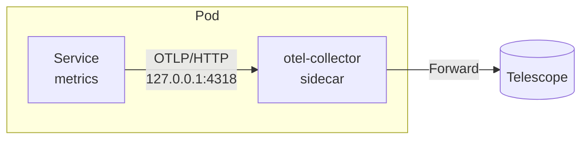
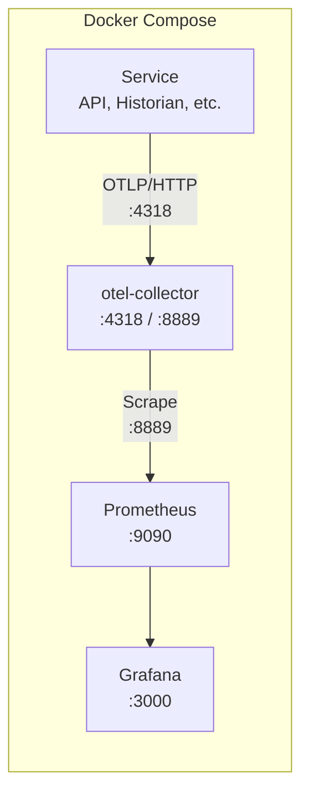

# Metrics

## Overview

Matik uses OpenTelemetry to export metrics to Telescope via a local otel-collector sidecar. The metrics module provides instrumentation for:

- **Client metrics** - External API calls (Incident.io, Jira, etc.)
- **Database metrics** - Query timing and connection pool stats
- **HTTP metrics** - FastAPI request instrumentation
- **Job metrics** - Background job execution tracking
- **Facade metrics** - LLM/Facade API instrumentation
- **SQS Publisher metrics** - SQS message publish instrumentation for historian producers

For a complete list of all metrics emitted, including labels and histogram buckets, see the [Metrics Reference](../observability/metrics.md).

## Architecture



## Configuration

Metrics configuration is in `metrics.yaml`, separate from service configs:

```yaml
# metrics.yaml
telescope:
  enabled: ${TELESCOPE_ENABLED}
  tenant_id: ${TELESCOPE_TENANT_ID}
  push_interval_seconds: ${TELESCOPE_PUSH_INTERVAL_SECONDS}
  otel_endpoint: ${TELESCOPE_OTEL_ENDPOINT}
```

Load and merge with service config:

```python
from common.config import load_config, merge_config

config = load_config("matik-historian-config.yaml")
config = merge_config(config, "metrics.yaml")
```

### Configuration Fields

| Field | Description | Default |
|-------|-------------|---------|
| `enabled` | Enable/disable metrics | `false` |
| `tenant_id` | Telescope tenant ID for routing | Required |
| `push_interval_seconds` | Export interval | `60` |
| `otel_endpoint` | OTLP HTTP endpoint | `http://127.0.0.1:4318/v1/metrics` |
| `timeout_seconds` | Export timeout | `30` |

Runtime fields (set programmatically):
- `service_name` - Name of the service
- `service_version` - Version string
- `environment` - Deployment environment

## Basic Usage

```python
from common.config import load_config, merge_config
from common.metrics import TelescopeClient, ClientMetrics, DBMetrics, JobMetrics

# Load config with metrics
config = load_config("matik-historian-config.yaml")
config = merge_config(config, "metrics.yaml")

# Set runtime fields
config.telescope.service_name = "historian"
config.telescope.environment = config.common.environment

# Initialize Telescope client
telescope = TelescopeClient(config.telescope)
telescope.start()

# Create metrics instances
client_metrics = ClientMetrics(telescope.meter, "historian", "incidentio")
db_metrics = DBMetrics(telescope.meter, "historian")
job_metrics = JobMetrics(telescope.meter, "historian")

# Shutdown on exit
telescope.shutdown()
```

## Client Metrics

Track external API calls (Incident.io, Jira, GitHub, etc.).

### Step 1: Initialize in Your Service (main.py)

```python
from common.config import load_config, merge_config
from common.metrics import TelescopeClient, ClientMetrics

# Load config with metrics
config = load_config("matik-historian-config.yaml")
config = merge_config(config, "metrics.yaml")

# Set runtime fields
config.telescope.service_name = "historian"
config.telescope.environment = config.common.environment

if config.telescope and config.telescope.enabled:
    telescope = TelescopeClient(config.telescope)
    telescope.start()
    incidentio_metrics = ClientMetrics(telescope.meter, "historian", "incidentio")

client = create_incidentio_client(
    incidentio_config=config.incidentio,
    client_metrics=incidentio_metrics,
)
```

### Step 2: Record Metrics in Your Client

```python
# Record a request manually
metrics.record_request(
    method="GET",
    endpoint="/v2/incidents",
    duration_seconds=0.5,
    status_code=200,
)

# Or use timing helper
record = metrics.start_request("GET", "/v2/incidents")
try:
    response = await client.get("/v2/incidents")
    record(response.status_code, None)
except Exception as e:
    record(500, e)

# Record retries
metrics.record_retry("GET", "/v2/incidents", attempt=2)
```

## Database Metrics

Track database queries:

```python
from common.metrics import DBMetrics, PoolStats

metrics = DBMetrics(meter, "historian")

# Record a query
record = metrics.start_query("select", "incidents")
try:
    result = await db.execute(query)
    record(None)
except Exception as e:
    record(e)

# Update connection pool stats
metrics.update_pool_stats(PoolStats(
    open_connections=10,
    idle_connections=5,
    in_use_connections=5,
))
```

## HTTP Metrics (FastAPI)

Add middleware to FastAPI apps:

```python
from fastapi import FastAPI
from common.metrics import HTTPMetrics

app = FastAPI()

# Add metrics middleware
middleware_cls = HTTPMetrics.create_middleware(telescope.meter, "api")
app.add_middleware(middleware_cls)
```

## Job Metrics

Track background job execution:

```python
from common.metrics import JobMetrics

metrics = JobMetrics(meter, "historian")

# Record job execution
record = metrics.start_job("incidentio_incidents")
try:
    items = await process_incidents()
    record(len(items), None)
except Exception as e:
    record(0, e)

# Record non-fatal errors during processing
metrics.record_job_error("incidentio_incidents", "rate_limit")
```

## Facade Metrics (LLM)

Track Facade/LLM API calls and token usage for services that integrate with Facade.

### Step 1: Initialize in the Enricher (main.py)

Facade metrics belong to the service that actually calls the LLM — the **Enricher**
(historians no longer call Facade; they forward to the Enricher's SQS queue).

```python
from common.config import load_config, merge_config
from common.metrics import TelescopeClient, ClientMetrics, FacadeMetrics

# Load config with metrics
config = load_config("matik-enricher-config.yml")
config = merge_config(config, "metrics.yml")

# Initialize metrics
facade_client_metrics = None
facade_metrics = None

if config.telescope and config.telescope.enabled:
    config.telescope.service_name = "enricher"
    config.telescope.environment = config.common.environment

    telescope = TelescopeClient(config.telescope)
    telescope.start()
    meter = telescope.meter

    # ClientMetrics tracks HTTP calls to the Facade API
    facade_client_metrics = ClientMetrics(meter, "enricher", "facade")
    # FacadeMetrics tracks LLM-specific metrics (tokens, model usage)
    facade_metrics = FacadeMetrics(meter, config.telescope.service_name)

# Pass both to the facade client
facade_client = create_facade_client(
    facade_config=config.facade,
    common_config=config.common,
    metrics=facade_client_metrics,      # HTTP request metrics
    facade_metrics=facade_metrics,       # LLM token/model metrics
)
```

### Step 2: Record Metrics in Facade Client

```python
from common.metrics import FacadeMetrics

# Record a call manually
metrics.record_call(
    model="gpt-4o",
    operation="summarize_root_cause",
    prompt_tokens=500,
    completion_tokens=100,
    duration_seconds=2.5,
)

# Or use timing helper (recommended)
record = metrics.start_call("gpt-4o", "summarize_root_cause")
try:
    response, usage = await facade.send_message(...)
    record(usage.prompt_tokens, usage.completion_tokens, error=False)
except Exception:
    record(0, 0, error=True)
```

### Two Types of Metrics

Services integrating with Facade typically use two complementary metrics:

| Metric Class | Purpose | What It Tracks |
|--------------|---------|----------------|
| `ClientMetrics` | HTTP layer | Request count, latency, HTTP errors, retries |
| `FacadeMetrics` | LLM layer | Token usage, model distribution, LLM-specific errors |

Both should be initialized and passed to the facade client for complete observability.

## Standard Pattern

```python
"""Service entry point with metrics."""

from common.config import load_config, merge_config
from common.metrics import TelescopeClient, JobMetrics
from common.utils import log_utils

logger = log_utils.get_logger(__name__)


def main() -> int:
    # Load config
    config = load_config("matik-historian-config.yaml")
    config = merge_config(config, "metrics.yaml")

    log_utils.configure(
        level=config.common.log_level,
        environment=config.common.environment,
    )

    # Initialize metrics
    if config.telescope:
        config.telescope.service_name = "historian"
        config.telescope.environment = config.common.environment
        telescope = TelescopeClient(config.telescope)
        telescope.start()
        job_metrics = JobMetrics(telescope.meter, "historian")
    else:
        telescope = None
        job_metrics = None

    try:
        # Run job with metrics
        if job_metrics:
            record = job_metrics.start_job("incidentio_incidents")

        items = process_incidents()

        if job_metrics:
            record(len(items), None)

        return 0
    except Exception:
        logger.exception("job failed")
        if job_metrics:
            record(0, Exception("job failed"))
        return 1
    finally:
        if telescope:
            telescope.shutdown()
```

## File Structure

```
matik/common/
├── constants.py           # TELESCOPE_TENANT_LABEL, TELESCOPE_ORG_HEADER, etc.
├── models/
│   └── telescope_config.py  # TelescopeConfig model
└── metrics/
    ├── __init__.py                  # Public exports
    ├── telescope.py                 # TelescopeClient (OTLP exporter)
    ├── client_metrics.py            # External API instrumentation
    ├── db_metrics.py                # Database instrumentation
    ├── facade_metrics.py            # LLM/Facade instrumentation
    ├── http_middleware.py           # FastAPI middleware
    ├── job_metrics.py               # Background job instrumentation
    └── sqs_publisher_metrics.py     # SQS publish instrumentation (historians)
```

## Constants

Defined in `common/constants.py`:

| Constant | Value | Description |
|----------|-------|-------------|
| `TELESCOPE_TENANT_LABEL` | `telescope_tenant_id` | Resource attribute for tenant routing |
| `TELESCOPE_ORG_HEADER` | `X-Scope-OrgID` | HTTP header for tenant routing |
| `DEFAULT_TELESCOPE_TIMEOUT_SECONDS` | `30` | Default export timeout |
| `DEFAULT_OTEL_ENDPOINT` | `http://127.0.0.1:4318` | Local sidecar base URL |
| `OTEL_METRICS_PATH` | `/v1/metrics` | OTLP metrics endpoint path |

## Local Development

### Running the Metrics Stack

The local development environment includes a full metrics stack via Docker Compose:



**Services:**
- **otel-collector** - Receives OTLP metrics, exposes Prometheus endpoint
- **Prometheus** - Scrapes and stores metrics
- **Grafana** - Visualization dashboards

### Environment Variables

Configure in `.env.local`:

```bash
# Enable metrics collection
TELESCOPE_ENABLED="true"
TELESCOPE_TENANT_ID="matik"
TELESCOPE_PUSH_INTERVAL_SECONDS="15"
# Base URL only - /v1/metrics path is appended automatically
TELESCOPE_OTEL_ENDPOINT="http://otel-collector:4318"
```

### Starting the Stack

```bash
# Start all services including metrics stack
docker compose up -d

# Verify otel-collector health
curl http://localhost:13133/health

# Verify Prometheus is scraping
curl http://localhost:9090/api/v1/targets
```

### Verifying Metrics

1. **Generate some metrics** by making API requests:
   ```bash
   curl http://localhost:8080/health
   curl http://localhost:8080/v1/jira/batch/tracker/tcmr
   ```

2. **Check raw metrics** from otel-collector's Prometheus exporter:
   ```bash
   curl http://localhost:8889/metrics | grep matik
   ```

3. **Query Prometheus** directly:
   ```bash
   # List all matik metrics
   curl 'http://localhost:9090/api/v1/label/__name__/values' | jq '.data[] | select(startswith("matik"))'

   # Query specific metric
   curl 'http://localhost:9090/api/v1/query?query=matik_http_requests_total'
   ```

4. **View in Grafana** at http://localhost:3000 (default: admin/admin)

### Grafana Dashboard

The Grafana dashboard JSON located at `matik/local-configs/grafana/provisioning/dashboards/` is an exact copy of the production Telescope dashboard. This ensures local development metrics visualization matches what you'll see in production.

**Production Dashboard:** [Matik Unified Dashboard](https://grafana.a.musta.ch/d/matik-unified-dashboard/matik-unified-dashboard?orgId=1)

**Files:**
- `matik-metrics.json` - Dashboard definition (copy of production)
- `last-modified.txt` - UTC timestamp of last dashboard update

**Automatic timestamp tracking:**

A pre-commit hook automatically updates `last-modified.txt` with the current UTC timestamp whenever `matik-metrics.json` is modified. This helps track when the dashboard was last synced from production.

To update the dashboard:
1. Export the latest dashboard JSON from production Telescope
2. Replace `matik-metrics.json` in `matik/local-configs/grafana/provisioning/dashboards/`
3. Commit the changes - `last-modified.txt` will be automatically updated
4. Restart Grafana: `docker compose restart grafana`

### Disabling Metrics

For local development without metrics:

1. Set `TELESCOPE_ENABLED="false"` in `.env.local`
2. Or omit the `metrics.yml` merge in your service

The `TelescopeClient` gracefully handles disabled state - all metric recording calls become no-ops.

### Troubleshooting

**No metrics appearing:**
1. Check `TELESCOPE_ENABLED="true"` in `.env.local`
2. Verify otel-collector is running: `docker ps | grep otel`
3. Check otel-collector logs: `docker logs matik-otel-collector`
4. Ensure `TELESCOPE_OTEL_ENDPOINT` is the base URL only (no `/v1/metrics` path)

**Debug logging:**
Set `LOG_LEVEL=DEBUG` in `.env.local` to see metric recording debug statements:
```json
{"level": "debug", "message": "recorded http request metric", "method": "GET", "path": "/health", "status_code": 200, "duration_seconds": 0.005}
```
