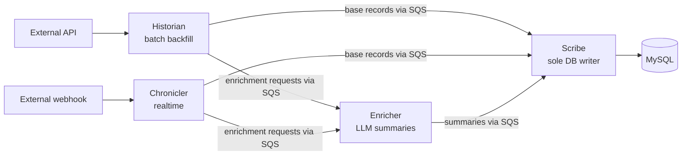

# Onboarding a New Data Source Guide

How to add a brand-new ingestion source (a new external system whose events Matik
catalogs) end to end, following the "paved path" the RFC established. If you'd
rather be walked through this interactively, run the **`/onboard`** slash command —
it drives every step below and asks you the questions this guide would.

## Overview

Matik ingests reliability signals from external systems and correlates them. A
source flows through this pipeline:



- **Historian** — batch job that crawls the source's API and publishes base
  records to Scribe (via SQS) and enrichment requests to the Enricher (via SQS).
- **Chronicler** — the realtime path: consumes webhooks and publishes to the same
  two queues. Optional; add it only if the source has webhooks.
- **Scribe** — the **only** service that writes the record tables. It validates
  each message and upserts via the source's DAO.
- **Enricher** — independently consumes enrichment requests, calls the LLM, and
  publishes the summaries back to Scribe's queue. **Config-only, no per-source
  code.**
- **MySQL** — the catalog. One table per source (plus a small tracker table).

The paved path means most of this is inherited. A new source **declares one
`DataSourceSpec`** and writes its source-specific pieces (model, client, DAO
finders, crawler); the generic DAO, Scribe handler, and historian shell read the
spec instead of hand-wired per-source code.

Reference implementation throughout this guide: **Incident.io** — the cleanest,
fully spec-driven source. Copy from it. Where JIRA or GHE-PR differ, it's called
out.

Related design docs: [DAO](dao.md) · [Historian](historian.md) ·
[Scribe](scribe.md) · [Chronicler](chronicler.md) · [Models](models.md) ·
[Configuration](configuration.md) · [Database Migrations](database-migrations.md).

## The `DataSourceSpec` is the single wiring point

Every source is declared once as a frozen `DataSourceSpec`
(`matik/common/datasources/registry.py`) and registered in the module-level
registry. Downstream infrastructure reads the spec — there are **no hand-maintained
per-source column lists** anywhere.

The Incident.io spec (`matik/common/datasources/incidentio.py`), verbatim:

```python
register_source(
    DataSourceSpec(
        source_type="incidentio",
        record_model=IncidentIOIncident,
        conflict_keys=["incident_id", "reference_id"],
        exclude_columns=[
            "incident_channel_summary",
            "incident_channel_summary_hash",
        ],
        dao_factory=_build_dao,
        enrichment_message_model=IncidentIOEnrichmentMessage,
        enrichment_key="incident_id",
        enrichment_hook_target="record",
        record_finder="find_incident_by_id",
    )
)
```

Fields:

| Field | Meaning |
|---|---|
| `source_type` | The Scribe/Enricher discriminator, e.g. `"incidentio"`. |
| `record_model` | The `table=True` SQLModel; its `__table__` drives every derived column list. |
| `conflict_keys` | Unique-index columns backing `ON DUPLICATE KEY UPDATE` (never updated on conflict). |
| `exclude_columns` | Denylist: extra columns kept OUT of base writes (e.g. immutable `created_at`, or columns another source owns). |
| `dao_factory` | `(engine, metrics) -> BaseUpsertDAO`. A lazy builder (imports the DAO inside the function to avoid an import cycle). |
| `enrichment_message_model` | Pydantic model the enrichment message validates into. `None` = source has no LLM route. |
| `enrichment_key` | Identifier field used to locate the row for the LLM update (e.g. `"incident_id"`). |
| `enrichment_hook_target` | `"message"` (default, cheap) or `"record"` (re-fetch the row for a post-write hook — incidentio's correlation hook needs the full incident). |
| `record_finder` | DAO method name used to re-fetch when `enrichment_hook_target == "record"`. |
| `base_message_model` / `base_partial_update` | Only for sources whose base write *patches* an existing row instead of upserting a full record. Leave unset for the normal path. |
| `enrichment_overwrites_with_none` | `True` writes `None` LLM columns as SQL NULL. Default `False` drops `None` so a missing field never overwrites. |
| `base_column_flags` | Boolean base-message flags that gate a single column in the upsert (JIRA's `{"update_services": "services"}`). |

Two lists are **derived** — you never write them:

- **`update_columns`** — every table column EXCEPT `conflict_keys ∪
  {id, row_created_at, row_updated_at} ∪ llm_columns ∪ exclude_columns`. To keep a
  new column out of base writes, add it to `exclude_columns`; the derivation does
  the rest.
- **`llm_columns`** — the `enrichment_message_model`'s fields minus
  `source_type`/`message_type`/`enrichment_key`. So **the enrichment message's
  field names must equal the DB column names exactly.**

## Step-by-step

Work in dependency order. Each step notes whether it's a NEW file or an EDIT to a
shared file, and which existing source to copy.

### 1. Record model (NEW: `common/models/<src>_record.py`)

Copy `common/models/incidentio_incident.py`. A `class <Src>Record(SQLModel,
table=True)` with:

- `__tablename__` + `__table_args__` declaring the `UniqueConstraint` (this is your
  `conflict_keys`) and `{"extend_existing": True}`.
- Autoincrement PK: `id: int | None = Field(default=None, sa_column=Column(BigInteger,
  primary_key=True, autoincrement=True))`.
- **JSON list columns**: `services: list[str] | None = Field(default=None,
  sa_column=Column(JSON, nullable=True))` — import `JSON` from
  `sqlalchemy.dialects.mysql`. ⚠️ Never `json.dumps` a list before storing it; the
  `JSON` column type serializes exactly once. (Double-encoding was a real bug — the
  DAO hands lists to SQLAlchemy as native objects.)
- **LLM-enriched columns**: plain nullable `Text` / `String(64)` (e.g.
  `root_cause_summary`, `root_cause_summary_hash`).
- **Audit columns** `row_created_at` / `row_updated_at`: `Column(DateTime,
  nullable=False, server_default=text("CURRENT_TIMESTAMP"))` and
  `text("CURRENT_TIMESTAMP ON UPDATE CURRENT_TIMESTAMP")`. Declared in the model but
  **populated only by MySQL** — never written by app code.
- **Timestamp validator**: one `@field_validator(<all datetime fields>,
  mode="before") @classmethod` that returns `parse_timestamp_to_utc(v)` (from
  `common.utils.datetime_utils`). All timestamps are stored as naive UTC — see the
  model guidelines in [`CLAUDE.md`](../../../CLAUDE.md) and [models.md](models.md).

### 2. Tracker model (NEW: `common/models/<src>_tracker.py`)

Copy `common/models/incidentio_tracker.py` — a single-row (`id=1`) SQLModel holding
the incremental-sync cursor + `status`. Use this shape unless the source needs
windowed backfill (JIRA's `jira_batch_tracker.py` uses per-`ticket_type`
`batch_start`/`batch_end`/`window_days`).

### 3. Config model (NEW: `common/models/<src>_config.py`)

Copy `common/models/incidentio_config.py` — a `SQLModel` with **no** `table=True`
holding `api_key`, `base_url`, pagination/retry settings, `start_date`/`lookback_days`,
`write_batch_size`, `consumer_timeout_seconds`, `sqs_queue_url`, `sqs_queue_region`,
plus module-level `DEFAULT_*` constants.

### 4. Scribe messages (EDIT: `common/models/scribe_messages.py`)

Add two Pydantic classes (copy `IncidentIOBaseMessage` / `IncidentIOEnrichmentMessage`):

- `class <Src>BaseMessage(BaseModel)` — `source_type: Literal["<src>"]`,
  `message_type: Literal["base"]`, `data: dict[str, Any]` (the flat record dump).
- `class <Src>EnrichmentMessage(EnricherEnvelopeMixin)` — `source_type` /
  `message_type: Literal["enrichment"]`, the `enrichment_key` field, and the LLM +
  hash columns. `EnricherEnvelopeMixin` (already in the file) flattens the Enricher's
  `{entity_id, updates, hashes}` envelope; you just declare the flat fields. **These
  field names must equal the DB column names** (they become `llm_columns`).

An enrichment-only source (no base write) omits the base message — see
`IncidentChannelSummaryEnrichmentMessage`.

### 5. Register the model for Alembic (EDIT: `common/models/__init__.py`)

Add the record + tracker models to the imports and `__all__`. **Required** — Alembic
autogenerate uses `SQLModel.metadata`, so a model that isn't imported here is
invisible to migrations.

### 6. DataSourceSpec (NEW: `common/datasources/<src>.py`; EDIT: `__init__.py`)

Copy `common/datasources/incidentio.py`: a lazy `_build_dao(engine, metrics=None)`
(imports the DAO inside the function) plus a module-level `register_source(
DataSourceSpec(...))`. Then add `import common.datasources.<src>` to
`common/datasources/__init__.py` (one line) so the registry self-populates on import.

### 7. DAO (NEW: `common/daos/<src>_dao.py`)

Copy `common/daos/incidentio_incident_dao.py`. The minimum:

```python
class <Src>DAO(BaseUpsertDAO):
    def __init__(self, engine, metrics=None):
        from common.datasources.registry import get_source  # lazy: avoids cycle
        super().__init__(get_source("<src>"), engine, metrics)

    def find_<record>_by_id(self, ...) -> <Src>Record | None:
        ...  # only the finders your spec.record_finder + API/Enricher need
```

Batch upsert (`upsert_batch`) and the LLM partial update
(`update_llm_fields_from_message`) are **fully inherited** from `BaseUpsertDAO`
(`common/daos/base_dao.py`). You only write the finder(s) named by
`spec.record_finder` plus any hash lookups the Enricher/API call. (The incidentio
DAO also has legacy `insert_new_*`/`update_*` wrappers — a clean new source does not
need them.)

### 8. API client (NEW: `common/clients/<src>_client.py`)

Copy `common/clients/incidentio_client.py`: a `create_<src>_client(<src>_config,
client_metrics=None)` factory over an async `httpx.AsyncClient`, with the shared
retry/metrics/pagination helpers (`RETRYABLE_STATUS_CODES`, `get_backoff_delay` from
`common.utils.retry_utils`, cursor pagination returning `(items, raw_count,
last_id)`).

### 9. API tracker route (NEW: `api/routes/<src>.py`; EDIT: `api/main.py`, `api/routes/deps.py`)

Historian crawlers read/write their tracker through the **Matik API** (not the DB
directly — Scribe owns the record tables). Copy `api/routes/incidentio.py`:
`GET`/`POST /v1/<src>/.../tracker/lastrecorded` backed by the tracker DAO. Then
`app.include_router(<src>_router)` in `api/main.py` (+ import) and add the DAO
dependency in `api/routes/deps.py`.

### 10. Historian (NEW: `historian/<src>/{__init__,__main__,main,<src>_crawler}.py`)

Copy `historian/incidentio/`:

- **`main.py`** — a `_build_and_run(ctx: HistorianContext) -> int` callback that
  builds the metric objects (from `ctx.meter`/`ctx.service_name`), the matik-api
  client, the source client, a base-record `SQSPublisher`, an `EnrichmentPublisher`,
  instantiates the crawler, calls `crawler.dispatch()`, and maps the `CrawlerResult`
  to an exit code. `main()` is a thin `run_historian(spec=get_source("<src>"),
  caller_name=__name__, source_config_files=[...], build_and_run=_build_and_run)`
  call. `run_historian` (`historian/base/runner.py`) owns the shared shell (config
  merges, logging, Telescope, validation, shutdown).
- **`<src>_crawler.py`** — see the decision below.
- **`__main__.py`** — two lines: `from .main import main` / `sys.exit(main())`.

**BaseCrawler vs. custom `dispatch()`** — every crawler exposes `dispatch() ->
CrawlerResult`, but there are two ways to get there:

- **Subclass `BaseCrawler`** (recommended default; copy
  `historian/incidentio/incidentio_incident_crawler.py`) when the source fits the
  streaming shape: paginate the API, stream items through a bounded queue,
  batch-write. You implement 10 hooks (`_get_tracker`, `_check_tracker_status`,
  `_update_tracker`, `_initial_sync_complete`, `_calculate_fetch_cursor`,
  `_producer`, `_publish_records`, `_publish_enrichment_messages`,
  `_write_batch_size`, `_consumer_timeout_seconds`) and inherit the
  producer/consumer/batch machinery.
- **Roll your own `dispatch()`** (do NOT subclass) when the crawl shape differs.
  GHE-PR (`historian/biztech_github/ghe_pr_crawler.py`) fans out over repos and owns
  its own event loop; JIRA (`historian/jira/main.py`) runs a synchronous two-job loop
  with a windowed tracker and no crawler class. Both still return a `CrawlerResult`.

### 11. Scribe wiring (EDIT: `scribe/main.py`, `scribe/processor.py`)

Two one-line edits (no new handler class — `GenericHandler` is spec-driven):

- `scribe/main.py`: add `"<src>": _build_generic("<src>")` to the `ScribeProcessor`
  handler dict. If the source needs a post-write side effect, wire a `HandlerHooks`
  (as incidentio does for its enigmatologist hook).
- `scribe/processor.py`: add `"<src>": _spec_routes("<src>")` to `VALID_ROUTES`.

### 12. Enricher (EDIT: `local-configs/matik-enricher-config.yml`)

**Config only — no code.** Add a `source_mappings.<src>` block:

```yaml
source_mappings:
  <src>:
    - input_keys: ["<content keys the historian puts in EnrichmentRequest.content>"]
      output_field: <llm_column>          # must match the enrichment message field
      hash_field: <llm_hash_column>        # gates the LLM call
      prompt: |
        <source-specific instructions>
```

`input_keys` must match the `content` keys your crawler/transformer sets on the
`EnrichmentRequest`; `output_field`/`hash_field` must match the enrichment-message
(= DB column) names. See [enricher-design](../architecture/enricher-design.md).

### 13. Migration (NEW: `migrator/alembic/versions/<hash>_*.py`)

Copy the create-table pattern from `migrator/alembic/versions/616f7b7e3e44_initial_schema.py`
(`op.create_table(...)` with `PrimaryKeyConstraint`, `UniqueConstraint`, indexes;
include the two audit columns from `b8d2f3a1c4e6_add_row_audit_timestamps.py`), and
seed the single-row tracker (`INSERT IGNORE ... VALUES (1, ...)`, copy
`e7795d51175b_insert_incidentio_tracker.py`). Chain `down_revision` to the current
head. See [database-migrations](database-migrations.md).

### 14. Config + `MatikConfig` (NEW: `local-configs/matik-historian-<src>-config.yml`; EDIT: `common/models/matik_config.py`)

- Copy `local-configs/matik-historian-incidentio-config.yml` — the env-var-substituted
  (`${VAR}`) config block referenced by name in your `run_historian(...,
  source_config_files=[...])`.
- Add `<src>: <Src>Config | None = Field(default=None)` to `MatikConfig`
  (`common/models/matik_config.py`). `run_historian` reads it via
  `getattr(config, source_config_attr or spec.source_type)`. If your config section
  name differs from `source_type` (GHE's is `biztech_github` vs `source_type="ghe_pr"`),
  pass `source_config_attr=` to `run_historian`.

### 15. Chronicler / realtime (OPTIONAL — NEW: `chronicler/transformers/<src>.py`; EDIT: `__init__.py`)

Only if the source has webhooks. Copy `chronicler/transformers/incidentio.py`: a
class implementing the `ProviderTransformer` protocol (`validate_signature`,
`should_process`, `to_base_message`, `to_enrichment_request`) ending with
`register_transformer("<provider>", <Src>Transformer())`; then add `import
chronicler.transformers.<src>` to `chronicler/transformers/__init__.py`. If the
webhook needs a secret, add its field to `common/models/chronicler_config.py`. See
[chronicler](chronicler.md).

## Verify

From `matik/`:

```bash
uv run ruff check . && uv run ruff format --check .
uv run mypy .
uv run pytest common/ historian/<src>/ scribe/ api/   # + chronicler/ if added
```

> Local caveat: `uv run` may try to re-sync dependencies against artifactory and
> time out. Use `uv run --no-sync` to skip the re-sync. Some modules transitively
> import `opentelemetry-instrumentation-openai`, which may not be installable
> locally; those run in CI.

Sandbox smoke check: reset a non-prod environment via the Spinnaker
`reset_sandbox` / `reset_staging` pipeline (which applies your migration as part of
the redeploy — see [Resetting a Matik Environment](reset-matik.md)), run the new
historian, and confirm the record + tracker tables populate, base upserts don't
clobber LLM columns, and enrichment summaries land. (Locally, `python -m migrator
upgrade head` applies migrations against your dev DB.)

## Deploy

- **Migrations run automatically during deploy.** The Spinnaker deploy pipelines run
  the migrator (`matik-migrator`, `upgrade head`) as a pipeline stage on every
  deploy — you do **not** run `python -m migrator` by hand for a deployed environment.
  Merging your migration is enough; the next deploy applies it. (The `reset_sandbox` /
  `reset_staging` pipelines additionally downgrade to base and re-apply — see
  [Resetting a Matik Environment](reset-matik.md).) `python -m migrator` is only for
  local dev DBs.
- Config secrets (API keys, webhook secrets, SQS URLs) are injected as env vars at
  deploy time from the infra repo — the `${VAR}` placeholders in `local-configs/` are
  the template.
- Every PR must include a `## Test Plan` section (CI enforces this — see
  [`CLAUDE.md`](../../../CLAUDE.md)).

## Onboarding checklist

- [ ] Record, tracker, config models (`common/models/<src>_*.py`)
- [ ] Scribe base + enrichment messages (`scribe_messages.py`)
- [ ] Models registered in `common/models/__init__.py`
- [ ] `DataSourceSpec` + registered in `common/datasources/__init__.py`
- [ ] DAO (finders only)
- [ ] API client
- [ ] API tracker route + `include_router`
- [ ] Historian (`main` + crawler + entrypoint)
- [ ] Scribe: handler-dict line + `VALID_ROUTES` line
- [ ] Enricher `source_mappings.<src>` block
- [ ] Alembic migration (table + tracker seed)
- [ ] Historian config YAML + `MatikConfig` field
- [ ] Chronicler transformer (if realtime)
- [ ] Tests, ruff, mypy green; PR with a Test Plan

## Related

For a guided, interactive walkthrough that runs these steps and asks you the
source-specific questions, use the **`/onboard`** slash command.
