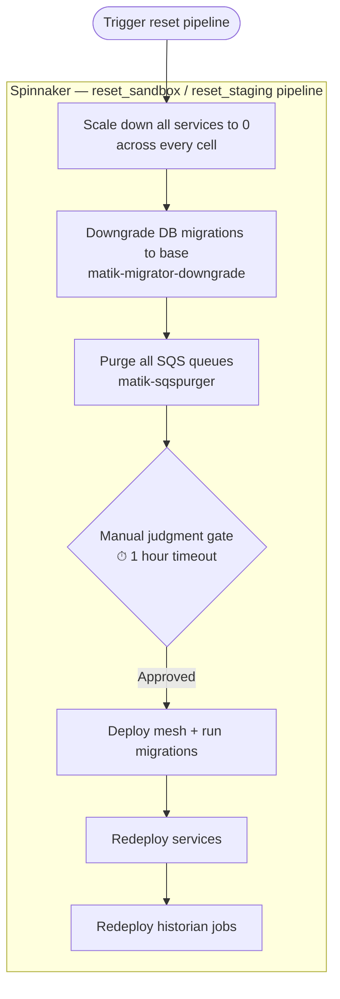

# Resetting Matik (Sandbox / Staging)

This runbook describes how to fully reset a non-production Matik environment — wiping all data, clearing queues, and redeploying services from a clean state. This is useful after large-scale testing, schema experiments, or when an environment has drifted into an unrecoverable state.

> **Non-production only.** This runbook targets the **sandbox** and **staging** environments. Do **not** apply to production.

| Environment | Pipeline | Cells |
|---|---|---|
| Sandbox | `reset_sandbox` | `pug` |
| Staging | `reset_staging` | `pug`, `taz`, `yun` |

> **Downgrade only, no redeploy?** Use `downgrade_sandbox` / `downgrade_staging` instead — same scale-down + `matik-migrator-downgrade` stages as above, but without the SQS purge or redeploy. Handy for quickly downgrading against a specific branch (e.g. its migration files matching what's currently stamped in the DB) before switching branches, without tearing down and rebuilding the whole environment.

---

## Current State

The reset process is **fully automated** by the Spinnaker pipelines. The DB downgrade and SQS purge run as pipeline stages — there are no manual SSH/SQL/script steps. The only manual interaction is approving the judgment gate before the redeploy.

---

## Overview

The downgrade and purge jobs always run on a single cell (`pug`) because the database and SQS queues are shared across cells. Scale-downs, however, target **every cell** the environment runs in.

---

## Prerequisites

- Access to [Spinnaker](https://spinnaker.a.musta.ch/#/applications/matik/snapshots/) for the matik application
- Membership in `team_matik` (to trigger pipelines and approve the gate)

> No SSH bastion, 1Password credentials, or local AWS CLI are required — the DB downgrade and SQS purge run inside the cluster as pipeline jobs.

---

## Step 1 — Trigger the Pipeline

1. Go to [Spinnaker → matik → Pipelines](https://spinnaker.a.musta.ch/#/applications/matik/snapshots/)
2. Find the pipeline for your target environment — **`reset_sandbox`** or **`reset_staging`** — and click **Start Manual Execution**
3. The pipeline will scale all long-running services (Scribe high/medium/low, Enricher, Enigmatologist, Chronicler, API, MCP) to 0 replicas. For staging this happens across all three cells (`pug`, `taz`, `yun`).
4. Once all services are down, the pipeline automatically:
   - Runs **`matik-migrator-downgrade`** (`downgrade base`) to clear the schema
   - Runs **`matik-sqspurger`** to purge every SQS queue (main + DLQs) for the environment

---

## Step 2 — Approve the Judgment Gate

After the SQS purge completes, the pipeline pauses at a **manual judgment gate** (1 hour timeout). This pause lets the purge fully propagate and gives you a window to clear/observe metrics before traffic resumes.

Click **Continue** on the gate. The pipeline will then:

1. Deploy mesh configs
2. Run Alembic migrations to bring the schema back to the latest revision
3. Redeploy all services against the clean database (blue/green, across every cell)
4. Redeploy historian cron jobs (single cell — `pug`) — these begin re-ingesting data from the tracker start dates

---

## Full Sequence Summary

| # | Step | Where |
|---|------|--------|
| 1 | Trigger `reset_sandbox` / `reset_staging` pipeline | Spinnaker |
| 2 | Scale all services to 0 across every cell | Spinnaker (automatic) |
| 3 | Downgrade DB migrations to base | Spinnaker (automatic) |
| 4 | Purge all SQS queues | Spinnaker (automatic) |
| 5 | Approve the judgment gate | Spinnaker (manual) |
| 6 | Deploy mesh + run migrations | Spinnaker (automatic) |
| 7 | Redeploy services + historian jobs against clean DB | Spinnaker (automatic) |

---

## Configuration Reference

- **Pipelines:** `_infra/cd/pipelines/reset_sandbox.yml`, `_infra/cd/pipelines/reset_staging.yml`
- **Downgrade-only pipelines (no purge/redeploy):** `_infra/cd/pipelines/downgrade_sandbox.yml`, `_infra/cd/pipelines/downgrade_staging.yml`
- **Downgrade job:** `_infra/kube/apps/matik-migrator-downgrade.yml` (runs `migrator downgrade base`)
- **Purge job:** `_infra/kube/apps/matik-sqspurger.yml`, config at `_infra/kube/files/matik-sqspurger-config.yml`
- **Queues purged per environment:** defined under each environment's `sqspurger.queue_urls` param in `_infra/kube/kube-gen.yml`

---

## Troubleshooting

**Pipeline gate timed out**
The gate has a 1-hour timeout. If it expires, the destructive steps (downgrade + purge) have already run, so simply trigger a standard `deploy_to_sandbox` / `deploy_to_staging` pipeline to bring services back up against the clean DB.

**Downgrade job fails**
Check the `matik-migrator-downgrade` job logs in the cell (`pug`). The job uses the migrator credentials resolved from Secret Lair — a failure here usually means a migration cannot be reversed cleanly. The pipeline halts before the purge, so the DB is left in a partially-downgraded state; resolve the migration issue and re-run.

**SQS purge fails with throttling error**
AWS allows only one purge per queue per 60 seconds. The `matik-sqspurger` job does not retry (`backoffLimit: 0`) by design. Wait 60 seconds and re-run the failed stage.

**Scribe HPA fights back to 1 replica during scale-down**
The `scaleManifest` stage overrides the HPA. If the HPA recovers before the gate is approved, it is safe to ignore — the `cellularDeploy` in the final step restores correct HPA settings on redeploy.
