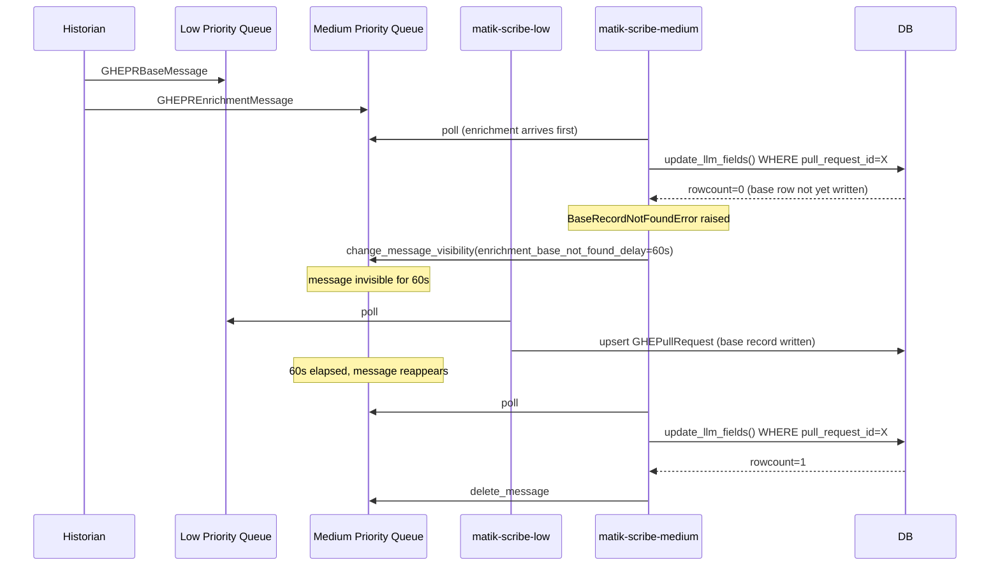
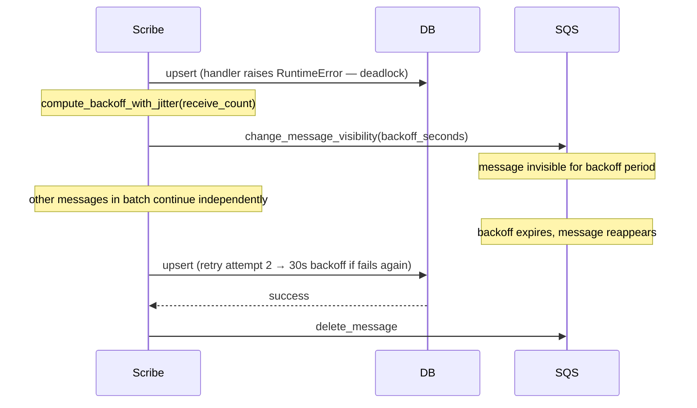
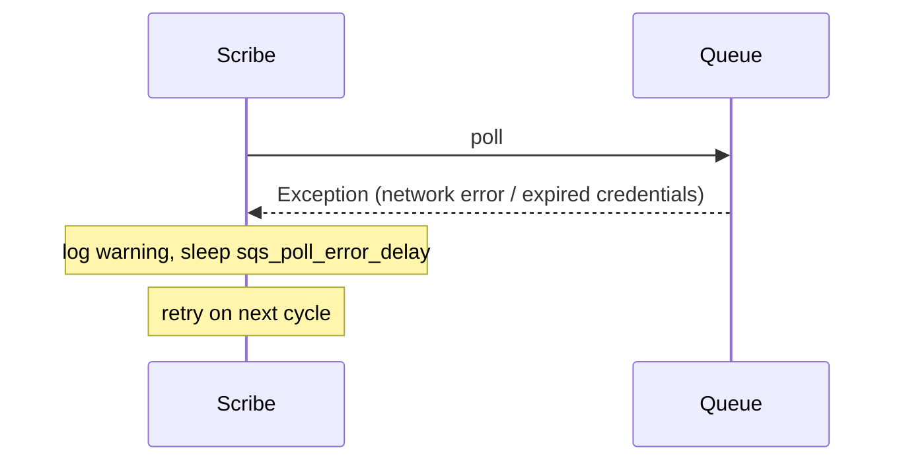

# Scribe Service Implementation Guide

## Overview

The Scribe is the sole database writer for all Matik domain tables. It consumes messages from an SQS queue, parses the `source_type` and `message_type` discriminators, routes each message to the appropriate handler, and calls the target DAO.

Scribe runs as three dedicated K8s deployments — `matik-scribe-high`, `matik-scribe-medium`, and `matik-scribe-low` — each polling exactly one SQS queue. This gives each priority tier independent scaling, independent DLQ, and guarantees that high-priority (real-time) writes are never delayed by low-priority (batch) writes.

**Architecture doc:** [`_infra/docs/architecture/scribe-design.md`](../architecture/scribe-design.md)

### Technology Stack

- **Python 3.13+** for the service implementation
- **asyncio** for the SQS consumer loop and concurrent DB writes
- **boto3** (synchronous, wrapped with `asyncio.to_thread`) for SQS calls
- **Pydantic** for message model validation
- **SQLAlchemy Core** (synchronous) for DB writes via the existing DAO layer
- **OpenTelemetry / Telescope** for metrics
- **Location:** `matik/scribe/`

### Design Principles

1. **Single write path** — All DB writes flow through one service; producers publish and move on
2. **Two-field routing** — `source_type` + `message_type` fully determine the handler and write strategy without inspecting the payload shape
3. **Non-retryable vs retryable** — Malformed messages go to DLQ immediately; DB errors use exponential backoff via SQS visibility timeout
4. **Idempotent base writes** — All base event writes use upsert semantics; replaying a message is safe
5. **Dedicated single-queue deployment** — Each priority tier runs as an independent Scribe deployment with its own SQS queue; isolation is achieved at the infrastructure level rather than through in-process priority logic

---

## File Structure

```
matik/scribe/
├── __init__.py              # Package marker
├── main.py                  # Entry point, SQS consumer loop, SIGTERM handler
├── batcher.py               # In-process batching layer (ScribeBatcher)
├── processor.py             # Message parsing, VALID_ROUTES, GroupKey, routing to handlers
├── errors.py                # NonRetryableError, MalformedMessageError, BaseRecordNotFoundError
├── handlers/
│   ├── __init__.py          # Package marker
│   ├── _base.py             # HandlerHooks container
│   ├── generic.py           # GenericHandler — spec-driven base + enrichment for ALL catalog sources
│   ├── ghe_pr_tracker.py    # GHE PR tracker base-only handler (non-catalog, bespoke)
│   ├── correlation.py       # Reliability correlation base-only handler (non-catalog, bespoke)
│   └── correlation_group.py # Correlation group base-only handler (non-catalog, bespoke)
└── hooks/
    ├── __init__.py          # Package marker
    ├── base.py              # PostWriteHook Protocol
    ├── runner.py            # HookRunner — parallel execution, fire-and-forget error policy
    └── enigmatologist.py    # EnigmatologistCorrelationHook — first concrete hook
```

**Shared modules (under `matik/common/`):**

| File | Description |
|------|-------------|
| `common/models/scribe_messages.py` | Pydantic message models for all source types |
| `common/models/scribe_config.py` | `ScribeQueueConfig` and `ScribeConfig` Pydantic models |
| `common/models/enigmatologist_config.py` | `EnigmatologistConfig` — provides `sqs_queue_url` for the correlation hook |
| `common/metrics/scribe_metrics.py` | `ScribeMetrics` OpenTelemetry instrumentation |

---

## Error Classes

**Location:** `matik/scribe/errors.py`

```python
"""Scribe service error taxonomy."""


class NonRetryableError(Exception):
    """Errors that should go directly to DLQ without retry."""


class MalformedMessageError(NonRetryableError):
    """Message failed JSON parsing, routing, or Pydantic validation."""


class BaseRecordNotFoundError(Exception):
    """Enrichment arrived before its base record exists in the database."""
```

**When each is used:**

| Class | Raised by | Trigger | SQS outcome |
|-------|-----------|---------|-------------|
| `NonRetryableError` | Base class only — not raised directly | Catch-all for all errors that should skip the retry path | Message forwarded to DLQ, deleted from source queue |
| `MalformedMessageError` | `ScribeProcessor`, all handlers | Invalid JSON, missing discriminator fields, unknown `source_type` or `message_type`, missing `data` field, Pydantic `ValidationError` on the message or domain model | Message forwarded to DLQ, deleted from source queue |
| `BaseRecordNotFoundError` | Enrichment handlers | `update_llm_fields()` returns `False` — the `WHERE` clause matched 0 rows because the base record has not been written yet | Visibility timeout extended by `enrichment_base_not_found_delay` (default 60s); message stays in queue and is retried |
| `RuntimeError` (or any plain `Exception`) | All handlers | DAO returns `None` — a database error occurred during the write | Visibility timeout extended with exponential backoff (10 / 30 / 60s ± jitter); message stays in queue and is retried |

### Enrichment ordering — base record not yet present

LLM enrichment messages are produced asynchronously after the base record is written. In practice the enrichment pipeline is fast, but a delayed or failed base write means an enrichment message can land in SQS before the row it targets exists.

**How it works end-to-end:**

1. `update_llm_fields()` executes `UPDATE … WHERE unique_key = ?`. If the row does not exist the UPDATE succeeds with `rowcount == 0`.
2. The DAO returns `False` (distinct from `None`, which signals a DB exception).
3. The handler raises `BaseRecordNotFoundError`.
4. `_poll_sqs` catches it and calls `change_message_visibility` with `enrichment_base_not_found_delay` (default **60 seconds**, configurable in `ScribeConfig`). The message is **not deleted** and **not sent to the DLQ**.
5. After the delay the message reappears and is retried. If the base record has since arrived the enrichment succeeds; otherwise step 1–5 repeats.
6. Once the SQS queue's `maxReceiveCount` is exhausted (configured at the infrastructure level), SQS itself routes the message to the DLQ as a last resort.

**Configuration knobs:**

| Field | Default | Description |
|-------|---------|-------------|
| `enrichment_base_not_found_delay` | `60` | Visibility timeout (seconds) applied on each `BaseRecordNotFoundError`. Set high enough that a slow base write has time to land before the next retry. SQS maximum is 43200 (12 hours). |
| SQS `maxReceiveCount` (infra) | varies | Number of delivery attempts before SQS automatically DLQs the message. With a 300-second delay and `maxReceiveCount=15`, a message survives **75 minutes** of missing-base retries. |

---

## Message Routing

**Location:** `matik/scribe/processor.py`

Routes for **catalog sources are derived from the `DataSourceSpec`** — a source with
an `enrichment_message_model` routes both `base` + `enrichment`, otherwise base-only.
`_spec_routes(source_type)` reads the spec; the non-catalog tracker/correlation
sources stay literal.

```python
def _spec_routes(source_type: str) -> frozenset[str]:
    spec = get_source(source_type)
    if spec.enrichment_message_model is not None:
        return frozenset({"base", "enrichment"})
    return frozenset({"base"})


VALID_ROUTES: dict[str, frozenset[str]] = {
    # Catalog sources — derived from the spec.
    "incidentio": _spec_routes("incidentio"),
    "ghe_pr": _spec_routes("ghe_pr"),
    "jira": _spec_routes("jira"),
    "incident_channel_summary": _spec_routes("incident_channel_summary"),
    # Non-catalog sources — literal, bespoke handlers.
    "ghe_pr_tracker": frozenset({"base"}),
    "correlation": frozenset({"base"}),
    "correlation_group": frozenset({"base"}),
}
```

**How to add a new catalog source's route:**

1. Register the source's `DataSourceSpec` (see
   [Onboarding a Data Source](onboarding-a-data-source.md)).
2. Add `"<src>": _spec_routes("<src>")` to `VALID_ROUTES`. No new handler class —
   `GenericHandler` serves every catalog source (see below).

(To add a brand-new `message_type` like `"delete"`, add it to the relevant
`frozenset` and add the corresponding method to `GenericHandler`.)

The processor validates the route before invoking the handler. An unknown
`source_type` or an unsupported `message_type` for a given source raises
`MalformedMessageError` and routes the message to the DLQ without calling any
handler code.

---

## Processor

**Location:** `matik/scribe/processor.py`

The processor exposes three public methods:

- **`parse_and_validate(body)`** — JSON-decodes the raw SQS body, validates the discriminator fields against `VALID_ROUTES`, and returns a `ValidatedMessage`. Raises `MalformedMessageError` on any validation failure. Called at admission time inside `ScribeBatcher.add()`.
- **`dispatch_batch(key, parsed_list)`** — Routes a list of pre-validated parsed dicts to the appropriate handler batch method (`handle_base_batch` or `handle_enrichment_batch`). Called by the batcher for each flush group.
- **`process(body)`** — Thin shim that calls `parse_and_validate` then `dispatch_batch` with a single-element list. Retained for backward compatibility with tests and any callers that process one message at a time.

**Key types:**

```python
@dataclass(frozen=True)
class GroupKey:
    """Immutable routing key used to group buffered messages before flushing."""
    source_type: str
    message_type: str

@dataclass
class ValidatedMessage:
    """Output of parse_and_validate — carries the parsed dict and routing discriminators."""
    parsed: dict[str, Any]
    source_type: str
    message_type: str
```

`GroupKey` is a frozen dataclass and is therefore hashable — it is used as a dict key inside the batcher when grouping buffered messages before dispatching.

**Dispatch routing:**

```python
async def dispatch_batch(self, key: GroupKey, parsed_list: list[dict[str, Any]]) -> None:
    handler = self._handlers[key.source_type]
    if key.message_type == "base":
        await handler.handle_base_batch(parsed_list)
    elif key.message_type == "enrichment":
        await handler.handle_enrichment_batch(parsed_list)
```

---

## Handler Pattern

Every handler exposes two batch entry points consumed by `ScribeProcessor.dispatch_batch`:

- **`handle_base_batch(parsed_list)`** — validates each item in the list, calls the relevant DAO upsert, runs post-write hooks per record.
- **`handle_enrichment_batch(parsed_list)`** — per-record loop calling the enrichment DAO method. Handlers with no enrichment support always raise `MalformedMessageError`.

The single-message `handle_base(parsed)` and `handle_enrichment(parsed)` methods are kept as thin one-line delegates:

```python
async def handle_base(self, parsed: dict[str, Any]) -> None:
    await self.handle_base_batch([parsed])

async def handle_enrichment(self, parsed: dict[str, Any]) -> None:
    await self._handle_enrichment_single(parsed)
```

### One `GenericHandler` for all catalog sources

Since the "paved path" refactor there are **no per-source handler classes**. All
catalog sources (`incidentio`, `jira`, `ghe_pr`, `incident_channel_summary`) are
served by a single spec-driven `GenericHandler` (`scribe/handlers/generic.py`):

- `handle_base_batch` — validates each `data` dict into `spec.record_model`, calls
  `dao.upsert_batch(records, dropped_columns=...)` (one DB connection per flush
  group), then runs the base hooks per record. `dropped_columns` is derived from the
  spec's `base_column_flags` (e.g. jira's `update_services`).
- `handle_enrichment_batch` — validates into `spec.enrichment_message_model`, calls
  `dao.update_llm_fields_from_message(...)`, then runs the enrichment hook on the
  **message** or the re-fetched **record** per `spec.enrichment_hook_target` /
  `spec.record_finder`.

`main.py` builds each catalog handler with `_build_generic(source_type, hooks)`,
which does `spec = get_source(source_type); dao = spec.dao_factory(engine, metrics);
return GenericHandler(spec, dao, hooks=hooks)`.

The only remaining **bespoke** handlers are the non-catalog sources (no LLM
enrichment / composite crawl-progress keys), kept literal in the handler map:

| Handler | Strategy |
|---------|----------|
| `GHEPRTrackerHandler` | Per-record tracker upsert (base-only) |
| `CorrelationHandler` | `dao.upsert_correlations_batch(...)` (base-only) |
| `CorrelationGroupHandler` | Per-record `insert_or_update_group` (base-only) |

Base-only sources reject enrichment routes — the `VALID_ROUTES` allowlist prevents
those combinations from reaching a handler, enforced defensively.

---

## Batching Layer

**Location:** `matik/scribe/batcher.py`

### Motivation

Before the batcher, every SQS message was processed individually: one asyncio task per message, each acquiring a semaphore slot and calling the DAO upsert with a single record. The DAOs already support batch writes (chunked at 500 rows) but feeding them one row at a time throws away the amortization — at peak load this produced up to `max_concurrent_writes × replicas` simultaneous DB connections across all Scribe pods.

The batcher accumulates admitted messages, groups them by `(source_type, message_type)`, and flushes via the batch DAO methods so one DB connection handles N records instead of N connections handling 1 record each.

### Buffer and Triggers

`ScribeBatcher` maintains an in-memory buffer of `BufferedMessage` objects. Two independent triggers cause the buffer to be flushed:

| Trigger | Fires when |
|---------|------------|
| **Size trigger** | `add()` brings the buffer length to `batch_max_messages` |
| **Time trigger** | `batch_flush_interval_ms` elapses since the first message landed in an empty buffer |

The time trigger is armed via `loop.call_later(flush_interval, _flush_due)` the moment the first message enters an empty buffer. It is cancelled and disarmed by the size trigger. This design means:

- **Idle pods** have no extra wakeups — if no messages arrive the timer is never armed.
- **Active pods** under sustained load are governed by the size trigger; the timer only matters when message rate is low enough that `batch_max_messages` is never reached within the interval.

Per-lane defaults in `kube-gen.yml`:

| Lane | `batch_max_messages` | `batch_flush_interval_ms` |
|------|---------------------|--------------------------|
| high | 25 | 500 |
| medium | 50 | 2000 |
| low | 100 | 5000 |

### Snapshot Pattern

Both triggers call `_flush_now(trigger)` which implements the snapshot pattern:

```python
def _flush_now(self, trigger: str) -> None:
    if self._timer_handle:
        self._timer_handle.cancel()
        self._timer_handle = None

    snapshot = self._buffer       # grab reference to current buffer
    self._buffer = []             # replace with fresh empty buffer

    if not snapshot:
        return

    groups: dict[GroupKey, list[BufferedMessage]] = defaultdict(list)
    for bm in snapshot:
        key = GroupKey(
            source_type=bm.parsed["source_type"],
            message_type=bm.parsed["message_type"],
        )
        groups[key].append(bm)

    for key, msgs in groups.items():
        task = asyncio.create_task(self._flush_group(key, msgs))
        self._inflight.add(task)
        task.add_done_callback(self._inflight.discard)
```

Because both triggers and `add()` run on the same asyncio event loop they serialize naturally — no locks are needed. Any `add()` call that arrives while a flush task is in flight lands in the new empty `_buffer`, not in the snapshot being processed. This is the key isolation property: a slow DB write on one flush cycle never delays messages that arrived later.

### Per-Group Flush and Failure Semantics

Each flush group runs as an `asyncio.Task` under `async with self._semaphore`, so at most `max_concurrent_writes` groups are flushing concurrently.

| Outcome | Action |
|---------|--------|
| `dispatch_batch` succeeds | Per-message `delete_message` (SQS ack). Emit `record_batch_flush(..., "success")`. |
| `dispatch_batch` raises any `Exception` (group-level transient) | Per-message `change_message_visibility(backoff)` to defer retry. Emit `record_group_failure`. No DLQ — SQS redrives after `max_receive_count`. |
| `dispatch_batch` raises `MalformedMessageError` (defensive) | Treated as group-level transient (extend visibility). Should never happen because `add()` validates before admission. Logs an error. |
| Message at `max_receive_count` | No visibility extension — let SQS redrive to the DLQ automatically. Emit `record_dlq_message`. |

The backoff schedule for visibility extension is identical to the single-message path: 10s / 30s / 60s ± 20% jitter, selected by `receive_count`.

### Backpressure

```python
def is_overloaded(self) -> bool:
    return len(self._inflight) >= self._semaphore._value * 2
```

The polling loop in `_run_single_queue_loop` checks `batcher.is_overloaded()` before each `receive_message` call. When True it sleeps 50ms and checks again. This prevents unbounded `_inflight` growth under sustained DB slowness — SQS naturally absorbs the backlog while the pod catches up.

### Message Admission

`add(raw)` validates the raw SQS message before buffering it:

```
raw SQS message
    │
    ▼
parse_and_validate(body)
    │
    ├─ MalformedMessageError ──► send_to_dlq + delete_message (never buffered)
    │
    └─ ValidatedMessage ──► append to _buffer
                                │
                                ├─ first message in empty buffer → arm timer
                                └─ buffer at batch_max_messages → _flush_now("size")
```

Messages that fail validation are forwarded to the DLQ and deleted from the source queue immediately, before any buffering occurs. The `_inflight` set and semaphore are never involved.

---

## Graceful Shutdown (SIGTERM)

### Signal Handler

`main()` installs a SIGTERM handler on the asyncio event loop before entering the polling loop:

```python
shutdown_event = asyncio.Event()

def _handle_sigterm() -> None:
    logger.info("SIGTERM received, initiating graceful shutdown")
    shutdown_event.set()

loop = asyncio.get_running_loop()
loop.add_signal_handler(signal.SIGTERM, _handle_sigterm)
```

`loop.add_signal_handler` is used instead of `signal.signal` because it integrates with the asyncio event loop — the callback is scheduled on the loop thread and does not interrupt a running coroutine.

### Polling Loop Exit

`_run_single_queue_loop` checks `shutdown_event` at the top of each iteration:

```python
while not shutdown_event.is_set():
    if batcher.is_overloaded():
        await asyncio.sleep(0.05)
        continue
    ...
```

When SIGTERM fires the loop exits cleanly after the current poll cycle completes (within at most `sqs_wait_time_seconds`, default 20s).

### Batcher Drain

After the loop exits `main()` calls `await batcher.stop(drain_timeout=30)`, which:

1. Cancels the armed timer (if any).
2. Calls `_flush_now("shutdown")` to snapshot and dispatch any buffered messages that have not yet been flushed.
3. Awaits all in-flight flush tasks with `asyncio.wait_for(..., timeout=drain_timeout)`.
4. Logs a warning if the timeout is exceeded (unflushed tasks continue to completion but the pod will be killed by K8s after `terminationGracePeriodSeconds`).

```python
try:
    await _run_single_queue_loop(...)
finally:
    await batcher.stop(drain_timeout=30)
    if telescope:
        telescope.shutdown()
```

### Kubernetes Configuration

All three Scribe deployments set `terminationGracePeriodSeconds: 60`. This gives the pod:

- Up to 20s for the current SQS long-poll to return (`sqs_wait_time_seconds`).
- Up to 30s for `batcher.stop()` to drain in-flight flushes.
- ~10s buffer before K8s sends SIGKILL.

```yaml
workload:
  deployment:
    terminationGracePeriodSeconds: 60
```

**Why 60s matters:** Without an adequate grace period, K8s could SIGKILL the pod before the batcher drains its buffer, leaving messages invisible in SQS until their visibility timeout expires (up to 300s). With 60s the normal drain completes well within the window.

---

## Post-Write Hooks

Post-write hooks are optional side effects that run **after a successful DAO write** and **before the SQS message is acked**. They are fire-and-forget: any exception from a hook is caught, logged, and metered — it never blocks the ack or triggers a DB retry. Hook failures are surfaced via metrics and logs only.

Hooks are used when a DB write must trigger a secondary action — for example, publishing a downstream SQS message — without coupling that logic to the handler.

### Design Principles

1. **Single responsibility** — handlers own the DB write; hooks own everything else.
2. **Fire-and-forget** — hook failures never influence message ack/retry. SQS retry semantics are driven by DAO outcomes only.
3. **Idempotent** — SQS may redeliver a message; both the DAO write and all hooks must be safe to run multiple times.
4. **Plug-and-play** — adding a new hook requires one new file and one line in `main.py`. No existing handler code changes.

### `PostWriteHook` Protocol

**Location:** `matik/scribe/hooks/base.py`

```python
from typing import Protocol, runtime_checkable
from pydantic import BaseModel

@runtime_checkable
class PostWriteHook(Protocol):
    """A task to run after a successful scribe DB write.

    Hooks are fire-and-forget: HookRunner catches all exceptions, logs them,
    and emits a metric. Implementations should be idempotent.
    """

    name: str  # used in metrics and log lines, e.g. "enigmatologist_correlation"

    async def run(self, message: BaseModel) -> None: ...
```

The `message` argument is the validated Pydantic model (e.g. `IncidentIOIncident`) produced by the handler before the DAO call. Hooks can read any field from it.

### `HookRunner`

**Location:** `matik/scribe/hooks/runner.py`

`HookRunner` holds a list of `PostWriteHook` instances and a reference to `ScribeMetrics`. `run_all` gathers all hooks in parallel via `asyncio.gather(return_exceptions=True)` so one slow hook does not delay others. Each exception is caught, logged, and recorded via `ScribeMetrics.record_hook`.

```python
runner = HookRunner(hooks=[my_hook], metrics=scribe_metrics)
await runner.run_all(validated_model)
```

An empty `HookRunner` (no hooks) is a noop and adds no overhead.

### `HandlerHooks` Container

**Location:** `matik/scribe/handlers/_base.py`

```python
class HandlerHooks:
    """Holds hook runners for each message_type a handler supports."""
    def __init__(
        self,
        base: HookRunner | None = None,
        enrichment: HookRunner | None = None,
    ):
        self.base = base or HookRunner([], None)
        self.enrichment = enrichment or HookRunner([], None)
```

Every handler accepts `hooks: HandlerHooks = HandlerHooks()` in its constructor. The default is a noop — no hooks, no changes to existing behaviour. After a successful DAO call in `handle_base`, the handler calls:

```python
await self._hooks.base.run_all(incident)
```

And similarly for `handle_enrichment`.

### Wiring Hooks in `main.py`

```python
# Build the hook once; share the same instance across every source that
# should trigger correlation.
enig_hook = EnigmatologistCorrelationHook(
    sqs_client=sqs_client,
    queue_url=config.enigmatologist.sqs_queue_url,
)

# incidentio: base writes AND enrichment writes both trigger correlation.
incidentio_hooks = HandlerHooks(
    base=HookRunner([enig_hook], scribe_metrics),
    enrichment=HookRunner([enig_hook], scribe_metrics),
)
# incident_channel_summary (OpsBot) has no base-write route — enrichment only.
incident_channel_summary_hooks = HandlerHooks(
    enrichment=HookRunner([enig_hook], scribe_metrics),
)

handlers = {
    "incidentio": _build_generic("incidentio", incidentio_hooks),
    "incident_channel_summary": _build_generic(
        "incident_channel_summary", incident_channel_summary_hooks
    ),
    ...
}
```

Handlers with no hooks omit the argument and get `HandlerHooks()` by default.

### `EnigmatologistCorrelationHook`

**Location:** `matik/scribe/hooks/enigmatologist.py`

The first concrete hook. After Scribe writes an Incident.io base record, **or** after an `incident_channel_summary` (OpsBot) enrichment write, it publishes a `CorrelationRequest` to the enigmatologist SQS queue so the downstream LLM correlation pipeline can link the new incident to PRs and tickets. Both sources set `enrichment_hook_target="record"` in their `DataSourceSpec` (`common/datasources/incidentio.py`, `common/datasources/incident_channel_summary.py`) and resolve to the same `IncidentIOIncident` row via `record_finder`, so the hook always operates on the full incident record regardless of which source triggered it. This replaces the fire-and-forget publish that previously lived in `POST /v1/incidentio/incident/batch` (`api/routes/incidentio.py`).

**Payload shape** (matches `CorrelationRequest` in `api/routes/incidentio.py`):

```json
{
  "reference_id": "INC-1234",
  "created_at": "2026-01-01T00:00:00",
  "description_summary": "...",
  "affected_services": ["svc-a", "svc-b"],
  "incident_channel_summary": "..."
}
```

### Adding a New Hook

1. Create `matik/scribe/hooks/<name>.py` implementing `PostWriteHook` (i.e. declare `name: str` and `async def run(self, message)`).
2. In `main.py`, instantiate the hook with any required dependencies (SQS client, queue URL, etc.).
3. Pass it to the relevant handler's `HandlerHooks(base=HookRunner([...], metrics))`.
4. Add unit tests for the hook: payload shape, successful execution, exception handling.

No changes to handler code, processor code, or message models are needed.

### Hook Metrics

`ScribeMetrics.record_hook(name, status, duration_seconds)` records one data point per hook invocation. Labels: `hook_name`, `status` (`"success"` or `"error"`). The same `start_message` timing pattern used for message processing applies here — start a timer before `run_all`, record after.

---

## Message Models

**Location:** `matik/common/models/scribe_messages.py`

```python
"""Scribe service message models for SQS queue routing.

Each message carries two discriminator fields:
- source_type: identifies the target domain table
- message_type: 'base' for full record upserts, 'enrichment' for targeted LLM field updates

Base event messages carry the full domain model serialized as a flat JSON `data` dict
(matching model.model_dump() output). Enrichment messages carry only the unique identifier
and LLM-generated fields — they trigger a targeted UPDATE that does not overwrite base fields.
"""

from typing import Any, Literal

from pydantic import BaseModel, Field

# ---------------------------------------------------------------------------
# Incident.io
# ---------------------------------------------------------------------------


class IncidentIOBaseMessage(BaseModel):
    """Full Incident.io incident record write."""

    source_type: Literal["incidentio"] = "incidentio"
    message_type: Literal["base"] = "base"
    data: dict[str, Any] = Field(..., description="Flat JSON of IncidentIOIncident model fields")


class IncidentIOEnrichmentMessage(BaseModel):
    """Targeted LLM field update for an existing Incident.io incident."""

    source_type: Literal["incidentio"] = "incidentio"
    message_type: Literal["enrichment"] = "enrichment"
    incident_id: str = Field(
        ..., description="Incident.io internal ID, e.g. 01K3H5K30V3TECAF9G2HD1X5ZB"
    )
    root_cause_summary: str | None = Field(
        default=None, description="LLM-generated root cause summary"
    )
    root_cause_summary_hash: str | None = Field(
        default=None, description="SHA256 of summary + resolution_statement"
    )
    description_summary: str | None = Field(
        default=None, description="LLM-generated description summary"
    )
    description_hash: str | None = Field(
        default=None, description="SHA256 of incident name + summary"
    )


# ---------------------------------------------------------------------------
# GHE Pull Requests
# ---------------------------------------------------------------------------


class GHEPRBaseMessage(BaseModel):
    """Full GHE pull request record write."""

    source_type: Literal["ghe_pr"] = "ghe_pr"
    message_type: Literal["base"] = "base"
    data: dict[str, Any] = Field(..., description="Flat JSON of GHEPullRequest model fields")


class GHEPREnrichmentMessage(BaseModel):
    """Targeted LLM field update for an existing GHE pull request."""

    source_type: Literal["ghe_pr"] = "ghe_pr"
    message_type: Literal["enrichment"] = "enrichment"
    pull_request_id: int = Field(..., description="GitHub API internal PR ID")
    repository_id: int = Field(..., description="GitHub repository ID")
    pull_request_summary: str | None = Field(
        default=None, description="LLM-generated PR description summary"
    )
    description_hash: str | None = Field(
        default=None, description="SHA256 of PR description"
    )


# ---------------------------------------------------------------------------
# JIRA
# ---------------------------------------------------------------------------


class JiraBaseMessage(BaseModel):
    """Full JIRA issue record write."""

    source_type: Literal["jira"] = "jira"
    message_type: Literal["base"] = "base"
    data: dict[str, Any] = Field(..., description="Flat JSON of JiraIssueRecord model fields")
    update_services: bool = Field(
        default=True,
        description="When False, the services column is not overwritten during upsert. "
        "Set to False when re-ingesting issues where services should not change.",
    )


class JiraEnrichmentMessage(BaseModel):
    """Targeted LLM field update for an existing JIRA issue."""

    source_type: Literal["jira"] = "jira"
    message_type: Literal["enrichment"] = "enrichment"
    issue_key: str = Field(..., description="JIRA issue key, e.g. OPS-123")
    issue_summary: str | None = Field(
        default=None, description="LLM-generated issue summary"
    )
    issue_comments_summary: str | None = Field(
        default=None, description="LLM-generated comments summary"
    )
    summary_hash: str | None = Field(
        default=None, description="SHA256 of issue description"
    )
    comments_hash: str | None = Field(
        default=None, description="SHA256 of aggregated comments"
    )


# ---------------------------------------------------------------------------
# GHE PR Tracker (base only — no LLM enrichment)
# ---------------------------------------------------------------------------


class GHEPRTrackerBaseMessage(BaseModel):
    """GHE PR crawler tracker state write."""

    source_type: Literal["ghe_pr_tracker"] = "ghe_pr_tracker"
    message_type: Literal["base"] = "base"
    data: dict[str, Any] = Field(..., description="Flat JSON of GHEPRTracker model fields")


# ---------------------------------------------------------------------------
# Correlations (base only — no LLM enrichment)
# ---------------------------------------------------------------------------


class CorrelationBaseMessage(BaseModel):
    """Full reliability correlation record write."""

    source_type: Literal["correlation"] = "correlation"
    message_type: Literal["base"] = "base"
    data: dict[str, Any] = Field(
        ..., description="Flat JSON of ReliabilityCorrelation model fields"
    )
```

---

## Publishing Messages from Historians

**Location:** `matik/common/clients/sqs_publisher.py`

Historians use the `SQSPublisher` client to send Pydantic message models to Scribe's input queue. The client serializes models to JSON via `model.model_dump_json()` and wraps the boto3 `send_message` call.

```python
from common.clients.sqs_publisher import SQSPublisher
from common.models.scribe_messages import GHEPRBaseMessage

import boto3

session = boto3.Session(region_name=config.sqs_queue_region)
sqs_client = session.client("sqs")
publisher = SQSPublisher(sqs_client, config.sqs_queue_url)

# Async (from an async context)
message = GHEPRBaseMessage(data=pr.model_dump())
await publisher.send(message)

# Synchronous (from a non-async context)
publisher.send_sync(message)
```

`SQSPublisher` is instantiated once at historian startup and reused for all messages. The `sqs_queue_url` comes from the historian's own config (e.g., `BiztechGitHubConfig.sqs_queue_url` or `JiraConfig.sqs_queue_url`).

**`send()` vs `send_sync()`:**

| Method | When to use |
|--------|-------------|
| `send()` | From an `async` function (uses `asyncio.to_thread` internally) |
| `send_sync()` | From a synchronous context (e.g., a plain function called outside the event loop) |

---

## DAO: the LLM enrichment update

The enrichment update is **inherited from `BaseUpsertDAO`**, not hand-written per
source. `GenericHandler` calls `dao.update_llm_fields_from_message(**values)`
(`common/daos/base_dao.py`), which:

- pops `spec.enrichment_key` (the identifier), and writes the remaining values (the
  spec's `llm_columns`) with a targeted `UPDATE ... WHERE <key> = ?` that never
  touches base fields;
- drops `None` values by default so a missing field never overwrites an existing one
  (unless `spec.enrichment_overwrites_with_none` is set);
- routes through `execute_with_retry` (transient-MySQL retry on a fresh connection)
  — **not** a manual `connect()`/`commit()` — with the `DBMetrics.start_query`
  timing idiom.

Because it's derived from the spec, each source's enrichment key + LLM columns come
from its `DataSourceSpec` / enrichment message — no per-source `update_llm_fields`
method:

| Source | `enrichment_key` | LLM columns (`spec.llm_columns`) |
|--------|------------------|----------------------------------|
| `incidentio` | `incident_id` | `root_cause_summary`, `root_cause_summary_hash`, `description_summary`, `description_hash` |
| `jira` | `issue_key` | `issue_summary`, `issue_comments_summary`, `summary_hash`, `comments_hash` |
| `ghe_pr` | `pull_request_id` | `pull_request_summary`, `description_hash` |

The return value signals three distinct outcomes (the handler acts on each):

| Return value | Meaning | Handler action |
|---|---|---|
| `True` | Row updated successfully | Log success, no exception |
| `False` | `rowcount == 0` — base record not yet present | Raise `BaseRecordNotFoundError` → long-wait retry |
| `None` | DB error | Raise `RuntimeError` → short backoff retry |

---

## Configuration

### `ScribeQueueConfig` and `ScribeConfig` Classes

**Location:** `matik/common/models/scribe_config.py`

`ScribeQueueConfig` describes the single SQS queue pair for this deployment.

| Field | Type | Required | Description |
|-------|------|----------|-------------|
| `queue_url` | `str` | Yes | SQS input queue URL |
| `dlq_url` | `str` | Yes | Dead letter queue URL for non-retryable failures |
| `max_receive_count` | `int` | No (default 5) | SQS redrive policy `maxReceiveCount`; used to detect final delivery attempt before SQS silently redrives to DLQ |

`ScribeConfig` holds the full service configuration:

| Field | Type | Default | Description |
|-------|------|---------|-------------|
| `queue` | `ScribeQueueConfig` | — (required) | The single SQS queue pair for this deployment |
| `sqs_queue_region` | `str \| None` | `None` → `us-east-1` | AWS region for the queue |
| `sqs_max_messages` | `int` | `10` | Max messages per SQS receive call |
| `sqs_wait_time_seconds` | `int` | `20` | SQS long-poll wait time in seconds |
| `sqs_visibility_timeout` | `int` | `300` | Message visibility timeout in seconds |
| `sqs_poll_error_delay` | `int` | `5` | Seconds to sleep after a poll error or empty cycle |
| `max_concurrent_writes` | `int` | `10` | Max concurrent DB writes per pod (asyncio semaphore) |
| `enrichment_base_not_found_delay` | `int` | `60` | Visibility timeout (seconds) applied when an enrichment arrives before its base record exists |
| `batch_max_messages` | `int` | `25` | Flush the in-process buffer when it reaches this many messages (size trigger) |
| `batch_flush_interval_ms` | `int` | `500` | Flush the in-process buffer after this many milliseconds since the first message arrived (time trigger) |

### YAML Configuration Template

Each deployment mounts its own config file with a single `queue:` block. The three local configs are:

- `matik/local-configs/matik-scribe-high-config.yml`
- `matik/local-configs/matik-scribe-medium-config.yml`
- `matik/local-configs/matik-scribe-low-config.yml`

Example (high-priority deployment):

```yaml
common:
  environment: ${ENVIRONMENT}
  log_level: ${LOG_LEVEL}

mysql:
  engine: mysql
  endpoint: ${MYSQL_HOST}
  port: ${MYSQL_PORT}
  username: ${MYSQL_USER}
  password: ${MYSQL_PASSWORD}
  database: ${MYSQL_DATABASE}
  use_iam: false
  region: ${AWS_REGION}
  ssl_mode: disabled
  canonical_endpoint: ""
  corpinfra_role_arn: ""
  max_open_conns: ${MYSQL_MAX_OPEN_CONNS}
  max_idle_conns: ${MYSQL_MAX_IDLE_CONNS}
  conn_max_idle_time_minutes: ${MYSQL_CONN_MAX_IDLE_TIME_MINUTES}
  token_expiry_minutes: 15
  token_expiry_grace_minutes: 1

scribe:
  queue:
    queue_url: ${SCRIBE_HIGH_PRIORITY_QUEUE_URL}
    dlq_url:   ${SCRIBE_HIGH_PRIORITY_DLQ_URL}
  sqs_queue_region: ${AWS_REGION}
  sqs_max_messages: 10
  sqs_wait_time_seconds: 20
  sqs_visibility_timeout: 300
  sqs_poll_error_delay: 5
  max_concurrent_writes: 10
```

The medium and low configs are identical except for the `queue_url` and `dlq_url` values.

### Per-Deployment Configuration Guidelines

| Deployment | Producer | Queue env var | Rationale |
|------------|----------|--------------|-----------|
| `matik-scribe-high` | Chronicler (webhooks) | `SCRIBE_HIGH_PRIORITY_QUEUE_URL` | Real-time data; latency matters |
| `matik-scribe-medium` | Enricher (LLM pipeline) | `SCRIBE_MEDIUM_PRIORITY_QUEUE_URL` | Near-real-time enrichment; tolerates brief delay |
| `matik-scribe-low` | Historians (batch polling) | `SCRIBE_LOW_PRIORITY_QUEUE_URL` | Async background work; can wait |

### Environment Variables

| Variable | Required | Description |
|----------|----------|-------------|
| `SCRIBE_HIGH_PRIORITY_QUEUE_URL` | Yes (high deployment) | SQS URL for the high-priority queue |
| `SCRIBE_HIGH_PRIORITY_DLQ_URL` | Yes (high deployment) | DLQ URL for the high-priority queue |
| `SCRIBE_MEDIUM_PRIORITY_QUEUE_URL` | Yes (medium deployment) | SQS URL for the medium-priority queue |
| `SCRIBE_MEDIUM_PRIORITY_DLQ_URL` | Yes (medium deployment) | DLQ URL for the medium-priority queue |
| `SCRIBE_LOW_PRIORITY_QUEUE_URL` | Yes (low deployment) | SQS URL for the low-priority queue |
| `SCRIBE_LOW_PRIORITY_DLQ_URL` | Yes (low deployment) | DLQ URL for the low-priority queue |
| `ENIGMATOLOGIST_SQS_QUEUE_URL` | No | SQS URL for the enigmatologist correlation queue; when absent, the `EnigmatologistCorrelationHook` is not registered |
| `AWS_REGION` | No | AWS region for all SQS queues; defaults to `us-east-1` |
| `MYSQL_HOST` | Yes | MySQL host |
| `MYSQL_PORT` | Yes | MySQL port |
| `MYSQL_USER` | Yes | MySQL username |
| `MYSQL_PASSWORD` | Yes | MySQL password |
| `MYSQL_DATABASE` | Yes | MySQL database name |
| `ENVIRONMENT` | Yes | Deployment environment (e.g., `local`, `production`) |
| `LOG_LEVEL` | No | Log level (e.g., `INFO`, `DEBUG`) |

---

## Metrics

### `ScribeMetrics` Class

**Location:** `matik/common/metrics/scribe_metrics.py`

```python
"""Scribe service metrics for message processing instrumentation.

Provides metrics for tracking Scribe operations including:
- Message processing counts and durations
- Dead letter queue (DLQ) routing counts
- Exponential backoff retry counts
- Queue depth gauges
"""

import time
from collections.abc import Callable
from typing import Any

from opentelemetry import metrics

from common.utils import log_utils

logger = log_utils.get_logger(__name__)

# Standard histogram buckets for message processing latency (in seconds)
# Scribe writes are fast DB operations, so buckets are tuned for sub-second latency
MESSAGE_PROCESSING_BUCKETS = (
    0.005,
    0.01,
    0.025,
    0.05,
    0.1,
    0.25,
    0.5,
    1.0,
    2.5,
    5.0,
)


class ScribeMetrics:
    """Metrics for Scribe service message processing instrumentation.

    Tracks message counts, processing durations, DLQ routing, and backoff
    retries with labels for source type and message type.

    Usage:
        metrics = ScribeMetrics(meter)

        # Record a processed message
        metrics.record_message_processed(
            source_type="incidentio",
            message_type="base",
            status="success",
            duration_seconds=0.05,
        )

        # Or use the timing helper
        record = metrics.start_message("incidentio", "base")
        try:
            await handler.handle_base(body)
            record("success")
        except Exception as e:
            record("error")
            raise

        # Record DLQ routing on non-retryable errors
        metrics.record_dlq_message("incidentio", "MalformedMessageError")

        # Record backoff on retryable errors
        metrics.record_backoff("incidentio")

        # Update queue depth from SQS attribute polling
        metrics.set_queue_depth("scribe", 42)
        metrics.set_queue_depth("scribe-dlq", 0)
    """

    def __init__(self, meter: metrics.Meter) -> None:
        """Initialize Scribe metrics.

        Args:
            meter: OpenTelemetry meter for creating instruments
        """
        self._messages_processed = meter.create_counter(
            name="matik_scribe_messages_processed_total",
            description="Total number of Scribe messages processed",
            unit="{message}",
        )

        self._message_duration = meter.create_histogram(
            name="matik_scribe_message_processing_duration_seconds",
            description="Time to process a single Scribe message end-to-end",
            unit="s",
            explicit_bucket_boundaries_advisory=MESSAGE_PROCESSING_BUCKETS,
        )

        self._dlq_messages = meter.create_counter(
            name="matik_scribe_dlq_messages_total",
            description="Total number of messages routed to the dead letter queue",
            unit="{message}",
        )

        self._backoff_total = meter.create_counter(
            name="matik_scribe_backoff_total",
            description="Total number of exponential backoff retries triggered",
            unit="{retry}",
        )

        self._queue_depth = meter.create_gauge(
            name="matik_scribe_queue_depth",
            description="Approximate number of messages currently in the queue",
            unit="{message}",
        )

    def record_message_processed(
        self,
        source_type: str,
        message_type: str,
        status: str,
        duration_seconds: float,
    ) -> None:
        """Record a processed Scribe message with timing and status.

        Args:
            source_type: Data source (e.g., "incidentio", "ghe_pr", "jira", "correlation")
            message_type: Message type (e.g., "base", "enrichment")
            status: Outcome of processing (e.g., "success", "error")
            duration_seconds: Processing duration in seconds
        """
        attrs: dict[str, Any] = {
            "source_type": source_type,
            "message_type": message_type,
            "status": status,
        }

        self._messages_processed.add(1, attrs)
        self._message_duration.record(duration_seconds, attrs)

        logger.debug(
            "recorded scribe message processed metric",
            source_type=source_type,
            message_type=message_type,
            status=status,
            duration_seconds=round(duration_seconds, 3),
        )

    def record_dlq_message(self, source_type: str, error_type: str) -> None:
        """Record a message routed to the dead letter queue.

        Args:
            source_type: Data source (e.g., "incidentio", "ghe_pr", "jira", "correlation")
            error_type: Class name of the error that triggered DLQ routing
                        (e.g., "MalformedMessageError", "ValidationError")
        """
        attrs: dict[str, Any] = {
            "source_type": source_type,
            "error_type": error_type,
        }

        self._dlq_messages.add(1, attrs)

        logger.debug(
            "recorded scribe DLQ message metric",
            source_type=source_type,
            error_type=error_type,
        )

    def record_backoff(self, source_type: str) -> None:
        """Record an exponential backoff retry triggered by a retryable error.

        Args:
            source_type: Data source (e.g., "incidentio", "ghe_pr", "jira", "correlation")
        """
        attrs: dict[str, Any] = {"source_type": source_type}

        self._backoff_total.add(1, attrs)

        logger.debug(
            "recorded scribe backoff metric",
            source_type=source_type,
        )

    def set_queue_depth(self, queue_name: str, depth: int) -> None:
        """Set the current approximate message count for a queue.

        Called periodically by a background polling task. SQS values are
        approximate and suitable for monitoring and alerting purposes.

        Args:
            queue_name: Short queue identifier for the label
                        (e.g., "scribe", "scribe-dlq")
            depth: Approximate number of messages in the queue
        """
        attrs: dict[str, Any] = {"queue": queue_name}

        self._queue_depth.set(depth, attrs)

        logger.debug(
            "recorded scribe queue depth metric",
            queue=queue_name,
            depth=depth,
        )

    def start_message(
        self,
        source_type: str,
        message_type: str,
    ) -> Callable[[str], None]:
        """Start timing a message and return a function to record completion.

        Usage:
            record = metrics.start_message("incidentio", "base")
            try:
                await handler.handle_base(body)
                record("success")
            except Exception as e:
                record("error")
                raise

        Args:
            source_type: Data source identifier
            message_type: Message type identifier

        Returns:
            A function to call when processing completes, accepting the status string.
        """
        start = time.perf_counter()

        def record(status: str) -> None:
            duration = time.perf_counter() - start
            self.record_message_processed(source_type, message_type, status, duration)

        return record
```

### Batching Metrics

Three new methods were added to `ScribeMetrics` to instrument the batching layer:

```python
def record_batch_flush(
    self,
    source_type: str,
    message_type: str,
    batch_size: int,
    duration_seconds: float,
    status: str,
) -> None:
    """Record a completed batch flush. Increments messages_processed by batch_size."""

def record_buffer_size(self, source_type: str, size: int) -> None:
    """Set the current buffer gauge for a given source_type (called on each flush)."""

def record_group_failure(
    self,
    source_type: str,
    message_type: str,
    size: int,
) -> None:
    """Record a group-level transient failure (dispatch_batch raised an exception)."""
```

`record_batch_flush` reuses the existing `_messages_processed` counter (adding `batch_size`) and `_message_duration` histogram so per-source throughput metrics remain consistent whether the write was batched or not.

`record_group_failure` reuses `_backoff_total` (incrementing by `size`) and logs a warning. Monitor `matik_scribe_backoff_total` for sustained group failures — a spike indicates a DB degradation affecting a whole message type, not just isolated rows.

### Wiring Metrics in the Main Loop

`ScribeMetrics` is instantiated in `main()` from the Telescope meter and passed to `ScribeBatcher` at construction time. The batcher calls `record_batch_flush` after a successful group dispatch and `record_group_failure` on transient failures.

---

## Scenarios

**Scenario 1 — Enrichment before base record (ordering race)**



The enrichment message is never lost or DLQ'd — it is simply deferred until the base record exists.

---

**Scenario 2 — DB transient error**



Each message is an independent `asyncio.Task`; a deadlock on one message does not affect others in the same batch. After SQS `maxReceiveCount` is exhausted the queue itself moves the message to the DLQ.

---

**Scenario 3 — SQS connectivity error**



The pod logs a warning, sleeps `sqs_poll_error_delay` seconds, then retries. Each deployment is unaffected by connectivity issues in other deployments.

---

## Pod Processing Capacity

Each pod runs a single asyncio event loop. The key throughput knobs are:

| Setting | Default |
|---------|---------|
| `sqs_max_messages` | 10 |
| `max_concurrent_writes` | 10 |
| `batch_max_messages` | 25 (high) / 50 (medium) / 100 (low) |

The semaphore (`max_concurrent_writes`) now gates **concurrent flush groups** rather than individual message writes. A flush group covers all messages of the same `(source_type, message_type)` that accumulated in the buffer since the last flush. One semaphore slot → one DB connection → N records written in a single batch call.

This means the connection pressure per pod is bounded by `max_concurrent_writes` regardless of how large each flush batch is — the connection count stays constant while throughput scales with `batch_max_messages`.

**DB connection pool per pod** (production): `max_open_conns: 400`. With three deployments each at `scribe_min_replicas: 2`, the worst-case open connection count across all Scribe pods is `3 × 2 × max_concurrent_writes = 60` — well below the ceiling even at autoscale `max_replicas`.

**Rule of thumb for tuning:**
- Increase `batch_max_messages` to amortize more rows per DB connection (reduces connection churn).
- Increase `batch_flush_interval_ms` on low-priority lanes where latency is not critical.
- Keep `max_concurrent_writes` at or below the DB connection pool limit divided by pod count.

---

## Main Loop

**Location:** `matik/scribe/main.py`

### Backoff Function

```python
# Exponential backoff delays in seconds; capped at the last value
BACKOFF_DELAYS = [10, 30, 60]


def compute_backoff_with_jitter(receive_count: int) -> int:
    """Compute SQS visibility timeout with exponential backoff and ±20% jitter."""
    index = min(receive_count - 1, len(BACKOFF_DELAYS) - 1)
    base_delay = BACKOFF_DELAYS[index]
    jitter = random.uniform(-0.2, 0.2)
    return max(1, int(base_delay * (1 + jitter)))
```

### `_poll_sqs`

Single SQS receive call. Returns `True` if messages were found, `False` if the queue was empty. Raises on connectivity errors (propagated to `_run_single_queue_loop` for retry).

For each received message `_poll_sqs` calls `await batcher.add(raw)`. The batcher handles validation, buffering, and flushing — `_poll_sqs` has no knowledge of message contents.

### `_run_single_queue_loop`

The infinite polling loop for a single queue. Each cycle:

1. If `batcher.is_overloaded()` → sleep 50ms and re-check (backpressure).
2. Call `_poll_sqs`; pass each received message to `batcher.add`.
3. If the queue is empty, the SQS long-poll already waited up to `sqs_wait_time_seconds` (default 20s) — re-poll immediately.
4. On SQS errors, log a warning, sleep `sqs_poll_error_delay` seconds, and retry.
5. On `shutdown_event.is_set()` → exit the loop (see [Graceful Shutdown](#graceful-shutdown-sigterm)).

### `main()` Batcher Lifecycle

```python
batcher = ScribeBatcher(
    processor=processor,
    sqs_client=sqs_client,
    queue_url=queue.queue_url,
    dlq_url=queue.dlq_url,
    max_receive_count=queue.max_receive_count,
    semaphore=asyncio.Semaphore(scribe_cfg.max_concurrent_writes),
    flush_max_messages=scribe_cfg.batch_max_messages,
    flush_interval_seconds=scribe_cfg.batch_flush_interval_ms / 1000.0,
    enrichment_base_not_found_delay=scribe_cfg.enrichment_base_not_found_delay,
    scribe_metrics=scribe_metrics,
)
await batcher.start()
try:
    await _run_single_queue_loop(...)
finally:
    await batcher.stop(drain_timeout=30)
    if telescope:
        telescope.shutdown()
```

### Startup Logging

On startup `main()` emits one summary line:

```
scribe starting  region=us-east-1  max_concurrent_writes=10  batch_max_messages=25  batch_flush_interval_ms=500  queue_url=.../high-priority
```

### Startup Guards in `main()`

`main()` returns `1` (error) and logs a message if:

- `config.scribe` is `None` — the `scribe:` section is missing from the YAML
- `config.scribe.queue` is not configured — the `queue:` block is missing
- `config.mysql` is `None` — the `mysql:` section is missing

---

## Retry Backoff

| Retry | Base Delay | With Jitter (±20%) |
|-------|------------|-------------------|
| 1     | 10s        | 8–12s             |
| 2     | 30s        | 24–36s            |
| 3+    | 60s (max)  | 48–72s            |

The `compute_backoff_with_jitter` function (shown in the Main Loop section above) maps `receive_count` (1-based, from SQS `ApproximateReceiveCount`) to a jittered delay. The jitter spreads retries from multiple pods so they do not all hammer the database simultaneously after a transient failure.

After SQS `maxReceiveCount` is exceeded, SQS moves the message to the DLQ automatically. The Scribe also routes non-retryable errors to the DLQ immediately without waiting for the SQS retry count to be exhausted.

---

## Docker Compose Testing

### Starting the Stack

```bash
cd matik/

# Start MySQL and run migrations
docker compose up -d mysql
docker compose up migrator

# Start the Scribe service
docker compose up -d scribe
```

### Running Scribe Locally

The Scribe is a long-running service that polls SQS continuously:

```bash
# Start the Scribe
docker compose up scribe

# Start with debug logging
docker compose run -e LOG_LEVEL=DEBUG scribe

# View logs
docker compose logs -f scribe
```

### Docker Compose Service Definition

Add the Scribe to `docker-compose.yml`:

```yaml
scribe:
  build:
    context: .
    dockerfile: Dockerfile
  container_name: matik-scribe
  command: ["python", "-m", "scribe"]
  restart: unless-stopped
  environment:
    - SERVICE_NAME=scribe
  volumes:
    - ./local-configs:/config:ro
    - ./.env.local:/app/.env:ro
  depends_on:
    mysql:
      condition: service_healthy
    migrator:
      condition: service_completed_successfully
  networks:
    - matik-network
```

### Verifying Data

```bash
# Access Adminer (database UI)
open http://localhost:8081

# Or use MySQL CLI
docker compose exec mysql mysql -u matik_user -p matik_password

# Check that Scribe is picking up messages
docker compose logs -f scribe
```

---

## Adding a New Source Type to Scribe

Since the "paved path" refactor, wiring a catalog source into Scribe is **not a new
handler class** — `GenericHandler` is spec-driven and serves every catalog source.
The full end-to-end steps (models, DAO, spec, historian, enricher, migration) live
in [Onboarding a Data Source](onboarding-a-data-source.md). The **Scribe-specific**
part is just:

### 1. Add message models (`common/models/scribe_messages.py`)

- [ ] `<Source>BaseMessage` with `source_type: Literal["<src>"]`, `message_type:
      Literal["base"]`, `data: dict[str, Any]`
- [ ] `<Source>EnrichmentMessage(EnricherEnvelopeMixin)` with the `enrichment_key`
      field + the LLM/hash columns (field names == DB column names). Skip if
      base-only.

### 2. Register a `DataSourceSpec`

- [ ] `common/datasources/<src>.py` (`register_source(DataSourceSpec(...))` with
      `dao_factory`, `enrichment_message_model`, `enrichment_key`, …) + the import
      in `common/datasources/__init__.py`. This is what `GenericHandler` and
      routing read — no handler class or per-source `update_llm_fields` needed.

### 3. Two one-line edits to Scribe

- [ ] `scribe/main.py`: add `"<src>": _build_generic("<src>")` to the
      `ScribeProcessor` handler dict (pass a `HandlerHooks` only if the source needs
      a post-write side effect).
- [ ] `scribe/processor.py`: add `"<src>": _spec_routes("<src>")` to `VALID_ROUTES`.

### 4. Post-write hooks (optional)

If the DB write should trigger a secondary action (SQS publish, notification):

- [ ] Implement `matik/scribe/hooks/<name>.py` (`PostWriteHook`: `name: str` +
      `async def run(self, message)`; idempotent, fire-and-forget)
- [ ] Instantiate it in `main.py` and pass via
      `HandlerHooks(base=HookRunner([hook], metrics), enrichment=...)` to
      `_build_generic("<src>", hooks)` (see the incidentio → enigmatologist wiring)

### 5. Tests

- [ ] `scribe/processor_test.py`: the new `source_type` routes correctly (base /
      enrichment per its spec); unknown/unsupported combinations raise
      `MalformedMessageError`
- [ ] `GenericHandler` behavior is already covered by the shared generic-handler
      tests; add source-specific coverage only for a custom hook
