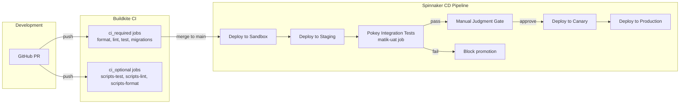
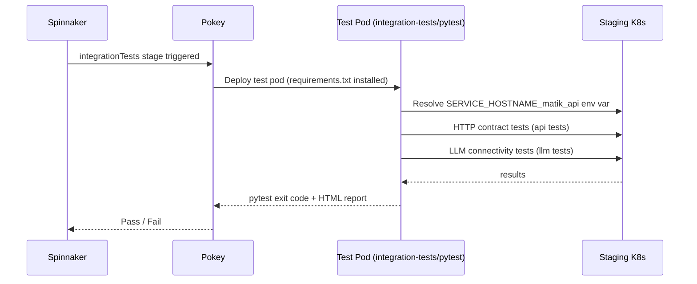

# UAT CI/CD Integration

## Overview

UAT tests run automatically as a [**Pokey integration test stage**](https://developers.a.musta.ch/docs/default/component/pokey/) in the Spinnaker CD pipeline after every staging deployment. They are **not triggered on PRs** — they run as a post-deploy gate.

Here is the reference on how to test [Python code](https://developers.a.musta.ch/docs/default/component/pokey/writing-integration-tests/testing-a-python-service-with-pytest/).



---

## Pokey Integration

Matik uses [**Pokey**](https://developers.a.musta.ch/docs/default/component/pokey/), Airbnb's integration testing platform, to run UAT as part of the CD pipeline. Pokey runs tests in an isolated Kubernetes pod inside the target environment's cluster. It can support both sycronous testing and cronjob-style testing. [Reference](https://developers.a.musta.ch/docs/default/component/pokey/monitoring-your-service-with-integration-tests/#setting-up-a-cron-integration-test-job).

### How Pokey Works



### Pokey Configuration (`_infra/integration-tests.yml`)

Currently only implementing syncronous testing.

```yaml
jobs:
  - name: matik-integration-tests
    framework: pytest
    airmeshOnly: true
    timeout: 600
```

Pokey injects `SERVICE_HOSTNAME_<service>` and `SERVICE_PORT_<service>` environment variables into the test pod. The `conftest.py` reads these automatically — no configuration needed in the CD pipeline.

### Spinnaker Stage (`_infra/cd/pipelines/deploy_to_staging.yml`)

```yaml
- name: integration-tests
  type: integrationTests
  parameters:
    environment: staging
  timeoutMinutes: 15
  title: Run UAT integration tests
  dependsOn:
    - deploy-to-staging
```

---

## Why Not CI (PR)?

UAT tests require:
- Live network access to deployed service endpoints
- Running inside the cluster to reach cluster-internal services

These constraints make UAT unsuitable for standard PR CI jobs. Running them post-deploy in Pokey, where the test pod lives inside the cluster, is the correct execution model.

---

## Running Locally (for debugging)

Engineers can run UAT locally against any environment using the AirMesh devAccess URLs and an IAP token. View the [getting started](getting-started.md) for detailed instructions.


---

## Failure Handling

When UAT fails:

1. The Spinnaker pipeline blocks at the `integration-tests` stage
2. Review the Pokey test output and HTML report attached to the pipeline execution
3. Fix the issue and re-deploy to staging to trigger UAT again
4. Engineers can also run locally to iterate faster (see above)
