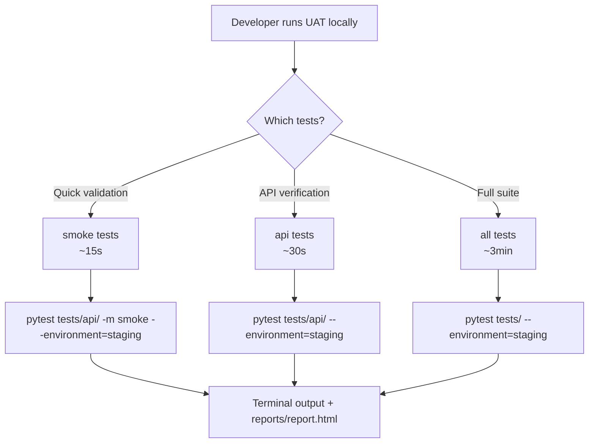
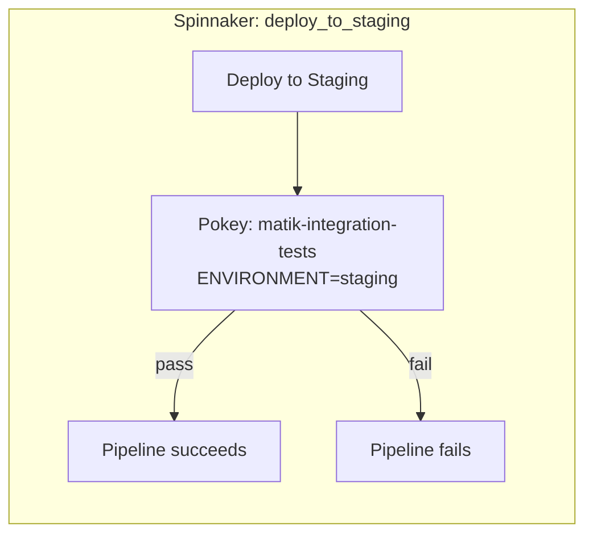

# Integration Testing Runbook

## Quick Reference

`-v` and `--tb=long` are enabled by default in `pytest.ini` — no need to pass them manually.

```bash
# Run smoke tests against staging
cd integration-tests/pytest && pytest tests/api/ -m smoke --environment=staging

# Run all API tests against staging
cd integration-tests/pytest && pytest tests/api/ --environment=staging

# Run LLM tests against staging
cd integration-tests/pytest && pytest tests/llm/ --environment=staging

# Run full UAT suite against staging
cd integration-tests/pytest && pytest tests/ --environment=staging --timeout=600

# Collect tests without running (verify configuration)
cd integration-tests/pytest && pytest tests/ --co --environment=staging
```

---

## Running Integration Tests Locally

### Prerequisites

- Python 3.13 and `pip` (or `uv`) installed
- IAP identity token (for AirMesh devAccess URLs)

### Setup

```bash
cd integration-tests/pytest
python3 -m venv path/to/venv
source path/to/venv/bin/activate
python3 -m pip install -r requirements.txt
```

### Local configuration

Service URLs are resolved automatically from the `--environment` flag — the only thing you need to provide is an IAP auth token.

**Step 1 — Copy the config template:**

```bash
cp integration-tests/pytest/config/local.yml.example integration-tests/pytest/config/local.yml
```

**Step 2 — Get an identity token:**

```bash
iap-auth https://developers.a.musta.ch
```

**Step 3 — Paste the token into `local.yml`:**

```yaml
headers:
  Authorization: "Bearer <your-identity-token>"
```

**Step 4 — Run, passing the target environment:**

```bash
cd integration-tests/pytest
pytest tests/api/ --environment=staging
pytest tests/api/ --environment=sandbox
```

`local.yml` is loaded automatically by `conftest.py` and is gitignored — never committed. The `--environment` flag controls which devAccess URLs are used.

**Optional URL overrides (`config/local.yml`):**

Only needed if you want to point at a custom endpoint (e.g. a local port-forward):

| Key | Description |
|-----|-------------|
| `headers` | **Required.** HTTP headers sent with every request (IAP auth token) |
| `api_base_url` | Override matik-api URL (default: resolved from `--environment`) |
| `mcp_base_url` | Override matik-mcp URL (default: resolved from `--environment`) |
| `facade_base_url` | Override LLM Facade URL (default: resolved from `--environment`) |
| `bedrock_base_url` | Override LLM Bedrock URL (default: resolved from `--environment`) |

### Output defaults (from `pytest.ini`)

| Setting | Value | Effect |
|---------|-------|--------|
| `-v` | always on | Prints each test name and PASSED/FAILED as it runs |
| `--tb=long` | always on | Shows the full traceback and assertion detail on failure |
| `--html` | always on | Generates `reports/report.html` after every run |

### Execution Paths



### Environment Selection

The environment controls which service URLs and namespace config are used. It is resolved in this order:

1. `ENVIRONMENT` env var — set automatically by Pokey from the Spinnaker pipeline parameter
2. `--environment` CLI flag — for local runs

| Value | Namespace | Notes |
|-------|-----------|-------|
| `sandbox` | matik-sandbox |  Development environment |
| `staging` | matik-staging | Pre-production (default for integration tests) |
| `canary` | matik-canary | Do not run integration tests against |
| `production` | matik-production | Restricted — Not recommended testing |

For local runs, pass `--environment` explicitly:

```bash
pytest tests/api/ --environment=staging
pytest tests/api/ --environment=sandbox
```

For multi-cell environments, add `--cell`:

```bash
pytest tests/api/ --environment=staging --cell=pug
```

---

## Running via Pokey (CD pipeline)

Integration tests run automatically via Pokey after every staging deployment — no manual trigger needed.



Pokey injects the `ENVIRONMENT` env var from the `parameters.environment` field in the Spinnaker stage — the tests automatically target the correct environment without any additional flags.

To re-run after a fix: re-deploy to staging and the Pokey stage will trigger automatically.

---

## Troubleshooting

### Reading a failure

With `--tb=long` (default), a failing test prints the full context:

```
FAILED tests/api/test_correlations_api.py::test_correlation_events_empty_for_unknown_anchor

  ...
  response = api_client.get("/v1/correlation/reliability/events/UAT-NONEXISTENT-ANCHOR-9999")
  assert response.status_code == 200
  AssertionError: assert 404 == 200
   +  where 404 = <Response [404 Not Found]>.status_code
```

### API tests failing with connection refused

```
httpx.ConnectError: [Errno 111] Connection refused
```

**Fix:** Check that `local.yml` is populated with the correct devAccess URL and a valid IAP token. Obtain a fresh token with:

```bash
iap-auth https://developers.a.musta.ch
```

### LLM tests failing with 401

```
AssertionError: Facade returned 401
```

**Fix:** IAP token has expired. Refresh it:

```bash
iap-auth https://developers.a.musta.ch
```

Update the `Authorization` header in `local.yml` and re-run.

### Import errors

```
ModuleNotFoundError: No module named 'config'
```

**Fix:** Always run from the `integration-tests/pytest/` directory:

```bash
cd integration-tests/pytest
pytest tests/ ...
```

---

## Test Reports

An HTML report is generated automatically after every run at:

```
integration-tests/pytest/reports/report.html
```

Open it in any browser — it is fully self-contained (no external dependencies) and shows pass/fail per test, full tracebacks, durations, and environment metadata.
