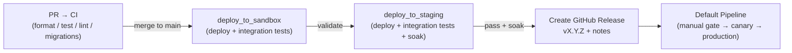

# 🚀 Releasing Matik

This section is the canonical home for **how Matik is released** — the end-to-end
promotion process, the per-component validation you run before promoting, and how
to write release notes and comms.

> New here? Start with the [Release Process](release-process.md) runbook, then use
> the [Validation Checklist](validation-checklist.md) to confirm each component is
> healthy before promoting. Versioning rules live in [Versioning](versioning.md).

---

## The release at a glance

Matik follows a **staged promotion model**: code is validated in **sandbox**,
promoted to **staging** where it must pass integration tests and soak without
errors, then a **GitHub Release** is cut and the **default pipeline** deploys that
release to **canary → production**.

---

## In this section

| Doc | What it covers |
|-----|----------------|
| [Release Process](release-process.md) | The step-by-step runbook: CI → sandbox → staging → release tag → default pipeline, plus emergency and reset paths, rollback, and who to ping. |
| [Validation Checklist](validation-checklist.md) | Per-component "is it healthy?" checks (logs + Grafana) and the sandbox → staging → prod promotion gate matrix. |
| [Release Comms](release-comms.md) | How to generate polished release notes from GitHub's auto-notes and how to write & send the announcement. |

### Templates

| Template | Used by |
|----------|---------|
| [Release notes template](templates/release-notes-template.md) | `/release-notes` command |
| [Release comms template](templates/release-comms-template.md) | `/release-comms` command |

---

## Quick reference

- **Repository:** [git.musta.ch/airbnb/matik](https://git.musta.ch/airbnb/matik)
- **Team Slack:** [#biztech-opseng-goalie](https://airbnb.enterprise.slack.com/archives/C028ENYCAH3)
- **Grafana (service health):** [dashboard](https://grafana.a.musta.ch/goto/ffo8nog9p7ke8d?orgId=1)
- **Grafana (infrastructure):** [dashboard](https://grafana.a.musta.ch/goto/cfo8ztsnrso3kd?orgId=1)
- **Deploy tooling:** Spinnaker pipelines under [`_infra/cd/pipelines/`](https://git.musta.ch/airbnb/matik/tree/main/_infra/cd/pipelines)
- **Versioning:** semantic `vX.Y.Z` — see [versioning](versioning.md)
