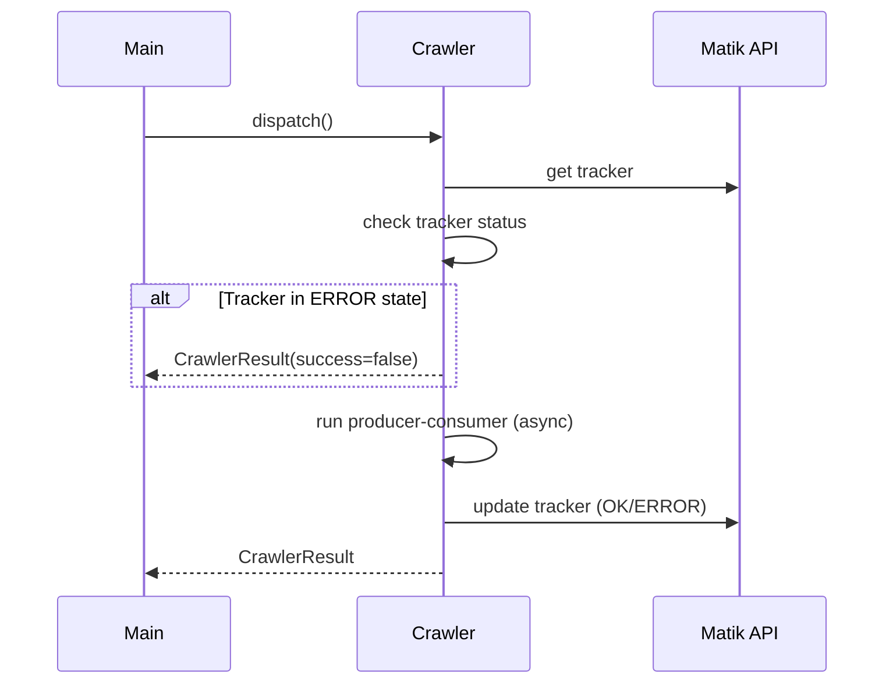
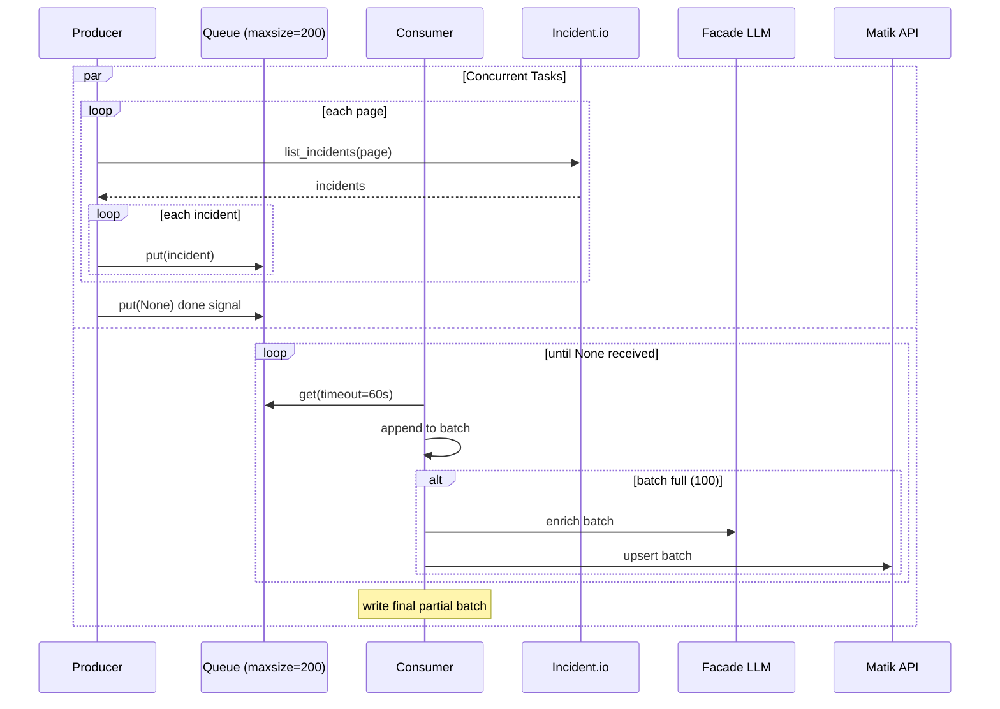
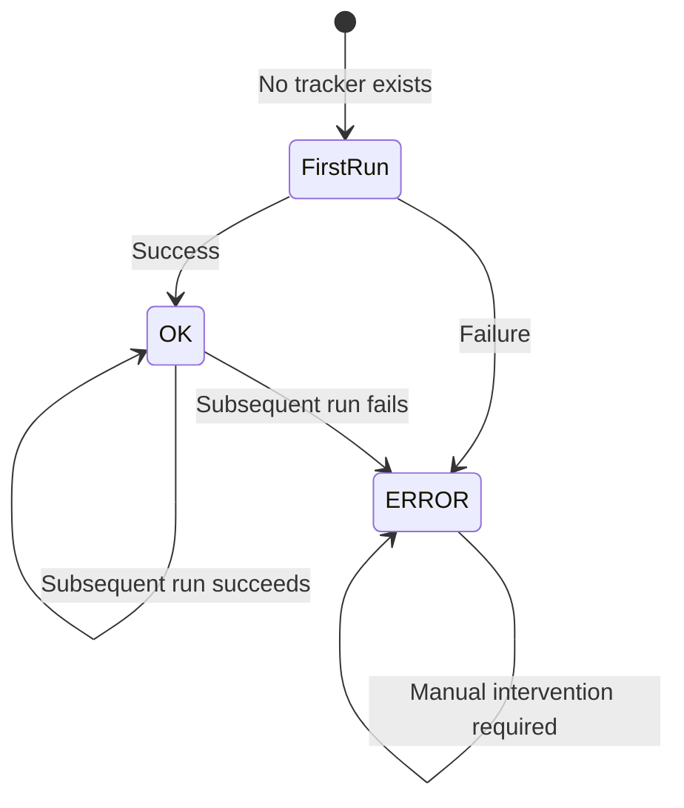

# Incident.io Historian Crawler

Fetches incidents from Incident.io API and stores them in the database with optional LLM-generated summaries.

## Crawler Flow

### High-Level



### Internal: Producer-Consumer Pattern

The `_dispatch_async` method runs producer and consumer as concurrent tasks:



## Configuration

| Field | Type | Default | Description |
|-------|------|---------|-------------|
| `api_key` | str | required | Incident.io API key |
| `base_url` | str | `https://api.incident.io` | API base URL |
| `page_size` | int | `100` | Incidents per API page |
| `max_retries` | int | `3` | API retry attempts |
| `timeout` | float | `30.0` | Request timeout (seconds) |
| `backoff_delays` | list | `[2.0, 4.0, 8.0]` | Retry backoff delays |
| `start_date` | str | None | Initial sync start date (YYYY-MM-DD) |
| `lookback_days` | int | `30` | Days to look back on subsequent runs |
| `write_batch_size` | int | `100` | Incidents per DB write batch |
| `consumer_timeout_seconds` | int | `60` | Consumer queue timeout |
| `max_concurrent_llm_calls` | int | `10` | Concurrent LLM requests |

## Tracker State Machine

The tracker persists sync state across runs and handles failure recovery.



| Scenario | Tracker State | Behavior |
|----------|---------------|----------|
| **First Run** | `initial_sync_complete=false` | Uses `start_date` config as `updated_at[gte]` filter. If not set, fetches all incidents. |
| **Subsequent Run** | `initial_sync_complete=true`, `status=OK` | Uses `now - lookback_days` as filter for incremental updates. |
| **After Failure** | `status=ERROR`, `last_updated_at_cursor` saved | Crawler aborts immediately. Requires manual status reset to retry. Saved cursor enables resume from failure point. |
| **Recovery** | Reset `status=OK` manually | Uses saved `last_updated_at_cursor` to retry from where it failed. |

### How to Reset Tracker Status After Fixing Error

```sql
UPDATE incidentio_tracker SET status = NULL WHERE id = 1;
COMMIT;
```

## Key Features

- **Producer-Consumer Pattern**: Async pipeline for fetching and processing
- **LLM Enrichment**: Generates `root_cause_summary` and `resolution_summary` via Facade
- **Hash-based Caching**: Skips LLM calls if incident content unchanged
- **Incremental Sync**: Uses `updated_at[gte]` filter with lookback window
- **Error Recovery**: Saves cursor on failure for retry; tracker status tracking
- **Visibility Filter**: Only processes public incidents
